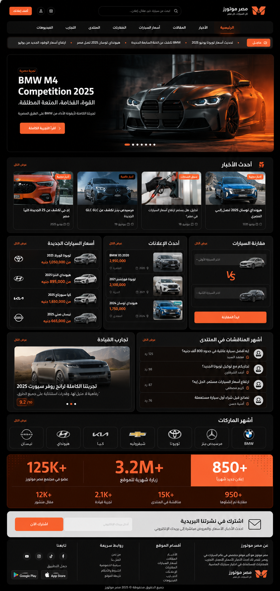

<div align="center" dir="rtl">

<p align="center">
  
</p>

# 🎨 TidyFactor Design `v1.3.7`
### محرك دورة حياة تصميم الواجهات ومحرك النماذج التفاعلية المناهض للتكرار

**البداية الرسمية لبناء نظام التصميم والدورة الكاملة لتصميم الواجهات التفاعلية ضمن منظومة TidyFactor Ecosystem.**

[](https://www.npmjs.com/package/@alwkala/tidyfactor-design)
[](LICENSE)
[](README.ar.md)
[](#-معايير-الجودة-ومناهضة-التكرار-rule-8)
[-green.svg?style=for-the-badge)](#-الترخيص-والحوكمة)

[✨ العرض المباشر](https://alwkala.com/tidyfactor-design/) • [🖼️ المعرض البصري](#%EF%B8%8F-المعرض-البصري-ونماذج-الواجهات) • [⚡ 24 أمرًا ذكياً](#-مراحل-دورة-حياة-التصميم-الـ-7-وسجل-الأوامر-الـ-24) • [🎨 8 قواعد تصميمية](#-8-قواعد-تصميمية-مرنة-css-foundations) • [🛡️ معايير الجودة](#-معايير-الجودة-ومناهضة-التكرار-rule-8) • [📖 Read in English](README.md)

</div>

---

> [!NOTE]
> **TidyFactor Design** هو محرك كودي كامل لدورة حياة تصميم الواجهات (UI Design Lifecycle Engine) وبديل كودي لـ Figma مصمم لعصر الذكاء الاصطناعي. يُمكّن المطورين، مهندسي التصميم، ووكلاء الذكاء الاصطناعي (*Google Antigravity, Claude Code, Cursor, Codex, Windsurf*) من إدارة كافة مراحل التصميم السبعة—من الاكتشاف والبحث وحتى تسليم المطورين—بتقنيات (HTML/CSS/JS) بدون أي خطوة تجميع وبدون أي تضارب في الأكواد.

---

## 🌟 القيمة المضافة ولماذا TidyFactor Design؟

| للمطورين (Developers) | لمهندسي التصميم (Design Engineers) | لوكلاء الذكاء الاصطناعي (AI Agents) |
|---|---|---|
| **بدون خطوة تجميع**: فتح صفحات `.html` مباشرة في أي متصفح بدون webpack/vite. | **بديل كودي لـ Figma**: التصميم المباشر بكود جاهز للإنتاج مع تفاعلية فورية. | **مقتصد في التوكنز**: الأوامر الذكية تحمل فقط السياق المطلوب (~350 توكن). |
| **بدون تشتت أكواد**: جميع التنسيقات والمكونات تعيش حصرياً داخل `design-system/`. | **8 قواعد تصميم مرنة**: اختيار Native CSS, Tailwind, daisyUI, shadcn/ui, Pico, Bootstrap, أو Alpine. | **مستوفٍ لمعايير المناهضة**: حظر القوالب النمطية المكررة عبر 16 قاعدة جودة آلية. |
| **تسليم كودي جاهز**: متغيرات CSS ووسوم HTML واضحة ومستقرة وجاهزة للربط مع الأطر. | **دعم عربي أصيل**: دعم كامل للاتجاه RTL وتزاوج خطوط El Messiri + Tajawal. | **مسارات محددة**: توافق بنسبة 100% عبر 24 أمراً مع أدوات تحقق تلقائية. |

---

## 🖼️ المعرض البصري ونماذج الواجهات

يولد `tidyfactor-design` واجهات تفاعلية غنية ومبهرة مصممة خصيصاً لمجال وسياق العمل:

### 1. نظام النمطين الفاتح والداكن (Dual-Mode Design System)
*تبديل ديناميكي بين النمطين الفاتح والداكن عبر قيم `brand.json` v2 (`colors.light` و `colors.dark`) بدون إعادة تحميل الصفحة.*

| النمط الفاتح (Light Mode) | النمط الداكن (Dark Mode) |
|---|---|
|  |  |

---

### 2. لوحات التحكم والتحليلات (Dashboards & Analytics)
*واجهات غنية بالبيانات مع تنسيق الأرقام الجدولي، بطاقات الإحصائيات، الفلاتر، وشريط التنقل الجانبي.*



---

### 3. المتاجر واستعراض المنتجات (E-Commerce Showcase)
*صفحات متاجر ذات كفاءة تحويل عالية مع معارض الصور، جداول المواصفات، محددات الأحجام، وأزرار الشراء.*


---

### 4. النشر والمجلات الصحفية (Editorial & Magazine)
*هرمية طباعية صحفية تعتمد خطوط Markazi Text / El Messiri للعناوين مع تخطيط متعدد الأعمدة.*


---

### 5. العروض السينمائية والغمرية (Atmospheric & Cinematic)
*سرد بصري غمر كامل مع تغيّر لون الخلفية البيئي `#ambient` ومحركات الـ Canvas Scroll-Film.*


---

## 🔄 مراحل دورة حياة التصميم الـ 7 وسجل الأوامر الـ 24

ينظم `tidyfactor-design` دورة عمل التصميم إلى **7 مراحل متتالية**، مع توفير 24 أمراً مباشراً يحمل ذاكرة تشغيلية دقيقة بدون تضخم في السياق:

```
1. الاكتشاف والبحث ➔ 2. الأساس والهوية ➔ 3. الهندسة والتخطيط ➔ 4. المكونات والتفاعل ➔ 5. الحركة والحيوية ➔ 6. الجودة والتدقيق ➔ 7. التسليم والنشر
```

---

### المرحلة 1: الاكتشاف والبحث (Discovery & Research)
*استخراج الـ Design DNA، تحديد السياق، وفحص التوافق البصري قبل كتابة الكود.*

| الأمر | صيغة الاستدعاء | الذاكرة المحملة | المخرجات والقيمة للمستخدم |
|---|---|---|---|
| **`/study`** | `/study [رابط\|صورة]` | `memory/01-design-schools.md`<br>`memory/06-quality-bar.md` | **تقرير الـ DNA التصميمي**: استخراج الألوان الفعلية (`getComputedStyle()`) والخطوط والهيكل العام بدون نسخ النصوص أو التخطيط الخام. |
| **`/brief`** | `/brief` | `memory/01-design-schools.md`<br>`memory/13-layout-archetypes.md` | **بوابة سياق التصميم**: تنفيذ أسئلة السياق الـ 3 (نمط الجمهور: inspire/evaluate/act/learn، نوع السطح، والمدرسة البصرية) واختبار الملاءمة. |

---

### المرحلة 2: الأساس والهوية (Foundation & System Setup)
*بناء رموز الهوية، هيكل brand.json v2، أنظمة الألوان، مزاوجة الخطوط، والمدارس التصميمية.*

| الأمر | صيغة الاستدعاء | الذاكرة المحملة | المخرجات والقيمة للمستخدم |
|---|---|---|---|
| **`/init`** | `/init [مجلد] [--foundation=اسم]` | `references/workflows/init-prototype.md`<br>`references/memory/architecture.md` | **إنشاء المشروع**: بناء مجلد `design-system/` والقاعدة التصميمية المحددة وملف `brand.json` والصفحة الأولى. |
| **`/brand`** | `/brand` | `memory/11-brand-json-v2.md`<br>`memory/02-design-tokens.md` | **هيكل الهوية v2**: ضبط النمطين الفاتح والداكن (16 رمزا لكل نمط)، حلقات التركيز `shadows.focusRing` مع `color-mix()`. |
| **`/typography`** | `/typography` | `memory/12-typography-matrix.md`<br>`memory/08-arabic-bilingual.md` | **مصفوفة الخطوط**: توجيه لـ 7 مسارات مزاوجة خطوط عربية ولاتينية (مثل El Messiri/Tajawal، Markazi Text/IBM Plex). |
| **`/school`** | `/school [المدرسة]` | `memory/01-design-schools.md` | **المدرسة البصرية**: تثبيت التوجيه البصري (Minimalist, Brutalism, Glassmorphism, Neumorphism, Swiss, Luxury). |
| **`/tokens`** | `/tokens` | `memory/02-design-tokens.md`<br>`references/memory/architecture.md` | **مصدر الرموز الموحد**: إدارة متغيرات CSS المخصصة داخل `design-system/tokens.css`. |
| **`/palette`** | `/palette <صورة>` | `memory/02-design-tokens.md`<br>`memory/10-python-tooling.md` | **مستخرج الألوان**: تشغيل `extract_palette.py` لاستخراج الألوان الرئيسية وفحص التباين بموجب WCAG 2.1 AA. |
| **`/assets`** | `/assets` | `memory/10-python-tooling.md` | **نظافة الأصول**: إزالة خلفيات الصور تلقائياً (`rembg`) وضغط WebP الدفعي (`optimize_images.py`). |

---

### المرحلة 3: الهندسة والتخطيط (Architecture & Layout)
*تخطيط الهيكل العام للصفحات، أنماط التنقل، والفوتر، ونماذج السطح.*

| الأمر | صيغة الاستدعاء | الذاكرة المحملة | المخرجات والقيمة للمستخدم |
|---|---|---|---|
| **`/layout`** | `/layout [النموذج]` | `memory/13-layout-archetypes.md`<br>`references/memory/architecture.md` | **نماذج التخطيط**: تطبيق 8 هياكل رئيسية (`fullbleed`, `editorial`, `spatial`, `interface`, `minimal`, `product`, `store`, `auto`). |
| **`/nav-footer`** | `/nav-footer` | `memory/14-nav-footer-catalog.md`<br>`memory/06-quality-bar.md` | **كتالوج التنقل والفوتر**: اختيار الهيدر (N1–N9) والفوتر (Ft1–Ft8) وتجنب القوالب التكرارية النمطية. |
| **`/page`** | `/page <الاسم>` | `references/workflows/init-prototype.md`<br>`memory/05-component-anatomy.md` | **صفحة تسويقية**: إنشاء وسوم HTML فقط (`pages/<name>.html`) بدون أي CSS/JS داخلي. |
| **`/dashboard`** | `/dashboard <الاسم>` | `references/workflows/init-prototype.md`<br>`memory/05-component-anatomy.md` | **صفحة تطبيق**: إنشاء هيكل لوحة تحكم أو تطبيق ويب مع بطاقات الإحصائيات وجداول البيانات. |

---

### المرحلة 4: المكونات والتفاعل (Components & State Matrix)
*بناء فئات المكونات المشتركة ومعالجة جميع الحالات التفاعلية الـ 8.*

| الأمر | صيغة الاستدعاء | الذاكرة المحملة | المخرجات والقيمة للمستخدم |
|---|---|---|---|
| **`/components`** | `/components` | `memory/05-component-anatomy.md`<br>`references/memory/architecture.md` | **مكتبة المكونات**: بناء الفئات المشتركة في `design-system/components.css` وإنشاء المعارض التفاعلية (`.preview.html`). |
| **`/states`** | `/states` | `memory/05-component-anatomy.md`<br>`memory/07-consistency-contract.md` | **مصفوفة الحالات**: تطبيق الحالات التفاعلية الـ 8 (الافتراضية، التمرير، النشطة، التركيز، المعطلة، التحميل، الخطأ، النجاح). |

---

### المرحلة 5: الحركة والحيوية (Motion & Interactive Experience)
*تنسيق تحريكات الدخول، تأثيرات التمرير، التفاعلات الدقيقة، والدعم اللغوي.*

| الأمر | صيغة الاستدعاء | الذاكرة المحملة | المخرجات والقيمة للمستخدم |
|---|---|---|---|
| **`/motion`** | `/motion` | `memory/04-motion-principles.md` | **تنسيق الحركة**: تطبيق تفاعلات التمرير، تغيّر خلفية `#ambient` البيئي، محركات الـ Canvas Scroll-Film، وطبقات الـ Z-Stack. |
| **`/flow`** | `/flow` | `memory/09-prototype-flow.md` | **التنقل التفاعلي**: ربط شريط التنقل العائم المساعد (`proto-nav.js`) للتنقل بين شاشات النموذج. |
| **`/i18n`** | `/i18n` | `memory/08-arabic-bilingual.md` | **محرك اللغة العربية و RTL**: ضبط خصائص الاتجاه المنطقية، خطوط El Messiri/Tajawal، ومحددات الحشمة الثقافية. |

---

### المرحلة 6: الجودة والتدقيق (Quality Assurance & Audit)
*فحص ميزانيات الأداء، تطبيق قواعد المناهضة، والهندسة العكسية للمواقع.*

| الأمر | صيغة الاستدعاء | الذاكرة المحملة | المخرجات والقيمة للمستخدم |
|---|---|---|---|
| **`/perf`** | `/perf` | `memory/15-performance-budget.md` | **فحص ميزانية الأداء**: توليد جدول الأوزان والأحجام الأقصى (البطل ≤ 400KB، الخطوط ≤ 3 عائلات، الشعار ≤ 40KB). |
| **`/audit`** | `/audit` | `references/workflows/audit-prototype.md`<br>`memory/06-quality-bar.md` | **تدقيق الجودة**: تقرير فحص قراءة فقط لقواعد المناهضة الـ 16 وعقد الاتساق الهيكلي. |
| **`/clone`** | `/clone <رابط>` | `references/workflows/clone-prototype.md`<br>`memory/03-narrative-conversion.md` | **استخراج نظام التصميم**: الهندسة العكسية للمواقع واستخراج الألوان الفعلية (`getComputedStyle()`) في `brand.json`. |
| **`/retrofit`** | `/retrofit` | `references/workflows/retrofit-prototype.md`<br>`memory/07-consistency-contract.md` | **توحيد النماذج**: إعادة هيكلة المشاريع المشتتة لتعتمد نظام تصميم موحد في `design-system/`. |

---

### المرحلة 7: التسليم والنشر (Delivery & Developer Handoff)
*تجميع أصول الإنتاج، تصدير توثيق المطورين، وتشغيل خوادم النشر.*

| الأمر | صيغة الاستدعاء | الذاكرة المحملة | المخرجات والقيمة للمستخدم |
|---|---|---|---|
| **`/handoff`** | `/handoff` | `memory/11-brand-json-v2.md`<br>`memory/05-component-anatomy.md` | **حزمة تسليم المطورين**: تصدير جداول الرموز، مصفوفة حالات المكونات، وقواعد الشبكة في `docs/handoff/`. |
| **`/deploy`** | `/deploy` | `memory/06-quality-bar.md`<br>`memory/10-python-tooling.md` | **التصدير النهائي**: تشغيل خادم المعاينة المحلي، فحص `test_build.py`، ضغط الأصول، وتجميع حزمة النشر (`build.py`). |

---

## 🎨 8 قواعد تصميمية مرنة (CSS Foundations)

تحديد القاعدة التصميمية يتم مرة واحدة أثناء `/init` ولا يتم خلط القواعد في مشروع واحد:

| القاعدة التصميمية | الرمز | الأنسب لـ | تفاصيل الهيكلية |
|---|---|---|---|
| **Native CSS** | `--foundation=native` | أنظمة التصميم النقية بدون مكتبات خارجية | متغيرات CSS مخصصة وفئات مكونات مفاهيمية في `tokens.css` و `components.css`. |
| **Tailwind Utility** | `--foundation=tailwind` | النمذجة السريعة بالفئات المباشرة | محرك Tailwind v4 عبر CDN مع ربط رموز التصميم المخصصة. |
| **daisyUI** | `--foundation=daisyui` | التطبيقات السريعة بمكونات جاهزة | Tailwind CDN + مكتبة مكونات daisyUI المجهزة بمتغيرات التصميم. |
| **Hybrid** | `--foundation=hybrid` | التطبيقات ولوحات التحكم ذات الهوية الخاصة | مكونات daisyUI المركبة مع فئات Native CSS للهوية البصرية الفريدة. |
| **shadcn/ui** | `--foundation=shadcn` | المكونات ذات إمكانية الوصول العالية | Tailwind v4 + خريطة رموز مكونات Radix UI الوصولية. |
| **Pico CSS v2** | `--foundation=pico` | المواقع والأدلة فائقة السرعة | وسوم HTML5 نُسقت بنظافة بدون تضخم في فئات الفاعلية. |
| **Bootstrap 5.3** | `--foundation=bootstrap` | الأنظمة المؤسسية والنمط الداكن | متغيرات المؤسسات مع دعم النمط الداكن المباشر `data-bs-theme="dark"`. |
| **Alpine + Tailwind** | `--foundation=alpine` | التفاعلات الدقيقة السريعة | توجيهات Alpine.js التفاعلية (`x-data`, `x-on`) مع محرك Tailwind v4. |

---

## 🛡️ معايير الجودة ومناهضة التكرار (Rule 8)

يضمن `tidyfactor-design` عدم توليد واجهات نمطية مكررة عبر تطبيق قواعد صارمة مستمدة من أفضل ممارسات هندسة التصميم (*Taste-Skill*, *Hallmark*, *Anthropic Frontend-Design*, *Website Cloner*).

> [!IMPORTANT]
> **ختم التقييم الذاتي**: يتم تقييم كل واجهة أو مكون قبل إنتاجه على 6 محاور: **الفلسفة (P)**، **الهرمية (H)**، **التنفيذ (E)**، **التخصص (S)**، **الضبط (R)**، و**التنوع (V)**. أي درجة أقل من 3 تطلق مراجعة تلقائية:
> `/* Pre-emit critique: P5 H4 E5 S4 R5 V5 */`

### ⚙️ نظام المؤشرات الثلاثة (`brand.json`)
تحكم ديناميكي في تباعد الهيكل، عمق الحركة، وكثافة البيانات:

```json
{
  "dials": {
    "designVariance": 8,
    "motionIntensity": 6,
    "visualDensity": 4
  }
}
```

### ⛔ 16 قاعدة آلية لحظر الواجهات النمطية المكررة

| القاعدة النمطية المكررة | سبب الفشل | قاعدة الجودة الآلية |
|---|---|---|
| **الخلفية البنفسجية المتدرجة** | أشهر علامات القوالب النمطية لـ AI | لون مرسي واحد؛ حظر الخلفيات المتدرجة في قسم البطل. |
| **خط Inter في كل مكان** | عدم مزاوجة الخطوط | مزاوجة خطوط متميزة للعناوين والجسم (`El Messiri` / `Tajawal` / `Outfit`). |
| **شبكة الميزات الـ 3 المكررة** | 3 بطاقات متساوية نمطية | شبكة غير متناظرة، ارتفاعات متغيرة، أو قوائم أيقونات سطرية. |
| **تداخل البطاقات Card-in-Card** | بطاقات حاوية بدون داعٍ | محظور. حدود مسطحة أو تظليل سطحي بدون بطاقات تداخل. |
| **العناوين المتدرجة الملونة** | تدرج `background-clip: text` | نص مسطح عالي التباين؛ حظر التدرجات الذهبية إلا للأنماط الداكنة الفاخرة. |
| **الشريط الملون الجانبي للبطاقة** | حد سميك 4-6px على اليسار | محظور. حد رقيق 1px أو ظلال ارتقاء خفيفة. |
| **قسم البطل بالارتفاع الكامل** | `min-height: 100vh` مع نص ممركز | الهامش العلوي للبطل محدد بـ `pt-24` (6rem)؛ العنوان سطرين كحد أقصى. |
| **الأسود والأبيض الخالص** | `#000000` أو `#ffffff` مسطح | استخدام ألوان محايدة ملونة (`#0F172A`, `#F8FAFC`). |
| **تكرار الهيكل الماكرو** | تكرار الهيكل في الصفحات المتتالية | تنويع نماذج التخطيط عبر صفحات المشروع (`memory/13-layout-archetypes.md`). |
| **التخطيط الصحفي غير المناسب** | اختيار نموذج صحفي لتطبيقات SaaS | مطابقة نموذج السطح مع مجال العمل (مثل `interface` لـ SaaS). |
| **قائمة التنقل النمطية AI Nav** | الشعار يسار، 4 روابط وسط، زر يمين | محظور. استخدام كتالوج N1–N9 (مثل N1 Floating Pill أو N5 Edge-Aligned). |
| **الفوتر النمطي AI Footer** | 4 أعمدة متساوية + روابط اجتماعية | محظور. استخدام كتالوج Ft1–Ft8 (مثل Ft1 Mast-Headed أو Ft5 Letter Close). |
| **فقاعات البلازما الخلفية** | فقاعات متحركة خلف النص | محظور. استخدام طبقة `#glow` شعاعية خفيفة أو أرضية ناصعة. |
| **الأشكال الـ 3D العائمة** | كرات عائمة مشوشة خلف النص | محظور. المحافظة على نظافة الخلفية والتركيز على المحتوى. |
| **المائل المفتعل في العناوين** | تحويل كلمة واحدة للمائل `<em>` | محظور. الاعتماد على الهرمية الطباعية الحقيقية وتباين الأوزان. |
| **التحميل الكسول للصورة الرئيسية** | إضافة `loading="lazy"` للبطل | محظور. صورة البطل تحميل عاجل LCP؛ التحميل الكسول لما تحت الطي فقط. |

---

## 🏛️ الهيكلية التنظيمية ومسار التدفق

```
my-prototype/
├── design-system/
│   ├── tokens.css        ← متغيرات التصميم (الألوان، الخطوط، المسافات، الظلال)
│   ├── base.css          ← إعادة الضبط، الوراثة والقواعد الأساسية
│   ├── components.css    ← مكتبة المكونات المشتركة (الأزرار، البطاقات، القوائم)
│   ├── utilities.css     ← فئات التنسيق المساعدة
│   ├── motion.js         ← تحريكات التمرير والدخول المشتركة
│   ├── interactions.js   ← التفاعلات المشتركة (القوائم المنسدلة، التبويبات، النوافذ)
│   └── brand.json        ← المصدر الرئيسي للهوية والمتغيرات والأصوات (إصدار v2)
├── pages/
│   ├── index.html        ← وسم HTML فقط (بدون أي CSS/JS داخلي)
│   ├── dashboard.html    ← وسم HTML فقط للوحة التحكم
│   └── pricing.html      ← وسم HTML فقط لصفحة الأسعار
├── scripts/              ← أدوات بايثون الذكية (استخراج الألوان، إزالة الخلفيات، ضغط WebP)
├── docs/                 ← حزم تسليم المطورين والأبحاث
└── proto-nav.js          ← شريط التنقل العائم المساعد أثناء التطوير
```

---

## 🇸🇦 دعم كامل للغة العربية والاتجاه من اليمين لليسار (RTL)

يوفر `tidyfactor-design` دعماً أصيلاً ومتكاملاً للمنتجات الرقمية باللغة العربية:

- **القواعد الطباعية**: عناوين العرض = **El Messiri**، الجسم = **Tajawal**. يمنع استخدام Amiri للعناوين أكبر من 24px.
- **الخصائص المنطقية**: تحويل كامل بين الاتجاهين (`dir="rtl"` / `dir="ltr"`) باستخدام CSS Logical Properties (`margin-inline-start`, `padding-inline`, `border-inline-end`).
- **محددات الحشمة الثقافية**: قواعد اختيار الصور الملائمة محلياً ومواضع الشعارات الصحيحة.
- **شريط التنقل التفاعلي RTL**: يُمكّن شريط التنقل العائم المساعد (`proto-nav.js`) التعديل التلقائي لليمين في وضع RTL.

---

## 🚀 البداية السريعة وأوامر CLI

موزع على NPM باسم [**`@alwkala/tidyfactor-design`**](https://www.npmjs.com/package/@alwkala/tidyfactor-design).

### 1. إنشاء مشروع جديد تفاعلي:

```bash
# إنشاء بيئة نموذج أولي جديدة
npx @alwkala/tidyfactor-design my-proto

# تحديد القاعدة التصميمية والمدرسة البصرية
npx @alwkala/tidyfactor-design my-app --foundation=native --school=luxury

# وضع التثبيت التلقائي لوكلاء الذكاء الاصطناعي (بدون أسئلة)
npx @alwkala/tidyfactor-design my-design-system --yes
```

### 2. حقن المهارة في مشروع قائم:

```bash
npx @alwkala/tidyfactor-design add-skill
```
*يحقن `.agents/skills/tidyfactor-design/`, `.claude-skill/`, `memory/`, `templates/`, و `AGENTS.md` مباشرة في مشروعك القائم.*

### 3. خادم المعاينة المحلي:

```bash
# تشغيل خادم معاينة محلي بدون أي مكتبات خارجية
python -m http.server 8123

# افتح المتصفح على http://localhost:8123
```

---

## 🏛️ منهجية مهارات TidyFactor وقواعد الحوكمة الـ 8/8

قد تلاحظ وجود الشارة **`Architect Score: 8/8 Pass (100%)`** عبر مستودعات منظومة TidyFactor. ما الذي تعنيه هذه المعايير بالضبط؟

**منهجية مهارات TidyFactor** (المحكومة بواسطة [`tidyfactor-skill-architect`](file:///c:/wamp64/www/TidyFactor/Skills/Skills-LAB/.agents/skills/tidyfactor-skill-architect/)) هي إطار معماري هندسي صارم لبناء مهارات وكلاء الذكاء الاصطناعي (AI Agent Skills). تضمن هذه المنهجية أن المهارة ليست مجرد موجه (Prompt) ضخم غير منظم أو مجموعة ملفات عشوائية، بل هي نظام تشغيلي حتمي وموجه ومصمم خصيصاً لتقليل استهلاك التوكنز، منع تضخم السياق، وضمان أعلى جودة تنفيذية.

### 📋 القواعد المعمارية الـ 8 التي تخضع لها كل مهارة في TidyFactor

| # | قاعدة الحوكمة | المواصفة الهندسية | القيمة المضافة للمستخدم ووكلاء الذكاء الاصطناعي |
|---|---|---|---|
| **1** | **انضباط الموزع (Dispatcher Discipline)** | يعمل ملف `SKILL.md` حصرياً كموجه للأوامر بحجم صغير (~350 توكن). يعلن الأوامر الموجودة ويوجه لملفات الذاكرة وسير العمل بدون تضمين تعليمات التنفيذ داخله. | **توفير هائل للتوكنز**: يحمل وكيل الذكاء الاصطناعي ~350 توكن فقط عند البدء بدلاً من قراءة آلاف السطور غير الضرورية. |
| **2** | **سير عمل واحد = نتيجة واحدة** | كل ملف سير عمل (`references/workflows/`) يملك نتيجة واحدة محددة وينتهي بقائمة تحقق من الصحة (Validation Checklist). | **نتائج حتمية بدون هلوسة**: يضمن إتمام المهام بموجب قائمة تحقق صارمة وعدم ترك خطوة ناقصة. |
| **3** | **الذاكرة التشغيلية النقية** | تحتوي ملفات `memory/` على حقائق، قواعد، مصفوفات، وقوالب تقنية فقط — بدون أي نصوص إنشائية. | **إشارة عالية بدون ضوضاء**: حقن القواعد التقنية المباشرة في السياق بدون استهلاك توكنز في شرح لا فائدة منه. |
| **4** | **منع الهياكل الفارغة** | لا تأنشأ مجلدات فرعية إلا عند وجود أكثر من ملف واحد حقيقي داخلها. | **بيئة نظيفة ومحمولة**: منع التضخم في المجلدات والمحافظة على سهولة النقل والتركيب. |
| **5** | **عزل الفلسفة والتسويق** | تعزل المانفيستو والشعارات التسويقية في `memory/philosophy.md` ولا تدخل أبداً في ملفات التنفيذ التشغيلية. | **تنفيذ تقني نقي**: يقرا الوكيل قواعد التنفيذ المباشرة فقط بدون تشتت في فلسفة المشروع. |
| **6** | **النمو المبرر بالمحفزات** | إضافة الأوامر والملفات الجديدة تتم فقط عند وجود محفز عملي حقيقي (مثل التوسع لمراحل دورة الحياة الـ 7). | **بدون تضخم تخميني**: المحافظة على خفة المهارة وسرعتها وصيانتها. |
| **7** | **معايير الجودة ومناهضة التكرار** | التقييم الذاتي قبل الإنتاج (Pre-Emit Self-Critique) على 6 محاور، وحظر 16 نمطاً مكرراً من عيوب الذكاء الاصطناعي. | **جودة بصرية مضمونة**: حظر الأكواد النمطية المكررة، التدرجات البنفسجية، والنصوص الملتفة. |
| **8** | **تحقق التوافقية متعدد البيئات** | توافق تام بنسبة 100% بين جميع بيئات المهارة (`.agents`, `.claude-skill`, والملفات الرئيسية) مفحوص آلياً بـ `validate-skill.js`. | **توافقية شاملة**: عمل المهارة بنفس الدقة والسرعة على Antigravity, Claude Code, Cursor, Codex, و Windsurf. |

---

## 📜 الترخيص والحوكمة

موزع تحت رخصة **MIT License**. تم التطوير بواسطة [Alwkala](https://alwkala.com) لصالح منظومة TidyFactor Ecosystem. مستوفٍ لجميع معايير الحوكمة بنسبة **100% (8/8 PASS)** تحت نظام `tidyfactor-skill-architect`.

*جميع الحقوق محفوظة (c) 2026 Alwkala (https://alwkala.com) / TidyFactor Ecosystem*
