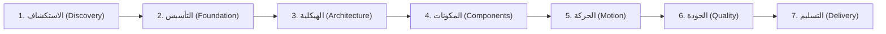

<div align="center">

# 🎨 TidyFactor Design `v1.9.0`
### محرك دورة حياة تصميم واجهات المستخدم الكودية الأصلية، ونظام التصميم المضاد للرداءة (Anti-Slop)، وهندسة النماذج الأولية التفاعلية لوكلاء البرمجة بالذكاء الاصطناعي

امنح وكلاء البرمجة بالذكاء الاصطناعي (**Google Antigravity أو Claude Code أو Cursor أو OpenAI Codex أو Windsurf**) عقل مهندس تصميم محترف (Design Engineer) يحول الرؤية المبدئية إلى أنظمة تصميم ونماذج برمجية تفاعلية جاهزة للإنتاج — بدون احتكاك تسليم Figma، وبدون رداءة التصاميم المكررة (AI Slop)، وبدون تشتت شيفرات CSS بين الصفحات.

[](https://www.npmjs.com/package/@tidyfactor/design)
[](https://github.com/TidyFactor/Design/stargazers)
[](LICENSE)
[](https://github.com/TidyFactor)
[](SKILL.md)
[](README.ar.md)
[-green.svg?style=for-the-badge)](#-منهجية-tidyfactor-وقواعد-الحوكمة-الـ-15)
[](SKILL.md)

[ English ](README.md) • [ العربية ](README.ar.md) • [ فارسی ](README.fa.md) • [ Español ](README.es.md) • [ Português ](README.pt.md) • [ 简体中文 ](README.zh.md) • [ Deutsch ](README.de.md) • [ Français ](README.fr.md)

<br/><br/>

<p align="center">
  
</p>

</div>

---

## 📚 جدول المحتويات (Table of Contents)

- [🎯 لماذا TidyFactor Design؟ — البديل الكودي الأصيل لـ Figma](#-لماذا-tidyfactor-design--البديل-الكودي-الأصيل-لـ-figma)
- [🏛️ الفكرة الأقوى: فصل "معرفة التصميم" عن "تنفيذ التصميم"](#%EF%B8%8F-الفكرة-الأقوى-فصل-معرفة-التصميم-عن-تنفيذ-التصميم)
- [🚀 البداية السريعة (Quick Start)](#-البداية-السريعة-quick-start)
- [🧭 بنية اتخاذ القرار المزدوجة (بروتوكول DM-DA)](#-بنية-اتخاذ-القرار-المزدوجة-بروتوكول-dm-da)
- [🔄 المراحل السبع لدورة حياة التصميم (The 7 Lifecycle Stages)](#-المراحل-السبع-لدورة-حياة-التصميم-the-7-lifecycle-stages)
- [⚡ سجل الأوامر الـ 24 (24 Slash Commands Registry)](#-سجل-الأوامر-الـ-24-24-slash-commands-registry)
- [🧠 ما هي "الذاكرة التشغيلية" (Operational Memory)؟](#-ما-هي-الذاكرة-التشغيلية-operational-memory)
- [🧩 مكتبة المكونات وهندسة الصفحات (Volumes 01 – 03)](#-مكتبة-المكونات-وهندسة-الصفحات-volumes-01--03)
- [🛡️ حوكمة مكافحة الرداءة (Anti-Slop Governance) وبوابة الجودة الميكانيكية](#%EF%B8%8F-حوكمة-مكافحة-الرداءة-anti-slop-governance-وبوابة-الجودة-الميكانيكية)
- [🇸🇦 الدعم العربي الأصيل والهندسة الدقيقة لـ RTL](#-الدعم-العربي-الأصيل-والهندسة-الدقيقة-لـ-rtl)
- [⚡ كفاءة الرموز وأسبقية YAML (القاعدة 15)](#-كفاءة-الرموز-وأسبقية-yaml-القاعدة-15)
- [🏛️ منهجية TidyFactor وقواعد الحوكمة الـ 15](#%EF%B8%8F-منهجية-tidyfactor-وقواعد-الحوكمة-الـ-15)
- [❓ الأسئلة الشائعة (FAQ)](#-الأسئلة-الشائعة-faq)
- [🤝 المساهمة والمجتمع](#-المساهمة-والمجتمع)
- [📜 الترخيص (License)](#-الترخيص-license)

---

## 🎯 لماذا TidyFactor Design؟ — البديل الكودي الأصيل لـ Figma

> [!IMPORTANT]
> **ظاهرة "الرداءة التكرارية" في الذكاء الاصطناعي (AI UI Slop)**  
> عندما تطلب من أي نموذج ذكاء اصطناعي عام: *"صمم صفحة هبوط حديثة"*، فإن النتيجة غالباً ما تكون متوسطاً إحصائياً مملاً ومكرراً:
> نفس تدرجات البنفسجي، خط Inter في كل مكان، نفس شبكة الـ 3 أعمدة، بطاقات متداخلة بلا هرمية (Card-in-card)، كرات ضوئية عائمة (Floating blobs)، وتشتت تام في شيفرات CSS بين الصفحات!  
> **TidyFactor Design هي الترياق الهندسي لهذه المشكلة:** إنها تنقل العملية من مجرد *"توليد واجهة عبر Prompt"* إلى **نظام تشغيل هندسي متكامل ومحكم**.

### مقارنة جذرية: Figma في مواجهة TidyFactor Design

TidyFactor Design لا تحاول أن تكون مجرد أداة رسم يدوي للمتجهات على Canvas ثنائي الأبعاد، بل هي **البديل البرمجي الأصيل (Code-Native Alternative)** المصمم خصيصاً للمطورين ومهندسي التصميم ووكلاء الذكاء الاصطناعي:

| وجه المقارنة | سير العمل التقليدي عبر Figma | TidyFactor Design (المحرك البرمجي الأصيل) |
|---|---|---|
| **النموذج الفكري** | أداة تصميم بصري ورسم على قماش | **سير عمل هندسة تصميم أصيل في الكود (Code-Native)** |
| **بيئة العمل** | رسومات متجهة محورها الـ Canvas | **واجهات برمجية حقيقية HTML5 / CSS3 / Vanilla JS** |
| **أطراف العملية** | مصمم بصري يسلم الكود لمطور برمجيات | **وكيل الذكاء الاصطناعي + المطور + مهندس التصميم في بيئة واحدة** |
| **الوحدات الأساسية** | إطارات ومكونات بصرية خاصة بـ Figma | **Design Tokens (`brand.yaml`) + مصفوفات مكونات + مسارات عمل** |
| **النماذج الأولية** | نماذج شاشات ثابتة موصولة بأسلاك بصرية | **نماذج حقيقية تفاعلية متجاوبة في المتصفح (Zero Build Step)** |
| **احتكاك التسليم (Handoff)** | تسليم يدوي معقد مع فجوة واختلاف في الكود | **صفر احتكاك تسليم (Zero Drift)**: التصميم هو الشيفرة البرمجية الإنتاجية ذاتها |
| **الحوكمة والجودة** | مراجعة بشرية بصرية وانطباعية | **بوابات جودة ميكانيكية**: تدقيق برمجي آلي عبر 7 محاور وفحص AST |
| **نطاق العمل** | رسم أصول الواجهة الرسومية | **إدارة دورة حياة التصميم كاملة عبر 7 مراحل مدروسة** |

---

## 🏛️ الفكرة الأقوى: فصل "معرفة التصميم" عن "تنفيذ التصميم"

الفكرة الجوهرية التي تميز **TidyFactor Design** هي الفصل المعماري الصارم بين **المعرفة والذكاء التصميمي (Design Intelligence)** و**التنفيذ البرمجي (Implementation)**:

```
                 DESIGN INTELLIGENCE
                        │
             ┌──────────┴──────────┐
             ↓                     ↓
       Operational Memory       Workflows
       (القواعد والمصفوفات)      (المسارات وخطوات العمل)
             │                     │
             └──────────┬──────────┘
                        ↓
                  AI Coding Agent
          (Antigravity / Claude / Cursor)
                        ↓
                Design System SSOT
             (brand.yaml + tokens.css)
                        ↓
            Interactive HTML/CSS/JS
             (بدون كتابة CSS مكرر لكل صفحة)
                        ↓
             Mechanical Audit Gate
           (ختم الجودة ذو المحاور الـ 7)
                        ↓
             Production Delivery
           (تسليم نظام التصميم والشيفرات)
```

### لماذا يجعل هذا المهارة قابلة للتكرار والنجاح في كل مشروع؟
عندما تُعزل خبرات التصميم (الهرمية، الخطوط، مصفوفات التباين، فيزياء الحركة) داخل **الذاكرة التشغيلية (Operational Memory)** وتُفصل عن خطوات التوليد، فإن نموذج الذكاء الاصطناعي **لا يحتاج في كل مرة إلى إعادة اختراع العجلة** أو التخمين؛ بل ينفذ خطواته وفق مرجعية موثقة وثابتة.

$$\text{الأسلوب التقليدي العشوائي: } \text{Prompt} \longrightarrow \text{الذكاء الاصطناعي يولد واجهة مكررة وباهتة}$$
$$\text{محرك TidyFactor الهندسي: } \text{Brief} \longrightarrow \text{Rules} \longrightarrow \text{System} \longrightarrow \text{Code} \longrightarrow \text{Validation} \longrightarrow \text{Handoff}$$

---

## 🚀 البداية السريعة (Quick Start)

### 1. التثبيت عبر NPM / NPX
أضف المهارة مباشرة إلى بيئة عمل مشروعك:
```bash
# تثبيت واستدعاء المهارة في المشروع
npx @tidyfactor/design add

# أو عبر أداة CLI الشاملة
npx @tidyfactor/cli add tidyfactor-design
```

### 2. الاستدعاء المباشر في وكلاء الذكاء الاصطناعي
يمكنك استدعاء المهارة فوراً داخل **Google Antigravity أو Claude Code أو Cursor أو Codex أو Windsurf**:
```text
/tidyfactor-design
```
أو تنفيذ أوامر محددة مباشرة:
```text
/brief          # تحديد سياق التصميم (الارتجال السريع أو المناظرة المعمارية)
/tokens         # إنشاء متغيرات ورموز التصميم ومطابقتها
/components     # بناء المكونات التفاعلية وفق الحالات الثمانية
/page           # تركيب صفحة كاملة متسقة دون كتابة CSS مخصص لها
/audit          # تدقيق الجودة وفحص الواجهة ضد أنماط الرداءة الـ 16
```

---

## 🧭 بنية اتخاذ القرار المزدوجة (بروتوكول DM-DA)

تتضمن مهارة TidyFactor Design طبقة القرار السياقية المتقدمة **Contextual Decision Layer (CDL v2.0)**، حيث يتبنى الوكيل دور **مهندس اتخاذ القرار المزدوج (Dual-Mode Decision Architect - DM-DA)**:

```
                      USER INTENT
                           │
             ┌─────────────┴─────────────┐
             ↓                           ↓
      [MODE A] 🎯                [MODE B] 🔥
  الارتجال الذكي المقيد       الاستجواب والمناظرة اللانهائية
  (3 جولات حاسمة سريعة)       (تفكيك الافتراضات والخيارات المعمارية)
             │                           │
      إنهاء حتمي بالجولة 3       مساءلة مستمرة ضد الـ Anti-Patterns
             │                 إلزام باختيارات حاسمة وتفادي النزاعات
             ↓                           │
     إصدار المسودة والتثبيت              │ إنهاء حصري بأمر "END DEBATE"
             │                           ↓
             └───────────┬───────────────┘
                         ↓
             .tidyfactor/brief.md
        Artifact: DEBATE_SYNTHESIS.md
                         ↓
             توليد الشيفرات البرمجية بدقة
```

### [MODE A] 🎯 الارتجال الذكي المقيد (Smart 3-Round Protocol)
- **الجولة 1 (الجوهر والمهمة)**: استخلاص عقلية الجمهور (`inspire`, `evaluate`, `act`, `learn`) ورسالة المنتج الأساسية.
- **الجولة 2 (الحدود الهيكلية وحزمة التقنيات)**: تثبيت محرك CSS (`native`, `tailwind`, `daisyui`, `pico`, `hybrid`)، ونموذج التخطيط (`L1`–`L4`)، وأزواج الخطوط.
- **الجولة 3 (حسم النزاعات والقيم الآمنة)**: ضبط التباديل المتبقية واعتماد القيم الافتراضية المحافظة دون إرهاق المستخدم.
- **بوابة التخيير والتصعيد**: إصدار فوري لملف `.tidyfactor/brief.md` ثم تخيير المستخدم: *"هل تعتمد هذا الأساس للبدء فوراً أم تفضل تصعيد الحوار إلى نمط المناظرة؟"*

### [MODE B] 🔥 الاستجواب والمناظرة اللانهائية (Relentless Debate & Interview)
- **استنطاق معماري عميق**: يُفعل عبر `/debate` أو `/grill-me` أو التحويل من النمط الأول.
- **تحدي الافتراضات الهشة**: مساءلة عنيفة لكل اختيار تصميمي، وكشف الأنماط الرديئة، واختبار تماسك الواجهة مع العربية والحركة قبل كتابة سطر كود واحد.
- **قاعدة إنهاء صارمة**: لا ينتهي أبداً إلا بأمر صريح من المستخدم: **`END DEBATE`** أو **`اعتماد`**.
- **المخرجات الموثقة**: توليد أثر هندسي تحليلي مفصل (`architectural_debate_synthesis.md`).

---

## 🔄 المراحل السبع لدورة حياة التصميم (The 7 Lifecycle Stages)

تقسم المهارة عملية هندسة الواجهات إلى 7 مراحل تسلسلية محكمة:



1. **الاستكشاف (Discovery)**: فهم نفسية الجمهور والهدف الاستراتيجي والـ DNA البصري.
2. **التأسيس (Foundation)**: بناء الرموز، تباين الألوان وفق WCAG AAA، الخطوط، وتحديد المدرسة البصرية.
3. **الهيكلية (Architecture)**: اختيار هيكل الصفحة (Layout)، وأشرطة التنقل، والتذييل، والقوالب.
4. **المكونات (Components)**: هندسة عناصر الواجهة بالحالات التفاعلية الثمانية (8 States) وضبط التمدد الرأسي.
5. **الحركة (Motion)**: ضبط فيزياء الانتقالات ومنحنيات التسارع ومراعاة قيود الحركة المخففة.
6. **الجودة (Quality)**: الفحص الميكانيكي عبر ختم الجودة ذي المحاور الـ 7، وميزانية الأداء، وفحص الرداءة.
7. **التسليم (Delivery)**: تصدير جداول المتغيرات، والنماذج الحية بدون خطوات بناء، وتوثيق المطورين.

---

## ⚡ سجل الأوامر الـ 24 (24 Slash Commands Registry)

| المرحلة | الأمر (Command) | الهدف وقصد المستخدم | الذاكرة التشغيلية المحقونة | المخرج الأساسي |
|---|---|---|---|---|
| **1. الاستكشاف** | `/brief` | استكشاف السياق عبر بروتوكول DM-DA المزدوج | `workflows/brief.md` + `memory/decision-points.md` | `.tidyfactor/brief.md` |
| **1. الاستكشاف** | `/study` | استخراج الـ DNA البصري من موقع مرجعي أو صورة | `commands/study.md` + `memory/01-design-schools.md` | تقرير تحليلي للهوية البصرية |
| **2. التأسيس** | `/init` | بدء نظام تصميم ونموذج أولي جديد | `workflows/init-prototype.md` + `memory/architecture.md` | مجلد `design-system/` وملف `index.html` |
| **2. التأسيس** | `/brand` | إدارة رموز التصميم في ملف `brand.yaml` | `commands/brand.md` + `memory/11-brand-json-v2.md` | ملف `brand.yaml` المعتمد |
| **2. التأسيس** | `/typography` | توليد أزواج الخطوط العربية واللاتينية بدقة | `commands/typography.md` + `memory/12-typography-matrix.md` | رموز الخطوط وربط Google Fonts |
| **2. التأسيس** | `/school` | تحديد المدرسة البصرية (Minimal, Brutalist...) | `commands/school.md` + `memory/01-design-schools.md` | تثبيت المدرسة في `brand.yaml` |
| **2. التأسيس** | `/tokens` | توليد ومزامنة متغيرات CSS المشتركة | `commands/tokens.md` + `memory/02-design-tokens.md` | ملف `design-system/tokens.css` |
| **2. التأسيس** | `/palette` | استخراج لوحة الألوان وحساب تباين WCAG AAA | `commands/palette.md` + `scripts/extract_palette.py` | رموز الألوان للوضعين الفاتح والداكن |
| **2. التأسيس** | `/assets` | تحسين الصور والتحويل إلى WebP وإزالة الخلفيات | `commands/assets.md` + `scripts/optimize_images.py` | أصول بصرية خفيفة دون 150KB |
| **3. الهيكلية** | `/layout` | اختيار النموذج الهيكلي العام (L1 إلى L4) | `commands/layout.md` + `memory/13-layout-archetypes.md` | هيكل شبكي متجاوب ومدروس |
| **3. الهيكلية** | `/nav-footer` | ربط أشرطة التنقل والتذييل من الكتالوج | `commands/nav-footer.md` + `memory/14-nav-footer-catalog.md` | مكونات الهيدر والفوتر المتجاوبة |
| **3. الهيكلية** | `/page` | تجميع صفحة تسويقية أو محتوى كاملة | `workflows/init-prototype.md` + `memory/05-component-anatomy.md` | صفحة HTML نقية تقرأ الرموز العامة |
| **3. الهيكلية** | `/dashboard` | تجميع لوحة تحكم وتطبيقات كثيفة البيانات | `workflows/init-prototype.md` + `memory/05-component-anatomy.md` | بطاقات KPI، جداول، وشريط جانبي |
| **4. المكونات** | `/components` | بناء مكونات الواجهة وفق مصفوفات التشريح | `commands/components.md` + `memory/05-component-anatomy.md` | ملف `components.css` المنظم |
| **4. المكونات** | `/states` | إلزام المكونات بالحالات التفاعلية الـ 8 | `commands/states.md` + `memory/05-component-anatomy.md` | حالات (الخمول، التحويم، التركيز، التعطيل...) |
| **5. الحركة** | `/motion` | تطبيق منحنيات التسارع الفيزيائية والحركة | `commands/motion.md` + `memory/04-motion-principles.md` | ملف `motion.js` المعتمد على GSAP/CSS |
| **5. الحركة** | `/flow` | ربط التنقل والتفاعل بين صفحات النموذج الأولي | `commands/flow.md` + `memory/09-prototype-flow.md` | مسارات التنقل السلسة بالمتصفح |
| **5. الحركة** | `/i18n` | دعم العربية والمحاذاة التلقائية RTL | `commands/i18n.md` + `memory/08-arabic-bilingual.md` | واجهة ثنائية الاتجاه مع خطوط عربية دقيقة |
| **6. الجودة** | `/perf` | فحص ميزانية الأداء وأحجام الملفات | `commands/perf.md` + `memory/15-performance-budget.md` | تقرير التحقق من بقاء الصفحة دون 500KB |
| **6. الجودة** | `/audit` | التدقيق الهيكلي الميكانيكي وختم الجودة | `workflows/audit-prototype.md` + `memory/06-quality-bar.md` | ختم الجودة ذو المحاور الـ 7 (`P5 H5...`) |
| **6. الجودة** | `/clone` | استخراج نظام التصميم هندسياً من رابط خارجي | `workflows/clone-prototype.md` + `memory/03-narrative-conversion.md` | رموز ومكونات نظيفة معاد بناؤها |
| **6. الجودة** | `/retrofit` | توحيد الصفحات المشتتة تحت نظام تصميم مركزي | `workflows/retrofit-prototype.md` + `memory/07-consistency-contract.md` | إزالة التنسيقات الفردية وتوحيدها بالرموز |
| **7. التسليم** | `/handoff` | استخراج مواصفات التسليم البرمجي للمطورين | `commands/handoff.md` + `memory/11-brand-json-v2.md` | جداول المتغيرات وتوثيق التسليم |
| **7. التسليم** | `/deploy` | إطلاق خادم المعاينة المحلي والنشر الثابت | `commands/deploy.md` + `memory/06-quality-bar.md` | معاينة حية بدون خطوات بناء معقدة |

---

## 🧠 ما هي "الذاكرة التشغيلية" (Operational Memory)؟

ملفات الذاكرة التشغيلية (`references/memory/`) في TidyFactor **ليست مقالات نظرية أو نصوصاً دعائية**؛ بل هي **قواعد هندسية صارمة، ومصفوفات بيانات مجدولة، وقيود تشغيلية واجبة النفاذ**:

- **مصفوفة الخطوط (`12-typography-matrix.md`)**: أزواج خطوط عربية ولاتينية مقترنة بالحالة النفسية للمستخدم ومقاييس نسبية ثابتة.
- **نماذج التخطيط (`13-layout-archetypes.md`)**: الهياكل المكانية الأساسية (L1 إلى L4) مع نسب الحاويات وشبكات العرض.
- **مبادئ الحركة (`04-motion-principles.md`)**: منحنيات كوزماتيكية دقيقة (`cubic-bezier(0.16, 1, 0.3, 1)`) ومراعاة تقليل الحركة.
- **مصفوفات المكونات الأساسية (`21-` إلى `28-`)**: كتالوجات شاملة لشارات التنبيه، ومقاطع البداية، والبطاقات، والأزرار، والفواصل، والإحصائيات، ومؤشرات الثقة.
- **بوابة الجودة (`06-quality-bar.md`)**: قائمة الـ 16 علامة المحظورة للذكاء الاصطناعي و11 عيباً هيكلياً مرفوضاً مع عتبات فحص ميكانيكية.
- **القواعد العربية (`08-arabic-bilingual.md`)**: قواعد الخطوط والاتجاه الصارمة (المسيري للعناوين، وتجوال للمتن، وحظر استخدام الأميري فوق 24 بكسل).
- **ميزانية الأداء (`15-performance-budget.md`)**: قيود قاطعة: ألا تتجاوز الشيفرات 150KB، والوسائط 350KB، وصفر مكتبات تشغيلية خارجية ثقيلة.

---

## 🧩 مكتبة المكونات وهندسة الصفحات (Volumes 01 – 03)

تتضمن مهارة `tidyfactor-design` ثماني مصفوفات هندسية متكاملة للمكونات:

```
references/memory/
├── 21-eyebrow-kicker-matrix.md      # 16 مؤشراً هرمياً مصغراً عبر 4 عائلات هيكلية
├── 22-hero-section-matrix.md       # 8 هياكل لأقسام البداية مدعومة بـ GSAP ScrollTrigger وSVG
├── 23-card-architecture-matrix.md   # 16 قالباً للبطاقات مع تثبيت الأزرار في الأسفل دائماً
├── 24-button-cta-matrix.md          # 16 بديلاً للأزرار التفاعلية مع تغطية الحالات الثمانية كاملة
├── 25-divider-separator-matrix.md   # فواصل الأقسام والانتقالات الانسيابية عبر دروب SVG بارامترية
├── 26-metrics-stat-matrix.md        # 12 تصميماً لبطاقات الأرقام والمؤشرات مع عدادات رقمية سلسة
├── 27-list-indicator-matrix.md      # 12 تصميماً لقوائم الثقة والميزات وعلامات الإنجاز
└── 28-shared-motion-primitives.md   # الأساسيات الحركية المشتركة في GSAP والتسارع وتقسيم الحروف
```

### الثوابت الهندسية الصارمة:
1. **قاعدة التمدد الرأسي وتثبيت الأزرار**: كل بطاقة يجب أن تبنى بـ `display: flex; flex-direction: column;`، مع تثبيت أزرار الإجراءات في القاع حتماً عبر `margin-top: auto` لمنع تعرج أسطر الأزرار.
2. **ملكية فواصل الأقسام (Seam Ownership)**: في مصفوفة الفواصل، ينتمي الفاصل إلى **القسم السابق** ويأخذ لونه تلقائياً عبر `currentColor` من خلفية القسم اللاحق، مما يلغي الفجوات البيضاء تماماً.
3. **العناصر التراثية دون تشويش**: المشربية والزخارف الهندسية والكوفية تعزل حصراً في خلفيات الفواصل أو كعلامات مائية عبر `mask-image` بشفافية لا تتعدى $0.08$، ويُحظر وضع نصوص القراءة فوق زخارف معقدة.

---

## 🛡️ حوكمة مكافحة الرداءة (Anti-Slop Governance) وبوابة الجودة الميكانيكية

تفرض TidyFactor Design **فحوصات جودة ميكانيكية مؤتمتة** على كل واجهة منتجة:

### 🚫 علامات رداءة الذكاء الاصطناعي الـ 16 المحظورة (Zero Tolerance)
1. ❌ **تدرج البنفسجي العشوائي (Purple Gradient Hero)**: حظر التدرج الشهير بين `#7928CA` و `#FF0080`.
2. ❌ **طغيان خط Inter في كل مكان**: حظر استخدام Inter في واجهات الفخامة أو الواجهات التحريرية والثقافية.
3. ❌ **شبكة الـ 3 أعمدة الرتيبة**: حظر البطاقات المتطابقة دون تمييز بصري لبطاقة مميزة أو محورية.
4. ❌ **البطاقات المتداخلة غير المتباينة (Card-in-Card)**: حظر حشر بطاقات بإطارات داخل بطاقات أخرى بإطارات.
5. ❌ **الكرات واللطخات الضوئية السابحة (Floating Orbs)**: حظر الدوائر الملونة الضبابية غير المستندة لسبب تصميمي.
6. ❌ **الأسطح البيضاء أو السوداء القاحلة (`#000` أو `#fff`)**: حظر السطوح الخالية من العمق والظلال المعايرة.
7. ❌ **عناوين النصوص المتدرجة المفرغة**: حظر النصوص الطويلة متعددة الألوان غير المقروءة.
8. ❌ **البطاقات ذات الخط الجانبي**: حظر شريط الـ 4 بكسل الملون على يسار المربعات لافتقاره للأصالة.
9. ❌ **غياب حالات التفاعل الكاملة**: حظر العناصر التفاعلية التي لا تملك سوى تأثير `:hover` بسيط.
10. ❌ **الهوامش الاتجاهية المعطوبة في RTL**: حظر استخدام `mr-*` و `ml-*` في البيئات متعددة اللغات.
11. ❌ **تعرج أسطر الأزرار**: حظر البطاقات غير المثبتة سفلياً في الشبكات المتجاورة.
12. ❌ **الصور غير المضغوطة**: حظر إدراج صور PNG/JPEG ثقيلة مباشرة بدون تحويلها إلى WebP.
13. ❌ **وميض الخطوط غير المحمي**: حظر إدراج الخطوط بدون `font-display: swap` وبدائل نظام محلية.
14. ❌ **فوضى طبقات Z-Index**: حظر كتابة أرقام عشوائية مثل `z-index: 99999`.
15. ❌ **الشاشات البيضاء عند غياب JS**: حظر النماذج التي تختفي تماماً إذا تعطل الجافاسكريبت.
16. ❌ **وضع النصوص فوق الزخارف المزدحمة**: حظر وضع فقرات القراءة فوق خلفيات هندسية معقدة.

### 🏷️ ختم الجودة ذو المحاور الـ 7 (7-Axis Pre-Emit Quality Stamp)
قبل تسليم أو إصدار أي واجهة، يتحقق الوكيل ويوثق ختم الجودة الصارم:
```text
[QUALITY GATE: P5 H5 E5 S5 R5 V5 D5 — 35/35 PASSED]
- P (الأداء): وزن الصفحة الإجمالي دون 500KB، وربط الخطوط مسبقاً.
- H (الهرمية): عنوان رئيسي H1 وحيد ومقياس تدرج طباعي متناسق وواضح.
- E (بيئة الاستخدام): مساحات لمس لا تقل عن 44 بكسل وتغطية الحالات التفاعلية الثمانية.
- S (الدلالة البرمجية): استخدام عناصر HTML5 الدلالية الصارمة (`<main>`, `<article>`).
- R (العربية والاتجاه): استخدام الخصائص المنطقية (`margin-inline-start`) وخطوط عربية معايرة.
- V (الأصالة البصرية): شهادة خلو الواجهة من علامات الرداءة الـ 16 الخاصة بالذكاء الاصطناعي.
- D (مطابقة القرار): التزام بنسبة 100% بالمسودة المعتمدة في ملف .tidyfactor/brief.md.
```

---

## 🇸🇦 الدعم العربي الأصيل والهندسة الدقيقة لـ RTL

صممت TidyFactor Design مع وضع خصوصية الخط العربي والهوية البصرية لمنطقة الشرق الأوسط وشمال أفريقيا في المقدمة:

- **الخصائص المنطقية في CSS**: استخدام حصري لـ `margin-inline-start` و `padding-inline-end` بدلاً من الخصائص الفيزيائية مثل `left` و `right`.
- **أزواج الخطوط المعايرة**:
  - **الكلاسيكي الراقي**: المسيري (العناوين) + تجوال (المتن)
  - **الهندسي الحديث**: الإسكندرية (العناوين) + ريدكس برو (المتن)
  - **التقني المعاصر**: كايرو (العناوين) + آي بي إم بليكس سانس عربي (المتن)
- **قيد خط الأميري (Amiri Constraint)**: يُحظر استخدام الأميري في المتن أو بمقاسات فوق 24 بكسل في الواجهات الرقمية الحديثة.
- **الانعكاس البصري الطبيعي**: انسيابية الهوامش وتناسب المسافات مع طبيعة اتصال الحروف العربية.

---

## ⚡ كفاءة الرموز وأسبقية YAML (القاعدة 15)

امتثالاً للقاعدة 15 من قواعد TidyFactor Master Workspace Rules:
- **الطبقة الإدراكية بصيغة YAML**: حفظ رموز العلامة التجارية ومصفوفات القرارات في ملف `brand.yaml` بدلاً من JSON.
- **توفير 35% إلى 50% من الرموز (Tokens)**: التخلص من ضوضاء الأقواس المزدوجة وعلامات الاقتباس المفرطة يمنح نماذج الذكاء الاصطناعي مساحة تفكير وسياق أكبر بكثير.
- **التوافق المزدوج**: يدعم المحرك تلقائياً ملفات `brand.json` القديمة في المشاريع السابقة.
- **حدود البروتوكولات الآلية**: حصر صيغة JSON على معايير تشغيل البرمجيات الخارجية (`package.json` و `manifest.json`).

---

## 🏛️ منهجية TidyFactor وقواعد الحوكمة الـ 15

| # | القاعدة الهيكلية | الحالة | آلية التحقق |
|---|---|:---:|---|
| **1** | **انضباط الموزع (Dispatcher Discipline)** | ✅ ناجح | ملف `SKILL.md` موجه خفيف (~747 رمزاً) مع حظر المهام العامة. |
| **2** | **مسار واحد = مخرج واحد** | ✅ ناجح | كل مسار له مخرج واحد محدد وقائمة تحقق صريحة `## Validation checklist`. |
| **3** | **الذاكرة التشغيلية النقية** | ✅ ناجح | مجلد `references/memory/` نقي من السرد الدعائي ومبني على مصفوفات هندسية. |
| **4** | **حظر الهياكل الفارغة** | ✅ ناجح | معمارية مفلطحة وخالية من المجلدات أحادية الملف. |
| **5** | **عزل الفلسفة عن التنفيذ** | ✅ ناجح | حصر فلسفة العلامة التجارية في ملف `memory/philosophy.md`. |
| **6** | **النمو المبرر بالسياق** | ✅ ناجح | إضافة الأوامر والملفات بناءً على أحداث حقيقية في دورة حياة التطوير. |
| **7** | **الأدوات البرمجية الحتمية** | ✅ ناجح | أدوات بايثون دقيقة لمعالجة الصور وفحص الألوان والتدقيق الآلي. |
| **8** | **المطابقة السلوكية وتزامن SemVer** | ✅ ناجح | تزامن تام لجميع ملفات التعريف مع الإصدار `v1.9.0`. |
| **9** | **التوافق التام مع المنصات** | ✅ ناجح | توافق الترويسة مع شروط `yaml.safe_load()` والوصف الدقيق. |
| **10** | **عقد بيان أدوات التشغيل** | ✅ ناجح | تصريح دقيق في `manifest.json` وفق مخطط أدوات المهارات. |
| **11** | **تحديث وصلاحية الذاكرة** | ✅ ناجح | كافة ملفات الذاكرة الـ 31 تحمل وسوم فحص معتمدة `2026-09-05`. |
| **12** | **الحدود بين المهارة وMCP** | ✅ ناجح | المعرفة الثابتة في المهارة، والبيانات الحية مفوضة لخوادم MCP. |
| **13** | **التوثيق ثنائي المستوى متعدد اللغات** | ✅ ناجح | شريط التنقل الشامل ذو اللغات الثماني في جميع ملفات README. |
| **14** | **طبقة القرار السياقية (CDL v2.0)** | ✅ ناجح | تفعيل بروتوكول DM-DA الكامل بنمطي الارتجال والمناظرة اللانهائية. |
| **15** | **كفاءة الرموز وأسبقية YAML** | ✅ ناجح | اعتماد `brand.yaml` في الطبقة المعرفية وتوفير 35-50% من استهلاك السياق. |

```bash
# تشغيل أداة التحقق والتدقيق الآلية ذات الـ 13 فحصاً
python tools/validate_skill.py
# النتيجة: [SUCCESS] ALL SKILL INTEGRITY CHECKS PASSED (15/15 COMPLIANT)!
```

---

## ❓ الأسئلة الشائعة (FAQ)

### كيف تختلف TidyFactor Design عن مكتبات مثل Tailwind UI أو shadcn/ui؟
المكتبات الجاهزة تعطيك أجزاء كود مجتزأة. **TidyFactor Design هي دورة هندسة تصميم متكاملة**: تكتشف هوية منتجك، وتختار المدرسة البصرية المناسبة، وتحسب تباين الألوان، وترتب الهيكل العام، وتضبط فيزياء الحركة، وتدقق الكود ضد الرداءة، وتخرجه كودياً بصفر تبعيات بناء معقدة.

### هل يتطلب تشغيل النماذج خطوات بناء معقدة أو بيئة Node.js إجبارية؟
**لا.** تعمل النماذج الأولية مباشرة في أي متصفح حديث عبر HTML5 وCSS Custom Properties وVanilla JS، ويمكنك فتح ملف `index.html` أو تشغيله عبر أي خادم محلي خفيف.

### هل يمكنني استخدام Tailwind CSS بدلاً من CSS الأصيل؟
**نعم بالتأكيد.** تتيح لك أوامر `/brief` و `/layout` اختيار محرك التنسيق المفضل: `native` (بدون مكتبات)، أو `tailwind`، أو `daisyui`، أو `pico`، أو `hybrid`.

---

## 🤝 المساهمة والمجتمع

نرحب بمساهمات واقتراحات مهندسي التصميم ومطوري الواجهات:
- 🐛 **الإبلاغ عن المشكلات**: [GitHub Issues](https://github.com/TidyFactor/Design/issues)
- 💡 **مناقشة الأفكار والتطوير**: [GitHub Discussions](https://github.com/TidyFactor/Design/discussions)
- 📖 **دليل الهندسة والاستخدام**: [docs/GUIDE.md](docs/GUIDE.md) و [docs/GUIDE.ar.md](docs/GUIDE.ar.md)

---

## 📜 الترخيص (License)

هذا المشروع مرخص بموجب ترخيص **Apache-2.0**. راجع ملف [LICENSE](LICENSE) للتفاصيل.

---

<div align="center">

**صُنعت بكل فخر واعتزاز بواسطة فريق TidyFactor الأساسي ووكالة الوكالة الرقمية (Alwkala).**  
*تمكين وكلاء البرمجة بالذكاء الاصطناعي من التصميم بدقة وذوق رفيع وصفر رداءة.*

</div>
