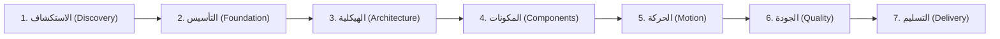

<div align="center">

# 🎨 محرك تصميم واجهات المستخدم بالكود الأصيل TidyFactor Design الإصدار `v1.10.0`
### محرك دورة حياة تصميم واجهات المستخدم الكودية الأصلية، ونظام التصميم المضاد للرداءة (Anti-Slop)، وهندسة النماذج الأولية التفاعلية لوكلاء البرمجة بالذكاء الاصطناعي

امنح وكلاء البرمجة بالذكاء الاصطناعي (**Google Antigravity أو Claude Code أو Cursor أو OpenAI Codex أو Windsurf**) عقل مهندس تصميم محترف (Design Engineer) يحول الرؤية المبدئية إلى أنظمة تصميم ونماذج برمجية تفاعلية جاهزة للإنتاج — بدون احتكاك تسليم Figma، وبدون رداءة التصاميم المكررة (AI Slop)، وبدون تشتت شيفرات CSS بين الصفحات.

[](https://www.npmjs.com/package/@tidyfactor/design)
[](https://github.com/TidyFactor/Design/stargazers)
[](LICENSE)
[](https://github.com/TidyFactor)
[](SKILL.md)
[](README.ar.md)
[-green.svg?style=for-the-badge)](#-منهجية-tidyfactor-وقواعد-الحوكمة-الـ-15)
[](SKILL.md)

[ English ](README.md) • [ العربية ](README.ar.md) • [ فارسی ](README.fa.md) • [ Español ](README.es.md) • [ Português ](README.pt.md) • [ 简体中文 ](README.zh.md) • [ Deutsch ](README.de.md) • [ Français ](README.fr.md)

<br/><br/>

<p align="center">
  
</p>

</div>

---

## 📚 جدول المحتويات (Table of Contents)

- [🎯 لماذا TidyFactor Design؟ — البديل الكودي الأصيل لـ Figma](#-لماذا-tidyfactor-design--البديل-الكودي-الأصيل-لـ-figma)
- [🏛️ الفكرة الأقوى: فصل "معرفة التصميم" عن "تنفيذ التصميم"](#%EF%B8%8F-الفكرة-الأقوى-فصل-معرفة-التصميم-عن-تنفيذ-التصميم)
- [🚀 البداية السريعة (Quick Start)](#-البداية-السريعة-quick-start)
- [🧭 بنية اتخاذ القرار المزدوجة (بروتوكول DM-DA)](#-بنية-اتخاذ-القرار-المزدوجة-بروتوكول-dm-da)
- [🔄 المراحل السبع لدورة حياة التصميم (The 7 Lifecycle Stages)](#-المراحل-السبع-لدورة-حياة-التصميم-the-7-lifecycle-stages)
- [⚡ سجل الأوامر الـ 24 (24 Slash Commands Registry)](#-سجل-الأوامر-الـ-24-24-slash-commands-registry)
- [🧠 ما هي "الذاكرة التشغيلية" (Operational Memory)؟](#-ما-هي-الذاكرة-التشغيلية-operational-memory)
- [🧩 مكتبة المكونات وهندسة الصفحات (Volumes 01 – 03)](#-مكتبة-المكونات-وهندسة-الصفحات-volumes-01--03)
- [🛡️ حوكمة مكافحة الرداءة (Anti-Slop Governance) وبوابة الجودة الميكانيكية](#%EF%B8%8F-حوكمة-مكافحة-الرداءة-anti-slop-governance-وبوابة-الجودة-الميكانيكية)
- [🇸🇦 الدعم العربي الأصيل والهندسة الدقيقة لـ RTL](#-الدعم-العربي-الأصيل-والهندسة-الدقيقة-لـ-rtl)
- [⚡ كفاءة الرموز وأسبقية YAML (القاعدة 15)](#-كفاءة-الرموز-وأسبقية-yaml-القاعدة-15)
- [🏛️ منهجية TidyFactor وقواعد الحوكمة الـ 15](#%EF%B8%8F-منهجية-tidyfactor-وقواعد-الحوكمة-الـ-15)
- [❓ الأسئلة الشائعة (FAQ)](#-الأسئلة-الشائعة-faq)
- [🤝 المساهمة والمجتمع](#-المساهمة-والمجتمع)
- [📜 الترخيص (License)](#-الترخيص-license)

---

## 🎯 لماذا TidyFactor Design؟ — البديل الكودي الأصيل لـ Figma

> [!IMPORTANT]
> **ظاهرة "الرداءة التكرارية" في الذكاء الاصطناعي (AI UI Slop)**  
> عندما تطلب من أي نموذج ذكاء اصطناعي عام: *"صمم صفحة هبوط حديثة"*، فإن النتيجة غالباً ما تكون متوسطاً إحصائياً مملاً ومكرراً:
> نفس تدرجات البنفسجي، خط Inter في كل مكان، نفس شبكة الـ 3 أعمدة، بطاقات متداخلة بلا هرمية (Card-in-card)، كرات ضوئية عائمة (Floating blobs)، وتشتت تام في شيفرات CSS بين الصفحات!  
> **TidyFactor Design هي الترياق الهندسي لهذه المشكلة:** إنها تنقل العملية من مجرد *"توليد واجهة عبر Prompt"* إلى **نظام تشغيل هندسي متكامل ومحكم**.

### مقارنة جذرية: Figma في مواجهة TidyFactor Design

TidyFactor Design لا تحاول أن تكون مجرد أداة رسم يدوي للمتجهات على Canvas ثنائي الأبعاد، بل هي **البديل البرمجي الأصيل (Code-Native Alternative)** المصمم خصيصاً للمطورين ومهندسي التصميم ووكلاء الذكاء الاصطناعي:

| وجه المقارنة | سير العمل التقليدي عبر Figma | TidyFactor Design (المحرك البرمجي الأصيل) |
|---|---|---|
| **النموذج الفكري** | أداة تصميم بصري ورسم على قماش | **سير عمل هندسة تصميم أصيل في الكود (Code-Native)** |
| **بيئة العمل** | رسومات متجهة محورها الـ Canvas | **واجهات برمجية حقيقية HTML5 / CSS3 / Vanilla JS** |
| **أطراف العملية** | مصمم بصري يسلم الكود لمطور برمجيات | **وكيل الذكاء الاصطناعي + المطور + مهندس التصميم في بيئة واحدة** |
| **الوحدات الأساسية** | إطارات ومكونات بصرية خاصة بـ Figma | **Design Tokens (`brand.yaml`) + مصفوفات مكونات + مسارات عمل** |
| **النماذج الأولية** | نماذج شاشات ثابتة موصولة بأسلاك بصرية | **نماذج حقيقية تفاعلية متجاوبة في المتصفح (Zero Build Step)** |
| **احتكاك التسليم (Handoff)** | تسليم يدوي معقد مع فجوة واختلاف في الكود | **صفر احتكاك تسليم (Zero Drift)**: التصميم هو الشيفرة البرمجية الإنتاجية ذاتها |
| **الحوكمة والجودة** | مراجعة بشرية بصرية وانطباعية | **بوابات جودة ميكانيكية**: تدقيق برمجي آلي عبر 7 محاور وفحص AST |
| **نطاق العمل** | رسم أصول الواجهة الرسومية | **إدارة دورة حياة التصميم كاملة عبر 7 مراحل مدروسة** |

---

## 🏛️ الفكرة الأقوى: فصل "معرفة التصميم" عن "تنفيذ التصميم"

الفكرة الجوهرية التي تميز **TidyFactor Design** هي الفصل المعماري الصارم بين **المعرفة والذكاء التصميمي (Design Intelligence)** و**التنفيذ البرمجي (Implementation)**:

```
                 DESIGN INTELLIGENCE
                        │
             ┌──────────┴──────────┐
             ↓                     ↓
       Operational Memory       Workflows
       (القواعد والمصفوفات)      (المسارات وخطوات العمل)
             │                     │
             └──────────┬──────────┘
                        ↓
                  AI Coding Agent
          (Antigravity / Claude / Cursor)
                        ↓
                Design System SSOT
             (brand.yaml + tokens.css)
                        ↓
            Interactive HTML/CSS/JS
             (بدون كتابة CSS مكرر لكل صفحة)
                        ↓
             Mechanical Audit Gate
           (ختم الجودة ذو المحاور الـ 7)
                        ↓
             Production Delivery
           (تسليم نظام التصميم والشيفرات)
```

### لماذا يجعل هذا المهارة قابلة للتكرار والنجاح في كل مشروع؟
عندما تُعزل خبرات التصميم (الهرمية، الخطوط، مصفوفات التباين، فيزياء الحركة) داخل **الذاكرة التشغيلية (Operational Memory)** وتُفصل عن خطوات التوليد، فإن نموذج الذكاء الاصطناعي **لا يحتاج في كل مرة إلى إعادة اختراع العجلة** أو التخمين؛ بل ينفذ خطواته وفق مرجعية موثقة وثابتة.

$$\text{الأسلوب التقليدي العشوائي: } \text{Prompt} \longrightarrow \text{الذكاء الاصطناعي يولد واجهة مكررة وباهتة}$$
$$\text{محرك TidyFactor الهندسي: } \text{Brief} \longrightarrow \text{Rules} \longrightarrow \text{System} \longrightarrow \text{Code} \longrightarrow \text{Validation} \longrightarrow \text{Handoff}$$

---

## 🚀 التثبيت والبدء السريع

اختر طريقة التثبيت المناسبة لمشروعك:

### الخيار (أ): عبر TidyFactor CLI الرسمي (الموصى به)
التثبيت الفوري دون الحاجة لتثبيت الأداة عالمياً في بيئة عملك النشطة:
```bash
npx @tidyfactor/cli add design
```
*أو في حال كانت الأداة مثبتة لديك عالمياً (`npm i -g @tidyfactor/cli`):*
```bash
tidyfactor add design
```

### الخيار (ب): عبر معيار مهارات الوكلاء المفتوح (skills.sh)
التثبيت العالمي المتوافق مع كافة بيئات الوكلاء ومحررات الذكاء الاصطناعي (Antigravity, Cursor, Claude Code, Windsurf, Codex):
```bash
npx skills add tidyfactor/design
```

### الخيار (ج): التثبيت المباشر الفردي عبر NPM
تشغيل مثبت المهارة المستقل مباشرة مع تجاوز الذاكرة المخبأة وضمان أحدث إصدار:
```bash
npx @tidyfactor/design@latest
```

### 2. الاستدعاء المباشر في وكلاء الذكاء الاصطناعي
يمكنك استدعاء المهارة فوراً داخل **Google Antigravity أو Claude Code أو Cursor أو Codex أو Windsurf**:
```text
/tidyfactor-design
```
أو تنفيذ أوامر محددة مباشرة:
```text
/brief          # تحديد سياق التصميم (الارتجال السريع أو المناظرة المعمارية)
/tokens         # إنشاء متغيرات ورموز التصميم ومطابقتها
/components     # بناء المكونات التفاعلية وفق الحالات الثمانية
/page           # تركيب صفحة كاملة متسقة دون كتابة CSS مخصص لها
/audit          # تدقيق الجودة وفحص الواجهة ضد أنماط الرداءة الـ 16
```

---

## 🧭 بنية اتخاذ القرار المزدوجة (بروتوكول DM-DA)

تتضمن مهارة TidyFactor Design طبقة القرار السياقية المتقدمة **Contextual Decision Layer (CDL v2.0)**، حيث يتبنى الوكيل دور **مهندس اتخاذ القرار المزدوج (Dual-Mode Decision Architect - DM-DA)**:

```
                      USER INTENT
                           │
             ┌─────────────┴─────────────┐
             ↓                           ↓
      [MODE A] 🎯                [MODE B] 🔥
  الارتجال الذكي المقيد       الاستجواب والمناظرة اللانهائية
  (3 جولات حاسمة سريعة)       (تفكيك الافتراضات والخيارات المعمارية)
             │                           │
      إنهاء حتمي بالجولة 3       مساءلة مستمرة ضد الـ Anti-Patterns
             │                 إلزام باختيارات حاسمة وتفادي النزاعات
             ↓                           │
     إصدار المسودة والتثبيت              │ إنهاء حصري بأمر "END DEBATE"
             │                           ↓
             └───────────┬───────────────┘
                         ↓
             .tidyfactor/brief.md
        Artifact: DEBATE_SYNTHESIS.md
                         ↓
             توليد الشيفرات البرمجية بدقة
```

### [MODE A] 🎯 الارتجال الذكي المقيد (Smart 3-Round Protocol)
- **الجولة 1 (الجوهر والمهمة)**: استخلاص عقلية الجمهور (`inspire`, `evaluate`, `act`, `learn`) ورسالة المنتج الأساسية.
- **الجولة 2 (الحدود الهيكلية وحزمة التقنيات)**: تثبيت محرك CSS (`native`, `tailwind`, `daisyui`, `pico`, `hybrid`)، ونموذج التخطيط (`L1`–`L4`)، وأزواج الخطوط.
- **الجولة 3 (حسم النزاعات والقيم الآمنة)**: ضبط التباديل المتبقية واعتماد القيم الافتراضية المحافظة دون إرهاق المستخدم.
- **بوابة التخيير والتصعيد**: إصدار فوري لملف `.tidyfactor/brief.md` ثم تخيير المستخدم: *"هل تعتمد هذا الأساس للبدء فوراً أم تفضل تصعيد الحوار إلى نمط المناظرة؟"*

### [MODE B] 🔥 الاستجواب والمناظرة اللانهائية (Relentless Debate & Interview)
- **استنطاق معماري عميق**: يُفعل عبر `/debate` أو `/grill-me` أو التحويل من النمط الأول.
- **تحدي الافتراضات الهشة**: مساءلة عنيفة لكل اختيار تصميمي، وكشف الأنماط الرديئة، واختبار تماسك الواجهة مع العربية والحركة قبل كتابة سطر كود واحد.
- **قاعدة إنهاء صارمة**: لا ينتهي أبداً إلا بأمر صريح من المستخدم: **`END DEBATE`** أو **`اعتماد`**.
- **المخرجات الموثقة**: توليد أثر هندسي تحليلي مفصل (`architectural_debate_synthesis.md`).

---

## 🔄 المراحل السبع لدورة حياة التصميم (The 7 Lifecycle Stages)

تقسم المهارة عملية هندسة الواجهات إلى 7 مراحل تسلسلية محكمة:



1. **الاستكشاف (Discovery)**: فهم نفسية الجمهور والهدف الاستراتيجي والـ DNA البصري.
2. **التأسيس (Foundation)**: بناء الرموز، تباين الألوان وفق WCAG AAA، الخطوط، وتحديد المدرسة البصرية.
3. **الهيكلية (Architecture)**: اختيار هيكل الصفحة (Layout)، وأشرطة التنقل، والتذييل، والقوالب.
4. **المكونات (Components)**: هندسة عناصر الواجهة بالحالات التفاعلية الثمانية (8 States) وضبط التمدد الرأسي.
5. **الحركة (Motion)**: ضبط فيزياء الانتقالات ومنحنيات التسارع ومراعاة قيود الحركة المخففة.
6. **الجودة (Quality)**: الفحص الميكانيكي عبر ختم الجودة ذي المحاور الـ 7، وميزانية الأداء، وفحص الرداءة.
7. **التسليم (Delivery)**: تصدير جداول المتغيرات، والنماذج الحية بدون خطوات بناء، وتوثيق المطورين.

---

## ⚡ سجل الأوامر الـ 24 (24 Commands Registry)

> [!TIP]
> **الدليل التقني الكامل لآلية عمل الأوامر**:  
> للاطلاع على التفاصيل الهندسية الكاملة، والذاكرة التشغيلية المحقونة، ومخرجات كل أمر بدقة، راجع [دليل الأوامر التقني (docs/COMMANDS.ar.md)](docs/COMMANDS.ar.md).

| الأمر (Command) | الهدف وقصد المستخدم (Purpose & User Intent) | المرحلة (Stage) |
|:---|:---|:---:|
| [`/brief`](docs/COMMANDS.ar.md#brief) | استكشاف سياق التصميم عبر بروتوكول DM-DA (الارتجال السريع أو المناظرة) | `الاستكشاف` |
| [`/study`](docs/COMMANDS.ar.md#study) | استخراج الـ DNA البصري والألوان من موقع مرجعي أو صورة ملهمة | `الاستكشاف` |
| [`/init`](docs/COMMANDS.ar.md#init) | تأسيس نظام التصميم ونموذج أولي برمجي أصيل بدون خطوات بناء معقدة | `التأسيس` |
| [`/brand`](docs/COMMANDS.ar.md#brand) | إنشاء وتدقيق وإدارة رموز التصميم في ملف `brand.yaml` المعتمد | `التأسيس` |
| [`/typography`](docs/COMMANDS.ar.md#typography) | توليد أزواج الخطوط العربية واللاتينية وفق الحالة النفسية بمقاييس نسبية | `التأسيس` |
| [`/school`](docs/COMMANDS.ar.md#school) | تثبيت المدرسة البصرية المعتمدة (Minimalist, Brutalist, Glass...) | `التأسيس` |
| [`/tokens`](docs/COMMANDS.ar.md#tokens) | توليد وتدقيق ومزامنة متغيرات CSS المركزية في `tokens.css` | `التأسيس` |
| [`/palette`](docs/COMMANDS.ar.md#palette) | استخراج لوحة الألوان وضمان نسب التباين وفق معيار WCAG 2.1 AAA | `التأسيس` |
| [`/assets`](docs/COMMANDS.ar.md#assets) | تحسين الصور والتحويل إلى WebP (<150KB) وتفريغ الخلفيات آلياً | `التأسيس` |
| [`/layout`](docs/COMMANDS.ar.md#layout) | اختيار الهيكل الشبكي العام للصفحة (L1 إلى L4) وبناء الحاويات | `الهيكلية` |
| [`/nav-footer`](docs/COMMANDS.ar.md#nav-footer) | ربط أشرطة التنقل الاحترافية (N1–N9) والتذييل المتجاوب (Ft1–Ft8) | `الهيكلية` |
| [`/page`](docs/COMMANDS.ar.md#page) | تجميع صفحة تسويقية أو محتوى كاملة تقرأ الرموز العامة فقط | `الهيكلية` |
| [`/dashboard`](docs/COMMANDS.ar.md#dashboard) | بناء لوحات تحكم وتطبيقات كثيفة البيانات ببطاقات KPI وجداول متقدمة | `الهيكلية` |
| [`/components`](docs/COMMANDS.ar.md#components) | هندسة عناصر الواجهة وفق معايير التشريح في `components.css` | `المكونات` |
| [`/states`](docs/COMMANDS.ar.md#states) | إلزام العناصر بالحالات التفاعلية الـ 8 (الخمول، التحويم، التركيز، التعطيل...) | `المكونات` |
| [`/motion`](docs/COMMANDS.ar.md#motion) | تطبيق منحنيات التسارع الفيزيائية وانتقالات GSAP وانسيابية الحركة | `الحركة` |
| [`/flow`](docs/COMMANDS.ar.md#flow) | ربط التفاعل والتنقل السلس بين صفحات وشاشات النموذج الأولي | `الحركة` |
| [`/i18n`](docs/COMMANDS.ar.md#i18n) | دعم العربية وانعكاس الاتجاه RTL السلس وضبط خصائص الخط العربي | `الحركة` |
| [`/perf`](docs/COMMANDS.ar.md#perf) | فحص ميزانية الأداء وضمان بقاء وزن الصفحة الإجمالي دون 500KB | `الجودة` |
| [`/audit`](docs/COMMANDS.ar.md#audit) | التدقيق الهيكلي الميكانيكي، وفحص الرداءة، وختم الجودة السباعي (`P5...`) | `الجودة` |
| [`/clone`](docs/COMMANDS.ar.md#clone) | استخراج نظام التصميم ومحاكاته برمجياً من رابط موقع خارجي | `الجودة` |
| [`/retrofit`](docs/COMMANDS.ar.md#retrofit) | إزالة التنسيقات الفردية وتوحيد الصفحات المشتتة تحت الرموز المشتركة | `الجودة` |
| [`/handoff`](docs/COMMANDS.ar.md#handoff) | تصدير مواصفات التسليم البرمجي وجداول متغيرات CSS للمطورين | `التسليم` |
| [`/deploy`](docs/COMMANDS.ar.md#deploy) | إطلاق خادم المعاينة المحلي والنشر الفوري على استضافة ثابتة | `التسليم` |

---

## 🧠 ما هي "الذاكرة التشغيلية" (Operational Memory)؟

ملفات الذاكرة التشغيلية (`references/memory/`) في TidyFactor **ليست مقالات نظرية أو نصوصاً دعائية**؛ بل هي **قواعد هندسية صارمة، ومصفوفات بيانات مجدولة، وقيود تشغيلية واجبة النفاذ**:

- **مصفوفة الخطوط (`12-typography-matrix.md`)**: أزواج خطوط عربية ولاتينية مقترنة بالحالة النفسية للمستخدم ومقاييس نسبية ثابتة.
- **نماذج التخطيط (`13-layout-archetypes.md`)**: الهياكل المكانية الأساسية (L1 إلى L4) مع نسب الحاويات وشبكات العرض.
- **مبادئ الحركة (`04-motion-principles.md`)**: منحنيات كوزماتيكية دقيقة (`cubic-bezier(0.16, 1, 0.3, 1)`) ومراعاة تقليل الحركة.
- **مصفوفات المكونات الأساسية (`21-` إلى `28-`)**: كتالوجات شاملة لشارات التنبيه، ومقاطع البداية، والبطاقات، والأزرار، والفواصل، والإحصائيات، ومؤشرات الثقة.
- **بوابة الجودة (`06-quality-bar.md`)**: مصفوفة مكافحة الرداءة الشاملة (66 قاعدة عبر 9 تصنيفات)، و11 عيباً هيكلياً مرفوضاً مع ختم الجودة ذو المحاور السبعة (`P5 H5 E5 S5 R5 V5 D5`).
- **القواعد العربية (`08-arabic-bilingual.md`)**: قواعد الخطوط والاتجاه الصارمة (المسيري للعناوين، وتجوال للمتن، وحظر استخدام الأميري فوق 24 بكسل).
- **ميزانية الأداء (`15-performance-budget.md`)**: قيود قاطعة: ألا تتجاوز الشيفرات 150KB، والوسائط 350KB، وصفر مكتبات تشغيلية خارجية ثقيلة.

---

## 🧩 مكتبة المكونات وهندسة الصفحات (Volumes 01 – 03)

تتضمن مهارة `tidyfactor-design` ثماني مصفوفات هندسية متكاملة للمكونات:

```
references/memory/
├── 21-eyebrow-kicker-matrix.md      # 16 مؤشراً هرمياً مصغراً عبر 4 عائلات هيكلية
├── 22-hero-section-matrix.md       # 8 هياكل لأقسام البداية مدعومة بـ GSAP ScrollTrigger وSVG
├── 23-card-architecture-matrix.md   # 16 قالباً للبطاقات مع تثبيت الأزرار في الأسفل دائماً
├── 24-button-cta-matrix.md          # 16 بديلاً للأزرار التفاعلية مع تغطية الحالات الثمانية كاملة
├── 25-divider-separator-matrix.md   # فواصل الأقسام والانتقالات الانسيابية عبر دروب SVG بارامترية
├── 26-metrics-stat-matrix.md        # 12 تصميماً لبطاقات الأرقام والمؤشرات مع عدادات رقمية سلسة
├── 27-list-indicator-matrix.md      # 12 تصميماً لقوائم الثقة والميزات وعلامات الإنجاز
└── 28-shared-motion-primitives.md   # الأساسيات الحركية المشتركة في GSAP والتسارع وتقسيم الحروف
```

### الثوابت الهندسية الصارمة:
1. **قاعدة التمدد الرأسي وتثبيت الأزرار**: كل بطاقة يجب أن تبنى بـ `display: flex; flex-direction: column;`، مع تثبيت أزرار الإجراءات في القاع حتماً عبر `margin-top: auto` لمنع تعرج أسطر الأزرار.
2. **ملكية فواصل الأقسام (Seam Ownership)**: في مصفوفة الفواصل، ينتمي الفاصل إلى **القسم السابق** ويأخذ لونه تلقائياً عبر `currentColor` من خلفية القسم اللاحق، مما يلغي الفجوات البيضاء تماماً.
3. **العناصر التراثية دون تشويش**: المشربية والزخارف الهندسية والكوفية تعزل حصراً في خلفيات الفواصل أو كعلامات مائية عبر `mask-image` بشفافية لا تتعدى $0.08$، ويُحظر وضع نصوص القراءة فوق زخارف معقدة.

---

## 🛡️ حوكمة مكافحة الرداءة (Anti-Slop Governance) وبوابة الجودة الميكانيكية

تفرض TidyFactor Design **فحوصات جودة ميكانيكية مؤتمتة** على كل واجهة وسطر كود يتم توليده. يتم تدقيق النماذج والمكونات مقابل **مصفوفة جودة ميكانيكية استقصائية تضم 66 قاعدة موزعة على 9 تصنيفات هندسية**:

### 🚫 مصفوفة قواعد مكافحة الرداءة الـ 66 (9 تصنيفات نوعية)

<details>
<summary><b>التصنيف الأول: الألوان والأسطح (القواعد 1–21)</b></summary>

1. ❌ **تدرج البنفسجي العشوائي (Purple Gradient Hero)**: حظر التدرج الشهير بين `#7928CA` و `#FF0080` أو التوهجات النيلية الدائرية كخلفية نمطية.
2. ❌ **طغيان خط Inter في كل مكان**: حظر فرض خط Inter افتراضياً في واجهات الفخامة، والواجهات التحريرية، والمنصات الثقافية.
3. ❌ **شبكة الـ 3 أعمدة الرتيبة**: حظر البطاقات المتطابقة دون تمييز بصري لبطاقة مميزة أو محورية لكسر الرتابة.
4. ❌ **البطاقات المتداخلة غير المتباينة (Card-in-Card)**: حظر حشر بطاقات مؤطرة داخل بطاقات أخرى مؤطرة دون ضرورة معمارية أو تباين لوني مدروس.
5. ❌ **عناوين النصوص المتدرجة المفرغة (Gradient Text)**: حظر النصوص الطويلة متعددة الألوان عبر `background-clip: text` المجهدة للقراءة.
6. ❌ **البطاقات ذات الخط الجانبي (Side-Stripe)**: حظر شريط الـ 4–6 بكسل الملون على حافة البطاقات كحيلة سطحية للتمييز.
7. ❌ **واجهة الشاشة الكاملة المركزية المفرطة**: حظر الاعتماد الآلي على `min-height: 100vh` مع سطر قصير وزر كبير في منتصف الشاشة كحل جاهز.
8. ❌ **الأسطح البيضاء أو السوداء القاحلة (`#000` أو `#fff`)**: حظر السطوح الخالية من العمق والظلال والصبغات اللونية الدقيقة المعايرة للعلامة.
9. ❌ **رتابة الهيكل المتكرر (Default-Attractor)**: حظر تكرار نفس الهيكل الكلي للصفحات عبر مشاريع ووثائق مختلفة.
10. ❌ **الانزلاق التحريري في واجهات SaaS**: حظر فرض ترقيم العينات الصحفية `01 - HELLO` على منتجات تقنية وتجارية لا تناسبها.
11. ❌ **شريط التنقل النمطي للذكاء الاصطناعي**: حظر النموذج المكرر (شعار باليسار، 4 روابط بالمنتصف، زر باليمين، وحد سفلي 1px).
12. ❌ **التذييل النمطي المتكرر (AI Footer)**: حظر القوالب الجاهزة المكررة من 4 أعمدة تقليدية دون مراعاة الاحتياج الفعلي للمنصة.
13. ❌ **خلفيات اللطخات الضبابية (Aurora-Blobs)**: حظر فقاعات الألوان العضوية الضبابية العائمة خلف النصوص دون مبرر بصري.
14. ❌ **الكرات ثلاثية الأبعاد السابحة (Floating Orbs)**: حظر الدوائر ثلاثية الأبعاد أو الكرات الضوئية العائمة التي لا تؤدي وظيفة تفاعلية.
15. ❌ **إمالة كلمة مفردة في العنوان (Italic Headers)**: حظر إمالة كلمة عشوائية في العنوان الرئيسي لاصطناع عمق تحريري زائف.
16. ❌ **التحميل الكسول لصورة الواجهة الأساسية (Lazy LCP)**: حظر وضع `loading="lazy"` على صورة القسم الرئيسي مما يضر بمؤشرات الأداء LCP.
17. ❌ **نمط الكريم والطين الفخاري (Cream-and-Terracotta)**: حظر جعل خلفية `#F4F1EA` مع خط سيريف حاد ولمسة طينية (`~#D97757`) المظهر الافتراضي الإجباري لـ "الفخامة".
18. ❌ **نمط الأسود الداكن واللون الحارق (Near-Black & Acid)**: حظر الخلفيات شبه السوداء مع لمسة خضراء فسفورية أو برتقالية كقالب مكرر للواجهات "التقنية".
19. ❌ **الأسود المشوب كبديل للأسود الخالص**: حظر استخدام `#0B0B0B` أو `#111` كبديل دائم للأسود دون علة تصميمية موثقة.
20. ❌ **الوضع الليلي كعكس رقمي ساذج**: حظر قلب ألوان الوضع النهاري آلياً، وفرض بناء لوحة ألوان ليلية مستقلة بهندسة تباين خاصة.
21. ❌ **النصوص ضعيفة التباين فوق الصور**: حظر وضع نصوص القراءة مباشرة فوق الصور أو التدرجات دون طبقة تعتيم واقية (Scrim) تضمن المقروئية.
</details>

<details>
<summary><b>التصنيف الثاني: الطباعة والخطوط (القواعد 22–28)</b></summary>

22. ❌ **تمييز كلمة مفردة بلون مغاير**: حظر تلوين أو إمالة كلمة واحدة في العنوان الافتتاحي كحيلة تقليدية لاصطناع الذكاء.
23. ❌ **الحروف الكبيرة الكاملة في الشارات (All-Caps)**: حظر استخدام الحروف الكبيرة المتباعدة على جميع الشارات الصغيرة بغض النظر عن هوية البراند.
24. ❌ **الشارات العلوية الزائدة (Unnecessary Eyebrows)**: حظر وضع شارة تصنيفية فوق كل عنوان دون أن تضيف معنى توضيحياً حقيقياً.
25. ❌ **فرض خطوط المونوسبيس على كل شيء**: حظر استخدام خطوط المونوسبيس على نصوص عامة غير برمجية وغير جدولية لمجرد الظهور بمظهر "تقني".
26. ❌ **محاذاة النص الكاملة بدون فواصل (Justified Body)**: حظر النص المحاذي للجهتين (Justified) دون ضبط الفواصل مما يولد فراغات شاذة (Rivers).
27. ❌ **الاقتران المسطح بين السيريف والسانس**: حظر دمج نوعي خط بنفس الوزن والتباين دون بناء هرمية بصرية واضحة وفاصلة بينهما.
28. ❌ **طول السطر المتجاوز لـ 80 حرفاً**: حظر أعمدة نصوص القراءة التي تجبر العين على البحث المرهق عن السطر التالي (تجاوز `65ch`).
</details>

<details>
<summary><b>التصنيف الثالث: التخطيط والتركيب الهيكلي (القواعد 29–36)</b></summary>

29. ❌ **الترقيم الشكلي للمحتوى غير المتسلسل**: حظر شارات 01/02/03 على بطاقات ومحتويات لا تشكل خطوات زمنية أو متتالية فعلية.
30. ❌ **سلاسل البيانات المفصولة بنقاط وسطية**: حظر صياغة البيانات الوصفية تلقائياً بنمط "أ · ب · ج" كقالب متكرر.
31. ❌ **نمط الواصلة الطويلة (Em-Dash) في التسميات**: حظر استخدام نمط "كلمة — عبارة" بصورة متكررة في أقسام غير مترابطة.
32. ❌ **استدارة الحواف الموحدة دون هرمية**: حظر تطبيق نفس قيمة `border-radius` على كل عنصر داخل الصفحة دون تمييز لمستويات الأهمية.
33. ❌ **الظل الناعم المتطابق لكل البطاقات**: حظر وضع نفس ظل الإسقاط `rgba(0,0,0,.1)` كعلاج افتراضي موحد لجميع البطاقات.
34. ❌ **الواجهة الافتراضية "رقم ضخم + تسمية صغيرة"**: حظر تصدير واجهة البداية بإحصائية ضخمة وتدرج لوني إلا إذا كانت أقوى أصل حقيقي للعلامة.
35. ❌ **التخريش الصحفي المفرط (Broadsheet Hairlines)**: حظر الخطوط الرفيعة الشبيهة بالجرائد والأعمدة الحادة دون مبرر لمجرد إعطاء مظهر "تحريري".
36. ❌ **توسيط كل العناصر افتراضياً**: حظر محاذاة كافة المحتويات في المنتصف دون دراسة المحاذاة الطبيعية المريحة لعين القارئ.
</details>

<details>
<summary><b>التصنيف الرابع: الزخرفة والحركة (القواعد 37–41)</b></summary>

37. ❌ **تكرار تأثير الظهور والانزلاق للأعلى في كل قسم**: حظر تكرار حركة الفتح (Fade & Slide-Up) على كل قسم تلو الآخر بدلاً من سيمفونية حركة موحدة.
38. ❌ **حشو أسهم التوجيه في كل زر ورابط**: حظر لصق سهم "←" أو "→" في نهاية كل زر ورابط تفاعلي بصورة قهرية.
39. ❌ **حساء الأيقونات أمام كل عنوان فرعي**: حظر تصدير كل عنوان بأيقونة شكلية تفتقر للدلالة الرمزية المعنوية.
40. ❌ **غسيل التدرجات التزيينية الفارغة**: حظر خلفيات التدرج اللوني المستخدمة فقط لملء الفراغ دون اتصال دلالي بالمحتوى.
41. ❌ **الحركة العشوائية دون محفز أو دلالة**: حظر الحركات والانتقالات التي لا تستجيب لفعل المستخدم أو لا تعبر عن تغير في حالة النظام.
</details>

<details>
<summary><b>التصنيف الخامس: التفاعل وتصميم الحالات (القواعد 42–47)</b></summary>

42. ❌ **غياب التمييز البصري للحالة المعطلة (Disabled)**: حظر الأزرار وحقول الإدخال التي تبدو متطابقة تماماً سواء كانت مفعلة أو معطلة.
43. ❌ **غياب حالات التحميل والهياكل العظمية (Skeleton)**: حظر المكونات التي تتحول لشاشات فارغة أو تقفز مفاجئة أثناء تحميل البيانات.
44. ❌ **إهمال تصميم الشاشات الفارغة (Empty State)**: حظر ترك حالات "لا توجد بيانات" كفراغ مهجور بدلاً من تقديم توجيه ودعوة للإجراء.
45. ❌ **إهمال تصميم حالات الخطأ (Error State)**: حظر النماذج والمكونات التي تفتقر لتنسيق واضح ورسائل تشخيصية عند حدوث خطأ أو فشل.
46. ❌ **تأثيرات التحويم على عناصر غير تفاعلية**: حظر إضافة أنماط التحويم (Hover) على بطاقات أو نصوص لا تتفاعل عند النقر عليها.
47. ❌ **حذف حلقة التركيز دون بديل (Focus Ring)**: حظر استخدام `outline: none` دون توفير حلقة تركيز مخصصة وواضحة لمستخدمي لوحة المفاتيح.
</details>

<details>
<summary><b>التصنيف السادس: التدويل وسهولة الوصول (القواعد 48–53)</b></summary>

48. ❌ **الأيقونات غير المعكوسة في واجهات RTL**: حظر الأيقونات الاتجاهية (الأسهم، أزرار الرجوع، التنقل) التي لا تنعكس في واجهات اللغة العربية.
49. ❌ **الاعتماد على اللون وحده كإشارة**: حظر التعبير عن حالات الخطأ أو التنبيه باللون فقط دون تدعيمه بأيقونة أو نص وصفي موازٍ.
50. ❌ **نسب تباين الألوان دون معيار WCAG AA**: حظر أزواج النصوص والخلفيات التي تفشل في تحقيق نسبة 4.5:1 للمتن أو 3:1 للعناوين.
51. ❌ **حساء حاويات Div بدلاً من HTML الدلالي**: حظر بناء القوائم والأزرار والعناوين من وسوم `<div>` غير دلالية مما يدمر برمجيات قراءة الشاشة.
52. ❌ **تجاهل تفضيل تقليل الحركة (prefers-reduced-motion)**: حظر إطلاق تأثيرات الحركة دون توفير بدائل فورية ثابتة للمستخدمين الذين فضلوا إيقافها.
53. ❌ **التواريخ والأرقام غير المعربة**: حظر التنسيقات الرقمية والزمنية الصلبة التي لا تتكيف مع البيئة المحلية (مثل الترقيم المشرقي وترتيب الأيام).
</details>

<details>
<summary><b>التصنيف السابع: الأداء والنظافة التقنية (القواعد 54–58)</b></summary>

54. ❌ **قفزة التخطيط الناتجة عن إهمال أبعاد الصور**: حظر وسوم `` الخالية من `width` و `height` الصريحة المتسببة في قفز التخطيط (CLS).
55. ❌ **السكربتات المعرقلة للرسم في رأس الصفحة (`<head>`)**: حظر وسوم `<script>` التزامنية غير المزودة بـ `defer` أو `async` المعطلة للرسم الأول.
56. ❌ **إهمال التحميل الكسول تحت خط الرؤية**: حظر التحميل التلقائي لكافة الصور الموجودة أسفل الصفحة مع أول ثانية تحميل.
57. ❌ **صراعات التحديد في CSS (Specificity Wars)**: حظر المحددات المتداخلة الفضفاضة التي تبطل خصائص التباعد والهوامش وتحدث سلوكاً غير متوقع.
58. ❌ **غياب سلسلة الخطوط البديلة (Fallback Font Stack)**: حظر استدعاء خط مخصص مفرد دون توفير سلسلة خطوط نظام احتياطية واقية.
</details>

<details>
<summary><b>التصنيف الثامن: المحتوى وصياغة النصوص (القواعد 59–63)</b></summary>

59. ❌ **أزرار الدعوة للإجراء بصيغة المجهول**: حظر الكلمات المبهمة مثل "إرسال" أو "Submit" بدلاً من التسمية الدقيقة للإجراء ("حفظ التغييرات"، "إنشاء الحساب").
60. ❌ **رسائل الخطأ الاعتذارية المبهمة**: حظر نصوص الأخطاء التي تكتفي بالاعتذار دون شرح ما حدث بدقة وكيفية علاجه وتجاوزه.
61. ❌ **تضارب الأفعال داخل مسار الإجراء الواحد**: حظر الضغط على زر يحمل اسم "نشر" بينما يظهر التنبيه اللاحق عبارة "تم الرفع بنجاح".
62. ❌ **تسليم نصوص Lorem Ipsum للإنتاج**: حظر ترك أي نصوص حشو أو فقرات تجريبية في النسخة المسلمة للمستخدم.
63. ❌ **الشاشات الفارغة الخالية من التوجيه**: حظر شاشات "لا يوجد شيء هنا بعد" دون توفير خطوة واضحة تالية أو زر إجراء فوري.
</details>

<details>
<summary><b>التصنيف التاسع: بصمات توليد الذكاء الاصطناعي (القواعد 64–66)</b></summary>

64. ❌ **مجموعة حليات القوالب الجاهزة (Template Chrome)**: حظر تكديس (شارة علوية + نقطة وسطية + واصلة طويلة + سهم في الزر) معاً، وهي البصمة الصارخة للتوليد الأعمى.
65. ❌ **نمطية بطاقات SaaS المتشابهة**: حظر المعاملة المتطابقة للبطاقات المستديرة مع نفس الظل بغض النظر عن طبيعة البراند (متجر ألعاب يختلف جذرياً عن منصة مالية).
66. ❌ **مكتبة مكونات واحدة لكل المهام**: حظر إعادة تدوير نفس أشكال الأزرار والبطاقات والأقسام عبر مشاريع متباينة دون تكييفها مع الهوية البصرية الحقيقية للمشروع.
</details>

### 🏷️ ختم الجودة ذو المحاور الـ 7 (7-Axis Pre-Emit Quality Stamp)
قبل تسليم أو إصدار أي واجهة، يتحقق الوكيل ويوثق ختم الجودة الصارم:
```text
[QUALITY GATE: P5 H5 E5 S5 R5 V5 D5 — 35/35 PASSED]
- P (الأداء): وزن الصفحة الإجمالي دون 500KB، وربط الخطوط مسبقاً.
- H (الهرمية): عنوان رئيسي H1 وحيد ومقياس تدرج طباعي متناسق وواضح.
- E (بيئة الاستخدام): مساحات لمس لا تقل عن 44 بكسل وتغطية الحالات التفاعلية الثمانية.
- S (الدلالة البرمجية): استخدام عناصر HTML5 الدلالية الصارمة (`<main>`, `<article>`).
- R (العربية والاتجاه): استخدام الخصائص المنطقية (`margin-inline-start`) وخطوط عربية معايرة.
- V (الأصالة البصرية): شهادة خلو الواجهة من كافة علامات الرداءة الـ 66 الخاصة بالذكاء الاصطناعي.
- D (مطابقة القرار): التزام بنسبة 100% بالمسودة المعتمدة في ملف .tidyfactor/brief.md.
```

---

## 🇸🇦 الدعم العربي الأصيل والهندسة الدقيقة لـ RTL

صممت TidyFactor Design مع وضع خصوصية الخط العربي والهوية البصرية لمنطقة الشرق الأوسط وشمال أفريقيا في المقدمة:

- **الخصائص المنطقية في CSS**: استخدام حصري لـ `margin-inline-start` و `padding-inline-end` بدلاً من الخصائص الفيزيائية مثل `left` و `right`.
- **أزواج الخطوط المعايرة**:
  - **الكلاسيكي الراقي**: المسيري (العناوين) + تجوال (المتن)
  - **الهندسي الحديث**: الإسكندرية (العناوين) + ريدكس برو (المتن)
  - **التقني المعاصر**: كايرو (العناوين) + آي بي إم بليكس سانس عربي (المتن)
- **قيد خط الأميري (Amiri Constraint)**: يُحظر استخدام الأميري في المتن أو بمقاسات فوق 24 بكسل في الواجهات الرقمية الحديثة.
- **الانعكاس البصري الطبيعي**: انسيابية الهوامش وتناسب المسافات مع طبيعة اتصال الحروف العربية.

---

## ⚡ كفاءة الرموز وأسبقية YAML (القاعدة 15)

امتثالاً للقاعدة 15 من قواعد TidyFactor Master Workspace Rules:
- **الطبقة الإدراكية بصيغة YAML**: حفظ رموز العلامة التجارية ومصفوفات القرارات في ملف `brand.yaml` بدلاً من JSON.
- **توفير 35% إلى 50% من الرموز (Tokens)**: التخلص من ضوضاء الأقواس المزدوجة وعلامات الاقتباس المفرطة يمنح نماذج الذكاء الاصطناعي مساحة تفكير وسياق أكبر بكثير.
- **التوافق المزدوج**: يدعم المحرك تلقائياً ملفات `brand.json` القديمة في المشاريع السابقة.
- **حدود البروتوكولات الآلية**: حصر صيغة JSON على معايير تشغيل البرمجيات الخارجية (`package.json` و `manifest.json`).

---

## 🏛️ منهجية TidyFactor وقواعد الحوكمة الـ 15

| # | القاعدة الهيكلية | الحالة | آلية التحقق |
|---|---|:---:|---|
| **1** | **انضباط الموزع (Dispatcher Discipline)** | ✅ ناجح | ملف `SKILL.md` موجه خفيف (~747 رمزاً) مع حظر المهام العامة. |
| **2** | **مسار واحد = مخرج واحد** | ✅ ناجح | كل مسار له مخرج واحد محدد وقائمة تحقق صريحة `## Validation checklist`. |
| **3** | **الذاكرة التشغيلية النقية** | ✅ ناجح | مجلد `references/memory/` نقي من السرد الدعائي ومبني على مصفوفات هندسية. |
| **4** | **حظر الهياكل الفارغة** | ✅ ناجح | معمارية مفلطحة وخالية من المجلدات أحادية الملف. |
| **5** | **عزل الفلسفة عن التنفيذ** | ✅ ناجح | حصر فلسفة العلامة التجارية في ملف `memory/philosophy.md`. |
| **6** | **النمو المبرر بالسياق** | ✅ ناجح | إضافة الأوامر والملفات بناءً على أحداث حقيقية في دورة حياة التطوير. |
| **7** | **الأدوات البرمجية الحتمية** | ✅ ناجح | أدوات بايثون دقيقة لمعالجة الصور وفحص الألوان والتدقيق الآلي. |
| **8** | **المطابقة السلوكية وتزامن SemVer** | ✅ ناجح | تزامن تام لجميع ملفات التعريف مع الإصدار `v1.9.0`. |
| **9** | **التوافق التام مع المنصات** | ✅ ناجح | توافق الترويسة مع شروط `yaml.safe_load()` والوصف الدقيق. |
| **10** | **عقد بيان أدوات التشغيل** | ✅ ناجح | تصريح دقيق في `manifest.json` وفق مخطط أدوات المهارات. |
| **11** | **تحديث وصلاحية الذاكرة** | ✅ ناجح | كافة ملفات الذاكرة الـ 31 تحمل وسوم فحص معتمدة `2026-09-05`. |
| **12** | **الحدود بين المهارة وMCP** | ✅ ناجح | المعرفة الثابتة في المهارة، والبيانات الحية مفوضة لخوادم MCP. |
| **13** | **التوثيق ثنائي المستوى متعدد اللغات** | ✅ ناجح | شريط التنقل الشامل ذو اللغات الثماني في جميع ملفات README. |
| **14** | **طبقة القرار السياقية (CDL v2.0)** | ✅ ناجح | تفعيل بروتوكول DM-DA الكامل بنمطي الارتجال والمناظرة اللانهائية. |
| **15** | **كفاءة الرموز وأسبقية YAML** | ✅ ناجح | اعتماد `brand.yaml` في الطبقة المعرفية وتوفير 35-50% من استهلاك السياق. |

```bash
# تشغيل أداة التحقق والتدقيق الآلية ذات الـ 13 فحصاً
python tools/validate_skill.py
# النتيجة: [SUCCESS] ALL SKILL INTEGRITY CHECKS PASSED (15/15 COMPLIANT)!
```

---

## ❓ الأسئلة الشائعة (FAQ)

### كيف تختلف TidyFactor Design عن مكتبات مثل Tailwind UI أو shadcn/ui؟
المكتبات الجاهزة تعطيك أجزاء كود مجتزأة. **TidyFactor Design هي دورة هندسة تصميم متكاملة**: تكتشف هوية منتجك، وتختار المدرسة البصرية المناسبة، وتحسب تباين الألوان، وترتب الهيكل العام، وتضبط فيزياء الحركة، وتدقق الكود ضد الرداءة، وتخرجه كودياً بصفر تبعيات بناء معقدة.

### هل يتطلب تشغيل النماذج خطوات بناء معقدة أو بيئة Node.js إجبارية؟
**لا.** تعمل النماذج الأولية مباشرة في أي متصفح حديث عبر HTML5 وCSS Custom Properties وVanilla JS، ويمكنك فتح ملف `index.html` أو تشغيله عبر أي خادم محلي خفيف.

### هل يمكنني استخدام Tailwind CSS بدلاً من CSS الأصيل؟
**نعم بالتأكيد.** تتيح لك أوامر `/brief` و `/layout` اختيار محرك التنسيق المفضل: `native` (بدون مكتبات)، أو `tailwind`، أو `daisyui`، أو `pico`، أو `hybrid`.

---

## 🤝 المساهمة والمجتمع

نرحب بمساهمات واقتراحات مهندسي التصميم ومطوري الواجهات:
- 🐛 **الإبلاغ عن المشكلات**: [GitHub Issues](https://github.com/TidyFactor/Design/issues)
- 💡 **مناقشة الأفكار والتطوير**: [GitHub Discussions](https://github.com/TidyFactor/Design/discussions)
- 📖 **دليل الهندسة والاستخدام**: [docs/GUIDE.md](docs/GUIDE.md) و [docs/GUIDE.ar.md](docs/GUIDE.ar.md)

---

## 📜 الترخيص (License)

هذا المشروع مرخص بموجب ترخيص **Apache-2.0**. راجع ملف [LICENSE](LICENSE) للتفاصيل.

---

<div align="center">

**صُنعت بكل فخر واعتزاز بواسطة فريق TidyFactor الأساسي ووكالة الوكالة الرقمية (Alwkala).**  
*تمكين وكلاء البرمجة بالذكاء الاصطناعي من التصميم بدقة وذوق رفيع وصفر رداءة.*

</div>
