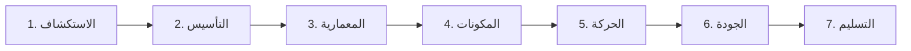

<div align="center" dir="rtl">

<p align="center">
  
</p>

# 🎨 مهندس تصميم تايدي فاكتور (TidyFactor Design) `v1.9.0`
### محرك دورة حياة تصميم الواجهات البرمجية ونظام التصميم المناهض للتكرار والهلوسة

**الأساس الرسمي لهندسة نظم التصميم وبناء النماذج الأولية التفاعلية المعتمدة على الكود ضمن منظومة TidyFactor.**

[](https://www.npmjs.com/package/@tidyfactor/design)
[](LICENSE)
[](README.ar.md)
[](#-بوابة-الجودة-الميكانيكية-ومناهضة-التكرار-anti-slop)
[-green.svg?style=for-the-badge)](#-القواعد-الهيكلية-الـ-15-لمهارات-تايدي-فاكتور)

[ 🇺🇸 English ](README.md) • [ 🇸🇦 العربية ](README.ar.md) • [ 🇮🇷 فارسی ](README.fa.md) • [ 🇪🇸 Español ](README.es.md) • [ 🇧🇷 Português ](README.pt.md) • [ 🇨🇳 中文 ](README.zh.md) • [ 🇩🇪 Deutsch ](README.de.md) • [ 🇫🇷 Français ](README.fr.md)

</div>

---

## 🏛️ الفكرة الجوهرية: فصل "معرفة التصميم" عن "تنفيذ التصميم"

الابتكار البنيوي الأهم في **TidyFactor Design** هو الفصل المعماري التام بين **الذكاء والمعرفة التصميمية** وبين **تنفيذ الكود**:

```
                 معرفة التصميم (DESIGN INTELLIGENCE)
                               │
             ┌─────────────────┴─────────────────┐
             ↓                                   ↓
   الذاكرة التشغيلية (Memory)              سير العمليات (Workflows)
 (قواعد، مصفوفات، سمات، CDL)               (خطوات تنفيذية مرتبة)
             │                                   │
             └─────────────────┬─────────────────┘
                               ↓
                    وكيل الذكاء الاصطناعي
               (Antigravity / Claude / Cursor)
                               ↓
                     نظام التصميم الموحد
                  (brand.yaml + tokens.css)
                               ↓
                  واجهات كود حية تفاعلية
                   (HTML/CSS/JS بدون بناء)
                               ↓
                    الفحص الآلي والتدقيق
                  (ختم المحاور الـ 7 + الرصد)
                               ↓
                    التسليم النهائي للمطور
                  (Production-Ready Handoff)
```

### لماذا هي "Design Engineering Skill" وليست مجرد Prompt أو مكتبة مكونات؟
عندما تطلب من نماذج الذكاء الاصطناعي التقليدية *"صمم لي صفحة هبوط"*، يحاول النموذج اختراع كل شيء دفعة واحدة (الألوان، الخطوط، التوزيع، الحالات، والكود) في برومبت واحد غير منضبط. النتيجة الحتمية هي **الهلوسة والتكرار (AI Slop)**: نفس التدرج البنفسجي، أزرار دعوة غير مثبتة، كروت متداخلة بلا معنى، وتشتت ملفات الـ CSS.

تحول **TidyFactor Design** العملية بالكامل من تخمين عشوائي إلى **نظام تشغيل هندسي منضبط**:

$$\text{الأسلوب التقليدي: } \text{Prompt} \longrightarrow \text{الذكاء الاصطناعي يخمن واجهة متكررة}$$
$$\text{محرك تايدي فاكتور: } \text{موجز التصميم} \longrightarrow \text{قواعد تشغيلية} \longrightarrow \text{نظام موحد} \longrightarrow \text{كود نظيف} \longrightarrow \text{فحص حتمي} \longrightarrow \text{تسليم}$$

---

## ⚡ المقارنة الحاسمة: فيجما (Figma) مقابل TidyFactor Design

مهارة TidyFactor Design هي **البديل البرمجي لـ Figma (Code-Native Alternative)** المخصص لعصر وكلاء البرمجة بالذكاء الاصطناعي:

| وجه المقارنة | فيجما (Figma) | تايدي فاكتور ديزاين (TidyFactor Design) |
|---|---|---|
| **بيئة العمل** | أداة تصميم مرئي ولوحات قماشية (Canvas GUI) | مساحة عمل برمجية حية تعمل مباشرة في المتصفح |
| **محور التركيز** | رسومات موجهة (Vector Graphics) | عناصر قياسية معتمدة على HTML5 / CSS3 / Vanilla JS |
| **المستخدم المستهدف** | مصمم الواجهات وتجربة المستخدم (UI/UX) | وكيل الذكاء الاصطناعي + المطور + مهندس التصميم |
| **نموذج المكونات** | إطارات ومتغيرات مرئية داخل ملفات التطبيق | متغيرات CSS وشاشات ومغلفات للمكونات بـ 8 حالات تفاعلية |
| **بناء النماذج الأولية** | محاكاة انتقالات ونقر بين الشاشات | نموذج أولي تفاعلي حقيقي ومتجاوب بالكامل في المتصفح |
| **تسليم التصميم للمطور** | فجوة شائعة بين التصميم وإعادة كتابته كودياً | **انعدام فجوة التسليم**: التصميم هو الكود الفعلي للإنتاج |
| **الحوكمة وضمان الجودة** | مراجعة بصرية يدوية وتخمين المطورين | **بوابات جودة ميكانيكية**: سكربتات فحص حتمية بمحاور الـ 7 |
| **نطاق المنظومة** | إنتاج الرسومات والواجهات الأولية | إدارة كاملة لدورة حياة التصميم عبر 7 مراحل هندسية |

---

## 🧠 ما هي "الذاكرة التشغيلية" (Operational Memory)؟

ملفات الذاكرة داخل مجلد `references/memory/` **ليست مقالات إنشائية أو نصائح تسويقية**، بل هي **قواعد هندسية، ومصفوفات حسابية، ومحددات تقنية صارمة**:

- **مصفوفة الخطوط والأوزان (`12-typography-matrix.md`)**: جداول دقيقة لاقتران الخطوط العربية واللاتينية بحسابات النسب الرياضية.
- **النماذج الهيكلية للواجهات (`13-layout-archetypes.md`)**: هياكل التصميم الكلية (L1–L4) مع أبعاد المسافات والشبكات.
- **مبادئ وتواقيع الحركة (`04-motion-principles.md`)**: منحنيات التهدئة (Cubic-bezier) وقواعد الوصول لأصحاب الحركة المخففة.
- **مصفوفات تشريح المكونات (`21-` إلى `28-`)**: كتالوجات شاملة لشعارات العناوين، أقسام الهيرو، البطاقات، الأزرار بـ 8 حالات، الفواصل البارامترية، والمقاييس الرقمية.
- **معايير الجودة ومناهضة التكرار (`06-quality-bar.md`)**: المؤشرات الـ 16 لهلوسة الذكاء الاصطناعي والعيوب الـ 11 المحظورة آلياً.
- **قواعد اللغة العربية والاتجاه من اليمين لليسار (`08-arabic-bilingual.md`)**: (خط المصيري للعناوين، وتجوال للمتن، ومنع خط الأميري للعناوين فوق 24px).

بفضل هذا الفصل، لا يحتاج وكيل الذكاء الاصطناعي لإعادة اختراع القواعد، بل يقرأ الحقيقة التشغيلية الموثقة وينفذ بناءً عليها.

---

## 🔄 مراحل دورة حياة التصميم السبع وسجل الأوامر الـ 24

تغطي المهارة دورة حياة التصميم عبر **7 مراحل متسلسلة** يديرها **24 أمراً تنفيذياً (Slash Commands)**:



| المرحلة | الأمر السريع | الهدف التشغيلي | ما يتم حقنه من الذاكرة | المخرج الحتمي |
|---|---|---|---|---|
| **1. الاستكشاف** | `/brief` | موجز التصميم الاستراتيجي وحل المعطيات المجهولة | `workflows/brief.md` + `memory/decision-points.md` + `memory/06-quality-bar.md` | ملف `.tidyfactor/design-brief.snapshot.json` + الموجز |
| **1. الاستكشاف** | `/study` | استخراج الشفرة الوراثية البصرية من موقع أو صورة | `commands/study.md` + `memory/01-design-schools.md` + `memory/06-quality-bar.md` | تقرير تحليلي بخصائص التكوين والسمات |
| **2. التأسيس** | `/init` | بدء نظام تصميم ونموذج أولي جديد من الصفر | `workflows/init-prototype.md` + `memory/architecture.md` + `memory/foundations.md` | مجلد `design-system/` + صفحة `index.html` دلالية |
| **2. التأسيس** | `/brand` | إدارة سمات العلامة في `brand.yaml` / `brand.json` | `commands/brand.md` + `memory/11-brand-json-v2.md` | ملف `brand.yaml` موثق ومطابق للمخطط |
| **2. التأسيس** | `/typography` | اختيار واقتران الخطوط المناسبة لطبيعة المشروع | `commands/typography.md` + `memory/12-typography-matrix.md` | تضمين خطوط جوجل في `tokens.css` والترويسة |
| **2. التأسيس** | `/school` | تحديد المدرسة والتوجه البصري للمشروع | `commands/school.md` + `memory/01-design-schools.md` | تثبيت المدرسة وتوثيقها في `brand.yaml` |
| **2. التأسيس** | `/tokens` | إدارة متغيرات CSS وقيم نظام التصميم | `commands/tokens.md` + `memory/02-design-tokens.md` | تحديث `design-system/tokens.css` |
| **2. التأسيس** | `/palette` | استخراج لوحة الألوان وحساب تباين WCAG AAA | `commands/palette.md` + `scripts/extract_palette.py` | ألوان مستوفية لمعايير التباين للوضع النهاري والليلي |
| **2. التأسيس** | `/assets` | تحسين وضبط أحجام الصور وعزل الخلفيات | `commands/assets.md` + `scripts/optimize_images.py` | صور مضغوطة بصيغة WebP ومفرغة الشفافية |
| **3. المعمارية** | `/layout` | اختيار الهيكل المعماري للصفحات وشبكة التوزيع | `commands/layout.md` + `memory/13-layout-archetypes.md` | بناء حاويات الشبكة L1–L4 المتجاوبة |
| **3. المعمارية** | `/nav-footer` | تركيب أنظمة التنقل (N1-N9) والتذييل (Ft1-Ft8) | `commands/nav-footer.md` + `memory/14-nav-footer-catalog.md` | شريط التنقل المتجاوب وتذييل الصفحة المعتمد |
| **3. المعمارية** | `/page` | إضافة صفحة تسويقية أو محتوى جديد | `workflows/init-prototype.md` + `memory/05-component-anatomy.md` | صفحة `pages/<name>.html` دلالية تقرأ الرموز المشتركة |
| **3. المعمارية** | `/dashboard` | إضافة شاشة لوحة تحكم أو تطبيق كثيفة البيانات | `workflows/init-prototype.md` + `memory/05-component-anatomy.md` | لوحة تحكم بجداول وأرقام واضحة وبطاقات KPI |
| **4. المكونات** | `/components` | إدارة مغلفات المكونات المشتركة بحالاتها الثماني | `commands/components.md` + `memory/05-component-anatomy.md` | ملف `design-system/components.css` المنظم |
| **4. المكونات** | `/states` | ضبط وتوثيق الحالات التفاعلية للمكونات | `commands/states.md` + `memory/05-component-anatomy.md` | حالات التحويم والتركيز والتعطيل والتحميل |
| **5. الحركة** | `/motion` | إضافة وصفات الحركة والتمرير السلس | `commands/motion.md` + `memory/04-motion-principles.md` | ملف `design-system/motion.js` مع مكتبة GSAP |
| **5. الحركة** | `/flow` | ربط مسارات التنقل بين صفحات النموذج الأولي | `commands/flow.md` + `memory/09-prototype-flow.md` | تنقل سلس بين شاشات النموذج التجريبي |
| **5. الحركة** | `/i18n` | دعم العربية وتوجيه الواجهة (RTL/LTR) ثنائي اللغة | `commands/i18n.md` + `memory/08-arabic-bilingual.md` | انعكاس حتمي للاتجاه مع الخطوط العربية المعتمدة |
| **6. الجودة** | `/perf` | فحص ميزانية الأداء وأحجام الملفات والتحميل | `commands/perf.md` + `memory/15-performance-budget.md` | التأكد من أن الوزن الإجمالي للصفحة دون 500 كيلوبايت |
| **6. الجودة** | `/audit` | الفحص الهيكلي الشامل ومطابقة معايير الجودة | `workflows/audit-prototype.md` + `memory/06-quality-bar.md` | تقرير التدقيق بختم المحاور الـ 7 ورصد الأخطاء |
| **6. الجودة** | `/clone` | إعادة بناء واستخراج نظام التصميم من موقع مرجعي | `workflows/clone-prototype.md` + `memory/03-narrative-conversion.md` | استخراج نظيف للرموز بدون نسخ عشوائي للأكواد |
| **6. الجودة** | `/retrofit` | توحيد النماذج المتفرقة تحت مظلة نظام التصميم | `workflows/retrofit-prototype.md` + `memory/07-consistency-contract.md` | إزالة الـ Inline Styles وتوحيدها مع السمات المشتركة |
| **7. التسليم** | `/handoff` | استخراج جداول مواصفات التسليم الموجهة للمطورين | `commands/handoff.md` + `memory/11-brand-json-v2.md` | جداول الربط بين متغيرات التصميم وكود الإنتاج |
| **7. التسليم** | `/deploy` | المعاينة المحلية ونشر الموقع الساكن | `commands/deploy.md` + `memory/06-quality-bar.md` | خادم محلي خفيف للعرض الفوري بدون خطوة تجميع |

---

## 📐 مصفوفات المكونات وهندسة بناء الصفحات (المجلدات 01–03)

يقدم الإصدار `v1.9.0` ثماني مصفوفات معمارية متقدمة في الذاكرة التشغيلية:

```
references/memory/
├── 21-eyebrow-kicker-matrix.md      # 16 تصميماً لشارات الترويسة موزعة على 4 عائلات هيكلية
├── 22-hero-section-matrix.md       # 8 معمارية لأقسام الهيرو مع حركات GSAP وتفاصيل SVG
├── 23-card-architecture-matrix.md   # 16 بديلاً للبطاقات مع تثبيت دائم للأزرار في الأسفل
├── 24-button-cta-matrix.md          # 16 تصميماً للأزرار مع مصفوفة الحالات التفاعلية الـ 8 كاملة
├── 25-divider-separator-matrix.md   # فواصل الأقسام البارامترية مع تموجات SVG التفاعلية
├── 26-metrics-stat-matrix.md        # 12 بطاقة للمقاييس الإحصائية بأرقام ثابتة العرض tabular-nums
├── 27-list-indicator-matrix.md      # 12 مؤشراً لقوائم الثقة والتحقق خالية من الإيموجي العشوائي
└── 28-shared-motion-primitives.md   # أساسيات الحركة المشتركة مع مكتبة GSAP وحركات رسم الـ SVG
```

### القواعد المعمارية الثابتة:
1. **تثبيت أزرار الإجراء في الأسفل (`mt-auto`)**: جميع البطاقات تعتمد `display: flex; flex-direction: column;` مع إلزامية وضع `margin-top: auto` لأزرار الإجراء لمنع تباين ارتفاع الأزرار في الصف الواحد.
2. **ملكية فواصل الأقسام**: في المجلد الثالث للفواصل، ينتمي الفاصل إلى **القسم السابق (Outgoing)** ويستمد لونه من القسم اللاحق، مما يلغي تماماً الفجوات والخطوط الفاصلة المشوهة.
3. **عزل الزخارف التراثية ومنع تداخلها مع النصوص**: الزخارف الهندسية (المشربية، زهرة اللوتس، الخط الكوفي) مخصصة فقط لفواصل الأقسام أو كخلفيات مائية باستخدام `mask-image` بشفافية لا تتجاوز $\le 0.08$ دون أي تداخل مع النصوص إطلاقاً.

---

## ⚡ القاعدة 15: كفاءة التوكن وأولوية YAML (YAML Primacy)

تطبيقاً للقاعدة 15، تعتمد TidyFactor Design صياغة **YAML** كمعيار أساسي للطبقة الإدراكية:
- **توفير 40% من التوكينات**: يستهلك `brand.yaml` قرابة 1,290 توكين مقارنة بـ 2,180 توكين في JSON بسبب التخلص من الأقواس وعلامات التنصيص والفواصل.
- **منع أخطاء التركيب**: القضاء التام على أخطاء الفاصلة الزائدة (Trailing Commas) التي تقع فيها النماذج اللغوية.
- **التوافق المزدوج الحتمي**: تقرأ كافة أدوات المهارة ملف `brand.yaml` أولاً، ثم تنتقل تلقائياً إلى `brand.json` للمشاريع السابقة.

---

## 🛡️ بوابة الجودة الميكانيكية ومناهضة التكرار (Anti-Slop)

يقوم المحرك برصد ورفض الأنماط المبتذلة للذكاء الاصطناعي آلياً أثناء أمر `/audit`:

### 🚫 المؤشرات الـ 16 لهلوسة الذكاء الاصطناعي (AI Tells)
1. **هيرو التدرج البنفسجي (Purple Gradient)**: خلفية من البنفسجي إلى الوردي مع نص أبيض متمركز.
2. **خط إنتر في كل مكان (Inter-Everywhere)**: استخدام خط واحد غير مقترن لكافة النصوص والعناوين.
3. **شبكة الميزات الثلاثية المتطابقة**: 3 أعمدة متساوية بأيقونات مكررة وعناوين من سطرين.
4. **البطاقات المتداخلة (Card-in-Card)**: بطاقات داخل بطاقات بدون أي مبرر دلالي.
5. **العناوين بتدرج نصي مشوه**: استخدام `background-clip: text` بشكل عشوائي ومبهرج.
6. **الشريط الملون الجانبي**: شريط سميك 4–6 بكسل على حافة البطاقات كبديل رخيص عن التصميم الحقيقي.
7. **الهيرو الكامل المتمركز**: شاشة هيرو بارتفاع كامل 100vh تتوسطها جملة قصيرة وزر ضخم.
8. **الأسود والأبيض الصريحين**: استخدام `#000000` أو `#ffffff` بدون تدريج محايد مدروس.
9. **التماثل بين الصفحات**: تكرار نفس التوزيع الهيكلي في الصفحات المتتالية للموقع.
10. **شريط التنقل النمطي**: شعار على اليمين، 4 روابط في الوسط، وزر على اليسار مع خط سفلي 1px.
11. **تذييل الصفحة النمطي**: 4 أعمدة مكررة (المنتج، الشركة، الموارد، القانونية) وروابط تواصل.
12. **خلفيات الكتل العضوية المشوهة (Aurora Blobs)**: بقع لونية متحركة تشتت الانتباه خلف النصوص.
13. **الكرات ثلاثية الأبعاد العائمة**: كرات ودوائر مموهة تطفو بلا هدف خلف العناوين.
14. **العناوين المائلة المفتعلة**: تحويل كلمة واحدة عشوائية في العنوان إلى مائل (`تصميم <em>ذكي</em>`).
15. **تأخير تحميل الصورة الأساسية**: وضع `loading="lazy"` على صورة الهيرو الرئيسية مما يدمر سرعة LCP.
16. **إحصائيات وهمية مخترعة**: اختلاق أرقام مثل *"ثقة أكثر من 50,000 عميل"* بدون بيانات حقيقية.

### 🏷️ ختم المحاور السبعة للتقييم الذاتي
يجب أن يُختم كل مكون ومخطط يتم توليده بما يلي:
`/* Pre-emit critique: P5 H5 E5 S5 R5 V5 D5 */`
- **P** — الأصالة والالتزام بالمدرسة الفنية المختارة
- **H** — التوازن الهرمي البصري ووضوح نقاط الجذب
- **E** — العزل البرمجي التام وانعدام الـ Inline CSS/JS
- **S** — اكتمال الحالات التفاعلية الثماني للمكونات
- **R** — سلامة التوجيه العربي والتوافق الدقيق مع RTL
- **V** — سلاسة ونعومة الحركة وسرعة التهدئة (أقل من 200 مللي ثانية)
- **D** — التوافق الحتمي مع موجز المشروع وملف `brand.yaml`

---

## 🎨 القواعد والأسس البرمجية المدعومة (8 CSS Foundations)

يتم قفل الأساس البرمجي مرة واحدة لكل مشروع، ويمنع الخلط بينها:
1. **Native CSS**: كود CSS حديث وخفيف بدون أي مكتبات خارجية وبأعلى درجات التوافق.
2. **Tailwind CSS**: نمط الأدوات المساعدة مع ربط كامل لسمات نظام التصميم.
3. **daisyUI**: فئات مكونات دلالية مبنية فوق Tailwind مع دعم القوالب الجاهزة.
4. **Hybrid**: مزيج متوازن بين متغيرات التصميم الأصلية وأدوات التنسيق السريعة.
5. **shadcn/ui**: معمارية المكونات الحديثة الخالية من التبعات.
6. **Pico CSS**: واجهات فائقة الخفة تعتمد على وسوم HTML الدلالية مباشرة.
7. **Bootstrap 5**: دعم المشاريع المؤسسية القديمة عبر استبدال متغيرات SASS.
8. **Alpine.js**: تفاعلات برمجية خفيفة بدون الحاجة لبناء تطبيقات الصفحة الواحدة المعقدة (SPA).

---

## 🚀 التثبيت وطريقة البدء

يمكن تثبيت المهارة عبر سطر أوامر TidyFactor أو مباشرة عبر أي وكيل برمجة:

```bash
# عبر سطر أوامر تايدي فاكتور (NPM)
npx @tidyfactor/cli add tidyfactor-design

# عبر معيار مهارات الوكلاء المفتوح (Claude Code / Cursor / Windsurf)
npx skills add TidyFactor/Design
```

### مسار العمل النموذجي:
```bash
# 1. تثبيت موجز التصميم وحل المجهولات
/brief

# 2. بناء نظام التصميم والصفحة الأولى
/init

# 3. استخراج ألوان العلامة من الشعار
/palette --source assets/logo.png

# 4. تدقيق الجودة وفحص الأخطاء الهيكلية
/audit

# 5. استخراج مواصفات التسليم للمطورين
/handoff
```

---

## 🏛️ الترخيص والحوكمة

- **الترخيص**: Apache-2.0. مفتوح المصدر ومجاني للاستخدام الشخصي والتجاري.
- **الحوكمة**: تخضع المهارة بالكامل لـ **القواعد الهيكلية الـ 15** لمنظومة مهارات تايدي فاكتور.
- **المنظومة**: جزء من **منظومة TidyFactor** ([tidyfactor.com](https://tidyfactor.com)) برعاية وتطوير **الوكالة (Alwkala)** ([alwkala.com](https://alwkala.com)).
