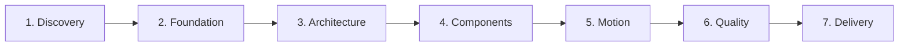
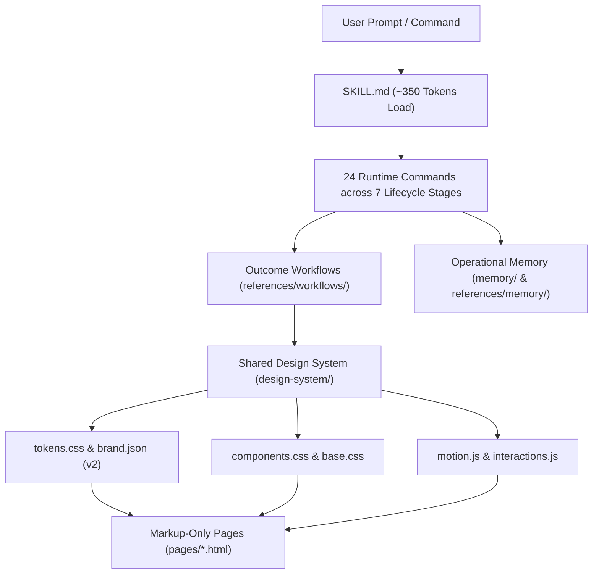

<div align="center">

<p align="center">
  
</p>

# 🎨 TidyFactor Design `v1.3.8`
### Code-Native UI Design Lifecycle Engine & Anti-Slop Design System Suite

**The official UI design & interactive prototyping foundation for the TidyFactor Ecosystem.**

[](https://www.npmjs.com/package/@alwkala/tidyfactor-design)
[](LICENSE)
[](README.ar.md)
[](#-anti-slop-governance--quality-bar-rule-8)
[-green.svg?style=for-the-badge)](#-license--governance)

[✨ Live Demo](https://alwkala.com/tidyfactor-design/) • [🖼️ Visual Showcase](#%EF%B8%8F-visual-showcase--surface-demos) • [⚡ 24 Slash Commands](#-the-7-ui-design-lifecycle-stages--24-command-registry) • [🎨 8 CSS Foundations](#-8-pluggable-css-foundations) • [🛡️ Anti-Slop Rules](#-anti-slop-governance--quality-bar-rule-8) • [📖 بالعربية](README.ar.md)

</div>

---

> [!NOTE]
> **TidyFactor Design** is an AI-era, code-native alternative to Figma and complete UI Design Lifecycle Engine. It empowers developers, design engineers, and AI coding agents (*Google Antigravity, Claude Code, Cursor, Codex, Windsurf*) to manage all 7 stages of UI design—from initial discovery through developer handoff—using clean, interactive HTML/CSS/JS with zero build steps and zero per-page CSS/JS drift.

---

## 🌟 Value Proposition & Why TidyFactor Design?

| For Developers | For Design Engineers | For AI Coding Agents |
|---|---|---|
| **Zero Build Step**: No webpack/vite compilation needed; open `.html` files directly in any browser. | **Figma Alternative**: Design directly in production-ready code with responsive live interactivity. | **Token-Efficient**: Modular slash commands load only necessary context (~350 tokens) per task. |
| **Zero Per-Page Drift**: All visual styles and components live strictly inside `design-system/`. | **8 Pluggable Foundations**: Choose Native CSS, Tailwind, daisyUI, shadcn/ui, Pico, Bootstrap, or Alpine. | **Anti-Slop Certified**: Structurally blocks generic AI design tells via 16 mechanical quality rules. |
| **Production Handoff**: Clean, predictable CSS variables and HTML markup ready for framework integration. | **Native RTL & Arabic**: Bidi-first layout support with El Messiri + Tajawal typography pairing. | **Deterministic Workflows**: 100% compliance across 24 commands with automated validation tooling. |

---

## 🖼️ Visual Showcase & Surface Demos

`tidyfactor-design` generates rich, responsive, anti-slop visual surfaces tailored to specific domain registers:

### 1. Dual-Mode Design System (Light & Dark)
*Dynamic theme switching powered by `brand.json` v2 token mappings (`colors.light` & `colors.dark`) without page reloads.*

| Light Mode Surface | Dark Mode Surface |
|---|---|
|  |  |

---

### 2. Application & Analytics Dashboards
*Data-rich layouts featuring tabular numeric formatting, KPI stat cards, filters, and shell rails.*


---

### 3. E-Commerce & Product Showcase
*High-conversion commerce surfaces with gallery previews, spec tables, variant selectors, and CTAs.*


---

### 4. Editorial & Magazine Publishing
*Literary typography hierarchy featuring Markazi Text / El Messiri headings, multi-column storytelling, and colophons.*


---

### 5. Atmospheric & Cinematic Showcase
*Full-bleed atmospheric storytelling with ambient background color shifts, canvas scroll-film reveals, and specular sheens.*


---

## 🔄 The 7 UI Design Lifecycle Stages & 24 Command Registry

`tidyfactor-design` structures the entire design workflow into **7 sequential stages**, providing 24 specialized slash commands that load precise operational memory without context bloat:



---

### Stage 1: Discovery & Research
*Extract design DNA, establish context, and determine visual fit before writing code.*

| Command | Signature Syntax | What It Loads | Output & Value |
|---|---|---|---|
| **`/study`** | `/study [url\|image]` | `memory/01-design-schools.md`<br>`memory/06-quality-bar.md` | **Design DNA Report**: Samples computed styles (`getComputedStyle()`), font family declarations, and macrostructure without copying raw layout or text. |
| **`/brief`** | `/brief` | `memory/01-design-schools.md`<br>`memory/13-layout-archetypes.md` | **Design Context Gate**: Executes 3-question context gate (Audience mode: inspire/evaluate/act/learn, Surface type, Tone school) & Fit Test filter. |

---

### Stage 2: Foundation & System Setup
*Scaffold identity tokens, brand schema, color systems, typography pairings, and design schools.*

| Command | Signature Syntax | What It Loads | Output & Value |
|---|---|---|---|
| **`/init`** | `/init [dir] [--foundation=name]` | `references/workflows/init-prototype.md`<br>`references/memory/architecture.md` | **Project Scaffold**: Scaffolds clean `design-system/` directory, locked CSS foundation, `brand.json`, and initial index page. |
| **`/brand`** | `/brand` | `memory/11-brand-json-v2.md`<br>`memory/02-design-tokens.md` | **Brand Schema v2**: Configures dual-mode `colors.light/dark` (16 tokens each), `shadows.focusRing`, motion tokens, and accessibility floors. |
| **`/typography`** | `/typography` | `memory/12-typography-matrix.md`<br>`memory/08-arabic-bilingual.md` | **Typography Matrix**: Routes to 7 curated Arabic + Latin font pairings (e.g. El Messiri/Tajawal, Markazi Text/IBM Plex, Jomhuria display). |
| **`/school`** | `/school [movement]` | `memory/01-design-schools.md` | **Visual Movement**: Locks design language direction (Minimalist, Brutalism, Glassmorphism, Neumorphism, Swiss, Luxury). |
| **`/tokens`** | `/tokens` | `memory/02-design-tokens.md`<br>`references/memory/architecture.md` | **Token Single Source**: Manages `design-system/tokens.css` custom properties and mapping rules. |
| **`/palette`** | `/palette <image>` | `memory/02-design-tokens.md`<br>`memory/10-python-tooling.md` | **Palette Extractor**: Runs `extract_palette.py` to derive dominant brand colors and WCAG 2.1 AA contrast scores. |
| **`/assets`** | `/assets` | `memory/10-python-tooling.md` | **Asset Hygiene**: Automated background removal (`rembg`), WebP compression, and image optimization (`optimize_images.py`). |

---

### Stage 3: Architecture & Layout Structuring
*Blueprint page macrostructures, navigation patterns, and surface layouts.*

| Command | Signature Syntax | What It Loads | Output & Value |
|---|---|---|---|
| **`/layout`** | `/layout [archetype]` | `memory/13-layout-archetypes.md`<br>`references/memory/architecture.md` | **Layout Archetypes**: Applies 8 specialized blueprints (`fullbleed`, `editorial`, `spatial`, `interface`, `minimal`, `product`, `store`, `auto`). |
| **`/nav-footer`** | `/nav-footer` | `memory/14-nav-footer-catalog.md`<br>`memory/06-quality-bar.md` | **Nav & Footer Catalog**: Selects Navigation (N1–N9, e.g. Floating Pill, Newspaper Masthead) & Footer (Ft1–Ft8) avoiding generic AI templates. |
| **`/page`** | `/page <name>` | `references/workflows/init-prototype.md`<br>`memory/05-component-anatomy.md` | **Marketing Screen**: Scaffolds content or landing page markup ONLY (`pages/<name>.html`) with zero inline CSS/JS. |
| **`/dashboard`** | `/dashboard <name>` | `references/workflows/init-prototype.md`<br>`memory/05-component-anatomy.md` | **Application Screen**: Scaffolds data dashboard or web app shell with stat cards, data tables, and filters. |

---

### Stage 4: Component Design & State Matrix
*Build reusable UI component classes with complete interactive state handling.*

| Command | Signature Syntax | What It Loads | Output & Value |
|---|---|---|---|
| **`/components`** | `/components` | `memory/05-component-anatomy.md`<br>`references/memory/architecture.md` | **Component Library**: Builds reusable classes in `design-system/components.css` and generates 8-State Demo Wrappers (`.preview.html`). |
| **`/states`** | `/states` | `memory/05-component-anatomy.md`<br>`memory/07-consistency-contract.md` | **State Matrix**: Enforces 8 interactive component states (Default, Hover, Active, Focus-Visible, Disabled, Loading, Error, Success). |

---

### Stage 5: Motion & Interactive Experience
*Choreograph entrance reveals, scroll-driven effects, micro-interactions, and localization.*

| Command | Signature Syntax | What It Loads | Output & Value |
|---|---|---|---|
| **`/motion`** | `/motion` | `memory/04-motion-principles.md` | **Motion Choreography**: Implements 4-tier whimsy taxonomy, background `#ambient` color shifts, canvas scroll-film engines, and z-stack layers. |
| **`/flow`** | `/flow` | `memory/09-prototype-flow.md` | **Interactive Flow**: Wires floating prototype navigation toolbar (`proto-nav.js`) for screen-to-screen clickable testing. |
| **`/i18n`** | `/i18n` | `memory/08-arabic-bilingual.md` | **Arabic & RTL Engine**: Configures `dir="rtl"` logical properties, Arabic typography, and cultural modesty guidelines. |

---

### Stage 6: Quality Assurance & Audit
*Verify performance budgets, enforce anti-slop rules, and reverse-engineer legacy sites.*

| Command | Signature Syntax | What It Loads | Output & Value |
|---|---|---|---|
| **`/perf`** | `/perf` | `memory/15-performance-budget.md` | **Performance Budget Audit**: Generates data table verifying asset weight limits (hero cutout ≤ 400KB, fonts ≤ 3 families/4 weights, logo ≤ 40KB). |
| **`/audit`** | `/audit` | `references/workflows/audit-prototype.md`<br>`memory/06-quality-bar.md` | **Quality Bar Audit**: Executes read-only compliance report against 16 AI anti-pattern tells and structural consistency contract. |
| **`/clone`** | `/clone <url>` | `references/workflows/clone-prototype.md`<br>`memory/03-narrative-conversion.md` | **Design System Extraction**: Reverse-engineers external sites by sampling computed styles and token mapping into `brand.json`. |
| **`/retrofit`** | `/retrofit` | `references/workflows/retrofit-prototype.md`<br>`memory/07-consistency-contract.md` | **Prototype Unification**: Refactors drifted multi-page prototypes to adopt a central shared `design-system/`. |

---

### Stage 7: Delivery & Developer Handoff
*Package production assets, export documentation, and run deployment servers.*

| Command | Signature Syntax | What It Loads | Output & Value |
|---|---|---|---|
| **`/handoff`** | `/handoff` | `memory/11-brand-json-v2.md`<br>`memory/05-component-anatomy.md` | **Developer Handoff Package**: Exports token mapping tables, 8-state component specs, grid container rules, and motion curves into `docs/handoff/`. |
| **`/deploy`** | `/deploy` | `memory/06-quality-bar.md`<br>`memory/10-python-tooling.md` | **Production Export**: Launches local preview server, runs `test_build.py`, asset minification, and generates release bundle (`build.py`). |

---

## 🎨 8 Pluggable CSS Foundations

Lock a CSS foundation once per project during `/init`. Never mix foundations in the same project:

| Foundation | Command Flag | Best For | Architecture Details |
|---|---|---|---|
| **Native CSS** | `--foundation=native` | Pure zero-dependency design systems | Custom CSS variables & semantic component classes in `tokens.css` & `components.css`. |
| **Tailwind Utility** | `--foundation=tailwind` | Fast utility-first prototyping | Tailwind v4 utility engine via CDN with custom design-token utility mappings. |
| **daisyUI** | `--foundation=daisyui` | Rapid web application screens | Tailwind CDN + daisyUI component library themed via custom token CSS variables. |
| **Hybrid** | `--foundation=hybrid` | Signature brand apps & dashboards | daisyUI composite application widgets + Native CSS for signature brand components. |
| **shadcn/ui** | `--foundation=shadcn` | Accessible primitive tokens | Tailwind v4 + Radix UI accessible token mapping & design primitive styles. |
| **Pico CSS v2** | `--foundation=pico` | Ultra-fast semantic minimalist sites | Semantic HTML5 tags styled cleanly without utility class bloat. |
| **Bootstrap 5.3** | `--foundation=bootstrap` | Enterprise apps & dark themes | Enterprise CSS variables with native `data-bs-theme="dark"` theme switching. |
| **Alpine + Tailwind** | `--foundation=alpine` | Interactive client micro-interactions | Alpine.js reactive state directives (`x-data`, `x-on`) paired with Tailwind v4 utilities. |

---

## 🛡️ Anti-Slop Governance & Quality Bar (Rule 8)

`tidyfactor-design` enforces strict anti-slop rules derived from premier design engineering standards (*Taste-Skill*, *Hallmark*, *Anthropic Frontend-Design*, *Website Cloner*).

> [!IMPORTANT]
> **Pre-Emit Self-Critique Stamp**: Every generated prototype page or component is evaluated on 6 axes: **Philosophy (P)**, **Hierarchy (H)**, **Execution (E)**, **Specificity (S)**, **Restraint (R)**, and **Variety (V)**. Scores < 3 trigger an automatic revision pass before emission:
> `/* Pre-emit critique: P5 H4 E5 S4 R5 V5 */`

### ⚙️ The Three-Dial System (`brand.json`)
Configure layout asymmetry, animation depth, and data density dynamically:

```json
{
  "dials": {
    "designVariance": 8,
    "motionIntensity": 6,
    "visualDensity": 4
  }
}
```

### ⛔ 16 Auto-Rejected AI Anti-Patterns

| Anti-Pattern Tell | Why It Fails | Mechanical Quality Rule |
|---|---|---|
| **Purple-Gradient Hero** | Most recognized AI template tell | Single anchor hue; no gradient hero backgrounds. |
| **Inter-Everywhere** | Unpaired single-font layout | Pair distinctive display + body faces (`El Messiri` / `Tajawal` / `Outfit`). |
| **3-Column Feature Grid** | Generic 3-equal card row | Asymmetric grid, variable card heights, or inline icon lists. |
| **Card-in-Card Bloat** | Unnecessary nested container cards | Banned. Flat borders or surface tinting without extra containers. |
| **Gradient Headline Fill** | `background-clip: text` linear gradient | Solid high-contrast text; reserve gold gradient for dark luxury accents. |
| **Side-Stripe Card** | 4–6px thick border on left edge of card | Banned. Clean 1px border or subtle elevation shadow. |
| **Full-Viewport Hero** | `min-height: 100vh` centered short sentence | Hero desktop top padding capped at `pt-24` (6rem); headline max 2 lines. |
| **Pure Black / White** | Pure `#000000` or `#ffffff` flat surfaces | Must use tinted neutrals (`#0F172A`, `#F8FAFC`). |
| **Default Sameness** | Same macrostructure across consecutive pages | Vary layout archetypes across project screens (`memory/13-layout-archetypes.md`). |
| **Specimen Fall-Through**| Defaulting to editorial `01 - HELLO` specimen | Match surface archetype to domain register (e.g. `interface` for SaaS). |
| **The AI Nav** | Wordmark left, 4 links center, CTA right | Banned. Use N1–N9 catalog (e.g. N1 Floating Pill or N5 Edge-Aligned). |
| **The AI Footer** | 4 equal columns + social row + copyright | Banned. Use Ft1–Ft8 catalog (e.g. Ft1 Mast-Headed or Ft5 Letter Close). |
| **Aurora-Blob Background** | Organic mesh blobs drifting behind hero | Banned. Use soft radial `#glow` layer or clean ambient ground. |
| **Floating-Orb Decoration** | Blurred 3D spheres drifting behind text | Banned. Keep background clean and focused on copy/media. |
| **Italic Header Trick** | Flipping one word in header to italic | Banned. Rely on genuine typographic hierarchy and weight contrast. |
| **Lazy-Loaded LCP** | Adding `loading="lazy"` to hero image | Banned. Hero LCP images must load eager; lazy-load below-the-fold only. |

---

## 🏛️ System Architecture & File Structure



### 📁 Project Directory Layout

```
my-prototype/
├── design-system/
│   ├── tokens.css        ← Single source of truth: color, typography, spacing, radius, motion
│   ├── base.css          ← CSS reset, typography inheritance & dark mode rules
│   ├── components.css    ← Shared component library (buttons, cards, navbars, modals)
│   ├── utilities.css     ← Spatial layout & container helper classes
│   ├── motion.js         ← Shared scroll-reveals, ambient color shifts & choreography
│   ├── interactions.js   ← Shared dropdowns, tabs, modals & toggle behavior
│   └── brand.json        ← Identity tokens, voice registers & brand dials (v2 schema)
├── pages/
│   ├── index.html        ← Landing page markup ONLY (zero inline CSS/JS)
│   ├── dashboard.html    ← App dashboard markup ONLY
│   └── pricing.html      ← Pricing table markup ONLY
├── scripts/              ← Python Power Tools (palette extraction, BG removal, WebP compression)
├── docs/                 ← Handoff specs and research documentation
├── proto-nav.js          ← Dev-only floating prototype toolbar
└── brand.json            ← Project-root brand identity configuration
```

---

## 🇸🇦 Native Arabic & RTL System

`tidyfactor-design` provides first-class support for bilingual Middle Eastern digital products:

- **Typography Rules**: Headings = **El Messiri**, Body = **Tajawal**. Never Amiri for headings above 24px.
- **RTL Logical Properties**: Layout direction switching (`dir="rtl"` / `dir="ltr"`) uses CSS logical properties (`margin-inline-start`, `padding-inline`, `border-inline-end`).
- **Modesty Guidelines**: Cultural visual rules for regional targets (modest photography selection, proper emblem placement).
- **RTL Nav & Toolbar**: Floating prototype toolbar (`proto-nav.js`) automatically mirrors alignment in RTL mode.

---

## 🚀 Quick Start & CLI Workflows

Published on NPM as [**`@alwkala/tidyfactor-design`**](https://www.npmjs.com/package/@alwkala/tidyfactor-design).

### 1. Interactive Scaffold CLI

```bash
# Scaffold new prototype workspace
npx @alwkala/tidyfactor-design my-proto

# Specify CSS Foundation (--foundation=native|tailwind|daisyui|hybrid|shadcn|pico|bootstrap|alpine)
npx @alwkala/tidyfactor-design my-app --foundation=native --school=luxury

# Automated AI Agent / CI mode (zero prompts)
npx @alwkala/tidyfactor-design my-design-system --yes
```

### 2. Inject Agent Skill into Existing Workspace

```bash
npx @alwkala/tidyfactor-design add-skill
```
*Injects `.agents/skills/tidyfactor-design/`, `.claude-skill/`, `memory/`, `templates/`, and `AGENTS.md` directly into your existing repo.*

### 3. Local Preview & Development Server

```bash
# Launch zero-dependency local preview server
python -m http.server 8123

# Open browser at http://localhost:8123
```

---

## 🏛️ TidyFactor Skill Methodology & 8/8 Governance Architecture

You will notice the badge **`Architect Score: 8/8 Pass (100%)`** across TidyFactor repositories. What does this mean?

The **TidyFactor Skill Methodology** (governed by [`tidyfactor-skill-architect`](file:///c:/wamp64/www/TidyFactor/Skills/Skills-LAB/.agents/skills/tidyfactor-skill-architect/)) is an opinionated, production-grade architectural framework for building AI Agent Skills. It guarantees that an agent skill is not a giant, uncontrolled prompt or a random file dump, but a structured, deterministic runtime system optimized for low latency, zero context bloat, and strict execution quality.

### 📋 The 8 Architectural Rules Every TidyFactor Skill Must Pass

| # | Governance Rule | Mechanical Specification | Value to User & AI Agents |
|---|---|---|---|
| **1** | **Dispatcher Discipline** | `SKILL.md` acts strictly as an entry-point command dispatcher (~350 tokens). It declares what commands exist and routes to workflow/memory files without carrying task execution instructions itself. | **Zero Context Waste**: Your AI Agent loads only ~350 tokens on startup instead of parsing 2,000+ lines of domain rules. |
| **2** | **One Workflow = One Outcome** | Every workflow file (`references/workflows/`) owns exactly one outcome and ends with an explicit, mechanical validation checklist. | **Deterministic Results**: Prevents AI hallucination or half-finished steps; guarantees tasks complete against a checklist. |
| **3** | **Operational Memory** | Files in `memory/` contain pure facts, rules, matrices, templates, and schemas — zero prose or narrative. | **High Signal-to-Noise**: Injects crisp, actionable domain constraints directly into the prompt without token bloat. |
| **4** | **No Empty Structures** | Folder hierarchies (`references/commands/`, `references/workflows/`, `memory/`) exist only when holding multiple items. | **Clean Repository**: Eliminates unnecessary file nesting and maintains portable simplicity. |
| **5** | **Philosophy Isolation** | Branding rationale, manifestos, or methodologies belong in optional `memory/philosophy.md` — never inside operational execution files. | **Pure Technical Execution**: Agents read only execution rules without parsing marketing philosophy. |
| **6** | **Trigger-Justified Growth** | New commands and memory files are added strictly when triggered by quantifiable lifecycle needs (e.g. 7-stage lifecycle expansion). | **No Speculative Bloat**: Keeps the skill lean, fast, and maintainable. |
| **7** | **Anti-Slop & Quality Bar** | Frontend generation workflows enforce Pre-Emit Self-Critique (1-5 scoring on 6 axes: P, H, E, S, R, V) and 16 mechanical AI anti-pattern checks. | **Guaranteed Aesthetic Quality**: Blocks generic "AI-looking" code, purple hero gradients, wrapped CTAs, and duplicate UI patterns. |
| **8** | **Multi-Target Parity Validation** | 100% parity across Agent skill targets (`.agents`, `.claude-skill`, and root repo files) verified automatically via `node tools/validate-skill.js`. | **Cross-Platform Compatibility**: Works identically in Antigravity, Claude Code, Cursor, Codex, and Windsurf. |

---


---

## 🏛️ TidyFactor Ecosystem Architecture

**TidyFactor** is a modular web architecture and AI coding agent skill ecosystem built on clear separation of concerns across the product lifecycle:

```
TidyFactor Organization (github.com/TidyFactor)
│
├── Design Skills
│   ├── Cinematic    → Experience / "Wow"     (Apple × Cartier Scroll-Driven Landing Pages)
│   ├── Design       → Prototype / "Build"    (Code-Native UI Design Engine & Figma Alternative)
│   └── Styler       → Production / "Ship"    (Framework Styler & RTL Polish Engine)
│
├── Development Skills
│   ├── HTML         → Content & Static       (Semantic SEO & Static Platform Starter)
│   ├── HTMX         → Hypermedia             (Server-Driven Micro-Interactions)
│   ├── JS           → Vanilla SPA            (Framework-Free Reactive ES Modules)
│   ├── PHP          → Server-Rendered        (Modern PHP 8.x Component UI & Architecture)
│   └── Next         → Multi-Tenant SaaS      (Next.js 16, React 19, Supabase RLS & Dev-Perf)
│
└── Growth Skills
    └── Marketing    → Growth / Revenue       (Direct Response, Pillar SEO & Content Lifecycles)
```

### 💎 Frontend Triad

```
                TidyFactor
                    │
          ┌─────────┼─────────┐
          │         │         │
      Cinematic   Design    Styler
          │         │         │
      Experience Prototype Production
          │         │         │
       "Wow"      "Build"   "Ship"
```

### 📦 Community Package & Skill Parity

| Track | Category | GitHub Repository | Agent Skill | NPM Package |
| :--- | :--- | :--- | :--- | :--- |
| **Cinematic** | Design | [`TidyFactor/Cinematic`](https://github.com/TidyFactor/Cinematic) | `tidyfactor-cinematic` | [`@alwkala/tidyfactor-cinematic`](https://www.npmjs.com/package/@alwkala/tidyfactor-cinematic) |
| **Design** | Design | [`TidyFactor/Design`](https://github.com/TidyFactor/Design) | `tidyfactor-design` | [`@alwkala/tidyfactor-design`](https://www.npmjs.com/package/@alwkala/tidyfactor-design) |
| **Styler** | Design | [`TidyFactor/Styler`](https://github.com/TidyFactor/Styler) | `tidyfactor-styler` | [`@alwkala/tidyfactor-styler`](https://www.npmjs.com/package/@alwkala/tidyfactor-styler) |
| **Next** | Development | [`TidyFactor/Next`](https://github.com/TidyFactor/Next) | `tidyfactor-next` | [`@alwkala/tidyfactor-next`](https://www.npmjs.com/package/@alwkala/tidyfactor-next) |
| **HTML** | Development | [`TidyFactor/HTML`](https://github.com/TidyFactor/HTML) | `tidyfactor-html` | [`@alwkala/tidyfactor-html`](https://www.npmjs.com/package/@alwkala/tidyfactor-html) |
| **HTMX** | Development | [`TidyFactor/HTMX`](https://github.com/TidyFactor/HTMX) | `tidyfactor-htmx` | [`@alwkala/tidyfactor-htmx`](https://www.npmjs.com/package/@alwkala/tidyfactor-htmx) |
| **JS** | Development | [`TidyFactor/JS`](https://github.com/TidyFactor/JS) | `tidyfactor-js` | [`@alwkala/tidyfactor-js`](https://www.npmjs.com/package/@alwkala/tidyfactor-js) |
| **PHP** | Development | [`TidyFactor/PHP`](https://github.com/TidyFactor/PHP) | `tidyfactor-php` | [`@alwkala/tidyfactor-php`](https://www.npmjs.com/package/@alwkala/tidyfactor-php) |
| **Marketing** | Growth | [`TidyFactor/Marketing`](https://github.com/TidyFactor/Marketing) | `tidyfactor-marketing` | [`@alwkala/tidyfactor-marketing`](https://www.npmjs.com/package/@alwkala/tidyfactor-marketing) |

---

## 👨‍💻 Organization & Support

- 🌐 **Official Website:** [https://tidyfactor.com/](https://tidyfactor.com/)
- 📚 **Official Documentation:** [https://tidyfactor.com/documentation](https://tidyfactor.com/documentation)
- 🤝 **Official Partner Website:** [Alwkala Digital Agency](https://alwkala.com/)
- 🐙 **GitHub Organization:** [github.com/TidyFactor](https://github.com/TidyFactor)
- 📧 **Business Inquiries:** [hello@tidyfactor.com](mailto:hello@tidyfactor.com)
- 📱 **WhatsApp:** [+20 101 665 6899](https://wa.me/201016656899)
- 📞 **Phone:** +20 101 665 6899
- 📍 **Location:** Cairo, Egypt

---

## 📜 License

Licensed under the **Apache License 2.0**. Copyright (c) 2026 [TidyFactor](https://tidyfactor.com) & [Alwkala](https://alwkala.com).
