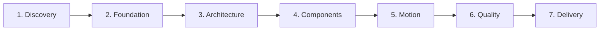

<div align="center">

# 🎨 TidyFactor Design `v1.10.0`
### The Code-Native UI Design Lifecycle Engine, Anti-Slop Design System Suite & Interactive Prototyping Architecture for AI Coding Agents

Give **Google Antigravity, Claude Code, Cursor, OpenAI Codex, or Windsurf** a senior design engineer's brain that transforms raw intent into production-grade design systems and interactive prototypes — without Figma handoff friction, generic AI slop, or per-page CSS drift.

[](https://www.npmjs.com/package/@tidyfactor/design)
[](https://github.com/TidyFactor/Design/stargazers)
[](LICENSE)
[](https://github.com/TidyFactor)
[](SKILL.md)
[](README.ar.md)
[-green.svg?style=for-the-badge)](#-the-15-structural-rules-of-tidyfactor-skills)
[](SKILL.md)

[ English ](README.md) • [ العربية ](README.ar.md) • [ فارسی ](README.fa.md) • [ Español ](README.es.md) • [ Português ](README.pt.md) • [ 简体中文 ](README.zh.md) • [ Deutsch ](README.de.md) • [ Français ](README.fr.md)

<br/><br/>

<p align="center">
  
</p>

</div>

---

## 📚 Table of Contents

- [🎯 Why TidyFactor/Design — The Code-Native Alternative to Figma](#-why-tidyfactordesign--the-code-native-alternative-to-figma)
- [🏛️ The Core Breakthrough: Design Intelligence vs. Execution](#%EF%B8%8F-the-core-breakthrough-design-intelligence-vs-execution)
- [🚀 Quick Start](#-quick-start)
- [🧭 Dual-Mode Decision Architecture (DM-DA Protocol)](#-dual-mode-decision-architecture-dm-da-protocol)
- [🔄 The 7 UI Design Lifecycle Stages](#-the-7-ui-design-lifecycle-stages)
- [⚡ The 24-Command Registry](#-the-24-command-registry)
- [🧠 Operational Memory — Rules, Matrices & Zero Invention](#-operational-memory--rules-matrices--zero-invention)
- [🧩 Production Component Library (Volume 01 – Volume 03)](#-production-component-library-volume-01--volume-03)
- [🛡️ Anti-Slop Governance & Mechanical Quality Gate](#%EF%B8%8F-anti-slop-governance--mechanical-quality-gate)
- [🇸🇦 Native Arabic & Surgical RTL Engineering](#-native-arabic--surgical-rtl-engineering)
- [⚡ Token Efficiency & YAML Primacy (Rule 15)](#-token-efficiency--yaml-primacy-rule-15)
- [🏛️ The 15 Structural Rules & Compliance Scorecard](#%EF%B8%8F-the-15-structural-rules--compliance-scorecard)
- [❓ FAQ](#-faq)
- [🤝 Contributing & Community](#-contributing--community)
- [📜 License](#-license)

---

## 🎯 Why TidyFactor/Design — The Code-Native Alternative to Figma

> [!IMPORTANT]
> **The Design Slop Epidemic in AI Coding**  
> When you ask a generic AI model to *"create a modern SaaS landing page"*, it produces a bland statistical average: repetitive purple-gradient heroes, unreadable Inter typography everywhere, arbitrary 3-column cards with card-in-card nesting, and fragmented CSS.  
> **TidyFactor Design is the architectural cure:** It transforms the expertise of a senior UI/UX designer and design engineer into an **executable operating system** for AI coding agents.

### Figma vs. TidyFactor Design: A Fundamental Paradigm Shift

TidyFactor Design does not try to be a vector drawing tool on a 2D canvas. It is **the Code-Native Design Workflow** built specifically for developers, design engineers, and AI coding agents:

| Dimension | Traditional Figma Workflow | TidyFactor Design (Code-Native Engine) |
|---|---|---|
| **Core Paradigm** | Visual graphic canvas | **Code-native design engineering workflow** |
| **Workspace** | Canvas-centric vector drawings | **Code-centric semantic HTML5 / CSS3 / Vanilla JS** |
| **Primary Actors** | Visual designer $\to$ Developer handoff | **AI Coding Agent + Developer + Design Engineer unified** |
| **Atomic Units** | Proprietary canvas components & variables | **Design tokens (`brand.yaml`) + component matrices + workflows** |
| **Prototyping** | Static screen transition linkers | **Real, responsive, zero-build HTML/CSS/JS runtime in the browser** |
| **Handoff Friction** | High friction: redlining, pixel drift, re-coding | **Zero Handoff Drift**: The design *is* the production code |
| **Governance & QA** | Subjective human visual inspection | **Mechanical Quality Gates**: Automated 7-axis AST audits (`validate_skill.py`) |
| **Scope** | UI asset drawing | **End-to-end 7-stage design lifecycle management** |

---

## 🏛️ The Core Breakthrough: Design Intelligence vs. Execution

The most powerful innovation of **TidyFactor Design** is the strict architectural separation of **Design Intelligence** from **Design Implementation**:

```
                 DESIGN INTELLIGENCE
                        │
             ┌──────────┴──────────┐
             ↓                     ↓
       Operational Memory       Workflows
    (Rules, Matrices, Schemas) (Ordered Steps & Checklists)
             │                     │
             └──────────┬──────────┘
                        ↓
                 AI Coding Agent
          (Antigravity / Claude / Cursor)
                        ↓
                Design System SSOT
             (brand.yaml + tokens.css)
                        ↓
            Interactive HTML/CSS/JS
             (Zero per-page CSS/JS)
                        ↓
             Mechanical Audit Gate
           (7-Axis Stamp + Anti-Slop)
                        ↓
             Production Delivery
           (Clean CSS Tokens + Handoff)
```

### Why This Makes the Skill Reusable Across Every Project
Because design knowledge is codified into **Operational Memory** (rules, matrices, typography pairings, motion physics) and separated from the code generation workflows, the AI agent **never guesses or re-invents visual engineering rules**. It executes against a shared, verified Single Source of Truth.

$$\text{Traditional Prompting: } \text{Prompt} \longrightarrow \text{AI generates generic, drifted UI}$$
$$\text{TidyFactor Design: } \text{Design Brief} \longrightarrow \text{Rules} \longrightarrow \text{System} \longrightarrow \text{Code} \longrightarrow \text{Validation} \longrightarrow \text{Handoff}$$

---

## 🚀 Quick Start

### 1. Installation via NPM / NPX
Install the skill into your local project workspace:
```bash
# Add to current workspace
npx @tidyfactor/design add

# Or run the global CLI runner
npx @tidyfactor/cli add tidyfactor-design
```

### 2. Invocable in All Major AI Coding Agents
Invoke directly inside **Google Antigravity, Claude Code, Cursor, Codex, or Windsurf**:
```text
/tidyfactor-design
```
Or run individual lifecycle commands:
```text
/brief          # Establish design context (Mode A: 3-round fast track, or Mode B: debate)
/tokens         # Generate CSS tokens and brand variables
/components     # Assemble 8-state interactive components
/page           # Compose a complete, token-disciplined page
/audit          # Audit against the 16 AI tells and 7-axis quality stamp
```

---

## 🧭 Dual-Mode Decision Architecture (DM-DA Protocol)

TidyFactor Design incorporates **The Contextual Decision Layer (CDL v2.0)**, operating under the formal role of **TidyFactor Dual-Mode Decision Architect (DM-DA)**:

```
                      USER INTENT
                           │
             ┌─────────────┴─────────────┐
             ↓                           ↓
      [MODE A] 🎯                [MODE B] 🔥
  Smart 3-Round Protocol     Relentless Debate & Interview
  (Fast-Track Alignment)      (Deep Ideological Extraction)
             │                           │
      3 Rounds Max             Continuous Counter-Questions
             │                 Challenges Anti-Patterns
             │                 Forces Logical Trade-offs
             ↓                           │
     Emit Brief / Cache                  │ Terminated by "END DEBATE"
             │                           ↓
             └───────────┬───────────────┘
                         ↓
             .tidyfactor/brief.md
        Artifact: DEBATE_SYNTHESIS.md
                         ↓
            Deterministic Code Emission
```

### [MODE A] 🎯 Smart 3-Round Protocol (الارتجال الذكي المقيد)
- **Round 1 (Root & Mission)**: Extract primary audience mindset (`inspire`, `evaluate`, `act`, `learn`) and product mission.
- **Round 2 (Boundaries & Stack)**: Lock CSS engine (`native`, `tailwind`, `daisyui`, `pico`, `hybrid`), page archetype (`L1`–`L4`), and typography pairing.
- **Round 3 (Final Conflicts & Safe Defaults)**: Resolve edge trade-offs and auto-populate unasked parameters with safe defaults.
- **Escalation Gate**: Emits `.tidyfactor/brief.md` instantly and presents the choice: *"Adopt baseline immediately OR escalate to Debate Mode?"*

### [MODE B] 🔥 Relentless Debate & Interview (الاستجواب والمناظرة اللانهائية)
- **Continuous Multi-Turn Interrogation**: Activated via `/debate`, `/grill-me`, or Mode A escalation.
- **Relentlessly Challenges Assumptions**: Exposes anti-patterns, forces binary trade-offs, and tests RTL/motion fragility before any code is written.
- **Strict Termination Rule**: Only ends when the user explicitly triggers `"END DEBATE"` or `"اعتماد"`.
- **Deliverable**: Emits a formal `architectural_debate_synthesis.md` artifact.

---

## 🔄 The 7 UI Design Lifecycle Stages

The design engineering process is partitioned into 7 sequential stages:



1. **Discovery**: Understand audience psychology, purpose, and visual DNA.
2. **Foundation**: Establish color tokens, WCAG AAA contrast, typography pairings, and design school.
3. **Architecture**: Select layout archetypes, navigation shells, footers, and page templates.
4. **Components**: Author 8-state interactive UI primitives with flex pinning and strict component anatomy.
5. **Motion**: Inject physics-based easing curves, GSAP ScrollTrigger seams, and reduced-motion guards.
6. **Quality**: Execute mechanical 7-axis self-critique audits, performance budgeting, and anti-slop scans.
7. **Delivery**: Export clean CSS variable maps, static zero-build prototypes, and developer handoff specs.

---

## ⚡ The 24-Command Registry

> [!TIP]
> **Complete Technical Reference & Output Artifacts**:  
> For full execution details, injected operational memory files, and deliverable artifacts for each command, see the dedicated [Technical Commands Reference (docs/COMMANDS.md)](docs/COMMANDS.md).

| Command | Purpose & User Intent | Stage |
|:---|:---|:---:|
| [`/brief`](docs/COMMANDS.md#brief) | Establish strategic design context via DM-DA protocol (Smart 3-Round or Debate) | `Discovery` |
| [`/study`](docs/COMMANDS.md#study) | Reverse-engineer visual DNA, colors, and rhythm from reference URL or image | `Discovery` |
| [`/init`](docs/COMMANDS.md#init) | Scaffold zero-build design system repository & semantic HTML foundation | `Foundation` |
| [`/brand`](docs/COMMANDS.md#brand) | Scaffold, audit, and manage `brand.yaml` design token SSOT | `Foundation` |
| [`/typography`](docs/COMMANDS.md#typography) | Mood-routed typography pairing (Latin + Arabic) with modular ratio scales | `Foundation` |
| [`/school`](docs/COMMANDS.md#school) | Lock visual movement (Minimalist, Brutalist, Glass, Editorial, Playful) | `Foundation` |
| [`/tokens`](docs/COMMANDS.md#tokens) | Generate, audit, and synchronize CSS custom properties in `tokens.css` | `Foundation` |
| [`/palette`](docs/COMMANDS.md#palette) | Extract color palette with computed WCAG 2.1 AAA contrast tokens | `Foundation` |
| [`/assets`](docs/COMMANDS.md#assets) | Optimize images, convert to WebP (<150KB), and remove backgrounds | `Foundation` |
| [`/layout`](docs/COMMANDS.md#layout) | Scaffold responsive macrostructure shell archetype (L1 to L4) | `Architecture` |
| [`/nav-footer`](docs/COMMANDS.md#nav-footer) | Wire production navigation shells (N1–N9) & footers (Ft1–Ft8) | `Architecture` |
| [`/page`](docs/COMMANDS.md#page) | Assemble token-disciplined marketing or content page (`pages/<name>.html`) | `Architecture` |
| [`/dashboard`](docs/COMMANDS.md#dashboard) | Assemble data-dense admin or app screen with KPI cards & data tables | `Architecture` |
| [`/components`](docs/COMMANDS.md#components) | Scaffold UI primitives with strict component anatomy in `components.css` | `Components` |
| [`/states`](docs/COMMANDS.md#states) | Enforce 8-state interactive wrappers (idle, hover, active, focus, disabled...) | `Components` |
| [`/motion`](docs/COMMANDS.md#motion) | Physics-based easing curves, scroll choreography & GSAP transitions | `Motion` |
| [`/flow`](docs/COMMANDS.md#flow) | Wire client-side interactive prototype transitions between screens | `Motion` |
| [`/i18n`](docs/COMMANDS.md#i18n) | Bi-directional RTL layout mirroring & tailored Arabic typography | `Motion` |
| [`/perf`](docs/COMMANDS.md#perf) | Audit asset performance budget (<500KB total page weight) | `Quality` |
| [`/audit`](docs/COMMANDS.md#audit) | Structural AST audit, anti-slop scan & 7-Axis Quality Stamp (`P5 H5 E5 S5 R5 V5 D5`) | `Quality` |
| [`/clone`](docs/COMMANDS.md#clone) | Reverse-engineer clean design tokens from external production URL | `Quality` |
| [`/retrofit`](docs/COMMANDS.md#retrofit) | Eradicate inline CSS styles and re-map drifted pages to shared tokens | `Quality` |
| [`/handoff`](docs/COMMANDS.md#handoff) | Export developer handoff specification & CSS variable mapping tables | `Delivery` |
| [`/deploy`](docs/COMMANDS.md#deploy) | Launch local zero-build preview server and static hosting deployment | `Delivery` |

---

## 🧠 Operational Memory — Rules, Matrices & Zero Invention

Operational memory (`references/memory/`) contains **pure technical constraints, schemas, and matrices**—never narrative filler:

- **01-design-schools.md**: Rules for 6 architectural design movements (Minimalist, Neo-Brutalist, Glassmorphic, Neo-Skeuomorphic, Warm Editorial, Playful).
- **02-design-tokens.md**: Strict 8pt spacing grid, modular typography scales, and semantic surface colors.
- **04-motion-principles.md**: Physics-based easing curves (`cubic-bezier(0.16, 1, 0.3, 1)`), duration brackets, and `@media (prefers-reduced-motion)` guards.
- **06-quality-bar.md**: The 66-rule anti-slop quality matrix (9 categories), 11 Codex defect bans, and the **7-Axis Pre-Emit Quality Stamp** (`P5 H5 E5 S5 R5 V5 D5`).
- **08-arabic-bilingual.md**: Bidirectional layout rules (El Messiri display, Tajawal body, never Amiri >24px).
- **12-typography-matrix.md**: Exact Latin/Arabic pairings matched by emotional register.
- **13-layout-archetypes.md**: L1 (Hero+Story), L2 (Split App), L3 (Sidebar Dashboard), L4 (Editorial Grid).
- **15-performance-budget.md**: Hard limits: $\le 150\text{ KB}$ HTML/CSS, $\le 350\text{ KB}$ WebP media, zero external runtime scripts.

---

## 🧩 Production Component Library (Volume 01 – Volume 03)

`tidyfactor-design` includes 8 modular component matrices in operational memory:

```
references/memory/
├── 21-eyebrow-kicker-matrix.md      # 16 micro-hierarchy kickers across 4 structural families
├── 22-hero-section-matrix.md       # 8 GSAP ScrollTrigger + SVG motion hero architectures
├── 23-card-architecture-matrix.md   # 16 modular cards (flex-col, mt-auto CTA bottom pinning)
├── 24-button-cta-matrix.md          # 16 button alternatives with full 8-state interaction matrices
├── 25-divider-separator-matrix.md   # Volume 03 Section Transitions & parametric SVG wavePath seams
├── 26-metrics-stat-matrix.md        # 12 tabular stat cards (tabular-nums, SVG rings, initCounters)
├── 27-list-indicator-matrix.md      # 12 trust bullet indicators (Status Rings, Milestone Trees)
└── 28-shared-motion-primitives.md   # Shared GSAP foundations (easing, prepDraw, splitChars)
```

### Architectural Invariants:
1. **Vertical Flex & Bottom Pinning**: Every card must use `display: flex; flex-direction: column;`. CTA actions MUST be pinned via `margin-top: auto` to eliminate ragged button rows across different card heights.
2. **Seam Ownership Mental Model**: Section dividers belong to the **outgoing section** and inherit the incoming background via `currentColor`, eliminating gap seams during resize.
3. **Heritage Detailing & Zero Motif Overlap**: Mashrabiya, Lotus, and Kufic geometric motifs are isolated to background seams and watermarks using CSS `mask-image` with opacity $\le 0.08$. Text overlays over heavy motifs are strictly prohibited.

---

## 🛡️ Anti-Slop Governance & Mechanical Quality Gate

TidyFactor Design enforces **automated, verifiable quality checks** on every emitted line of code. Prototypes and components are audited against an exhaustive **66-rule mechanical quality matrix across 9 categories**:

### 🚫 The 66-Rule Anti-Slop Quality Matrix (9 Categories)

<details>
<summary><b>Category I. Color & Surface (Rules 1–21)</b></summary>

1. ❌ **Purple-Gradient Hero**: Banned generic `#7928CA` to `#FF0080` or indigo radial glows behind hero text.
2. ❌ **Inter-Everywhere**: Banned using Inter as an unthinking default across display, body, and cultural surfaces.
3. ❌ **Generic 3-Column Feature Grid**: Banned identical 3-card grids with icon above 2-line heading above 3-line body without focal hierarchy.
4. ❌ **Card-in-Card Nesting**: Banned nesting bordered cards inside other bordered cards with no semantic structural contrast.
5. ❌ **Gradient Text Headlines**: Banned unreadable multi-stop `background-clip: text` linear gradients on display typography.
6. ❌ **Side-Stripe Accent Cards**: Banned arbitrary colored 4–6px left/right border accents on feature boxes.
7. ❌ **Full-Viewport Centered Hero**: Banned reflexive `min-height: 100vh` centered short sentence + big CTA button crutch.
8. ❌ **Pure Black / Pure White Surfaces**: Banned harsh `#000000` or `#ffffff` flat surfaces lacking depth or undertone tinting.
9. ❌ **Default-Attractor Sameness**: Banned repeating the exact same macrostructure across distinct project briefs.
10. ❌ **Specimen Fall-Through**: Banned defaulting to editorial `01 - HELLO` specimen cards for SaaS, commerce, or technical products.
11. ❌ **The Cookie-Cutter AI Nav**: Banned reflexive wordmark-left, 4-links-center, CTA-right with 1px bottom border.
12. ❌ **The Cookie-Cutter AI Footer**: Banned generic 4-column (Product, Company, Resources, Legal) grid with copyright line.
13. ❌ **Aurora-Blob Backgrounds**: Banned flowing organic blurred mesh blobs in purple/cyan behind content.
14. ❌ **Floating-Orb Decorations**: Banned blurred 3D spheres or colorful ambient circles drifting without interaction purpose.
15. ❌ **Italic Single-Word Headers**: Banned flipping one word in a headline to italic (`Built to <em>think</em>`) to fake editorial depth.
16. ❌ **Lazy-Loaded LCP Media**: Banned adding `loading="lazy"` to the main hero LCP image, degrading Core Web Vitals.
17. ❌ **Cream-and-Terracotta Trope**: Banned `#F4F1EA` background + high-contrast serif + terracotta/clay accent (`~#D97757`) as a default "premium" look.
18. ❌ **Near-Black-and-Acid-Accent Trope**: Banned near-black background with a single bright acid-green or vermilion accent as the default "techy" look.
19. ❌ **Tinted-Black-as-True-Black**: Banned `#0B0B0B`/`#111` standing in for black without a stated reason.
20. ❌ **Dark Mode as Pure Inversion**: Banned flipping light-mode values instead of designing a second palette with its own contrast logic.
21. ❌ **Low-Contrast Text-on-Image**: Banned body copy laid directly on photography/gradients without a scrim or contrast-safe zone.
</details>

<details>
<summary><b>Category II. Typography (Rules 22–28)</b></summary>

22. ❌ **Single-Word Headline Accent**: Banned italicizing/coloring one word in a headline as the "clever" default.
23. ❌ **All-Caps Labels**: Banned tracked-out ALL-CAPS for every small label regardless of brand voice.
24. ❌ **Unnecessary Eyebrow Labels**: Banned adding a label above every heading whether or not it clarifies anything.
25. ❌ **Monospace-for-Everything Data Labels**: Banned monospace fonts applied to non-tabular, non-code content just to look "technical."
26. ❌ **Justified Body Copy**: Banned justified text without hyphenation control, producing rivers and uneven spacing.
27. ❌ **Flat Serif/Sans Pairing**: Banned combining two typefaces at the same weight/contrast with no clear hierarchy between them.
28. ❌ **Line Length Over 80 Characters**: Banned body text columns that force the eye to hunt for the next line (`max-width: 65ch` exceeded).
</details>

<details>
<summary><b>Category III. Layout & Composition (Rules 29–36)</b></summary>

29. ❌ **Numbered Markers on Non-Sequential Content**: Banned 01/02/03 badges on cards that aren't actually a sequence.
30. ❌ **Middle-Dot Meta Strings**: Banned "A · B · C" metadata formatting as a default chrome pattern.
31. ❌ **Em-Dash Label Pattern**: Banned "WORD — fragment" labeling used reflexively across unrelated sections.
32. ❌ **Uniform Border-Radius Regardless of Hierarchy**: Banned one border-radius value applied to every element with no relationship to importance.
33. ❌ **Identical Soft Shadow Under Every Card**: Banned the same `rgba(0,0,0,.1)` drop shadow as a universal card treatment.
34. ❌ **Default Big-Number-Small-Label Hero**: Banned the "big stat + small caption + gradient accent" hero unless it's genuinely the strongest asset.
35. ❌ **Broadsheet Hairline Overload**: Banned dense newspaper-style hairline rules and zero-radius columns as a default "editorial" look.
36. ❌ **Everything Centered by Default**: Banned center-aligning all content without considering left/justified alternatives for readability.
</details>

<details>
<summary><b>Category IV. Decoration & Motion (Rules 37–41)</b></summary>

37. ❌ **Fade-and-Slide-Up on Every Section**: Banned the same scroll-reveal animation repeated on every block instead of one orchestrated moment.
38. ❌ **Arrow-Appended CTA Text**: Banned tacking "→" onto every link and button label as a tic.
39. ❌ **Icon-Before-Every-Heading Soup**: Banned decorative icons prefixed to headings that don't carry semantic weight.
40. ❌ **Decorative Gradient Washes**: Banned gradient backgrounds used purely as filler texture with no relation to content.
41. ❌ **Motion Without a Trigger or Meaning**: Banned animations that don't respond to a user action or communicate a state change.
</details>

<details>
<summary><b>Category V. Interaction & State Design (Rules 42–47)</b></summary>

42. ❌ **No Disabled State Styling**: Banned buttons/inputs that look identical whether enabled or disabled.
43. ❌ **Missing Loading/Skeleton State**: Banned components that just blank out or jump-cut while data loads.
44. ❌ **Missing Empty State Design**: Banned "no data" screens left as a blank void instead of a call to action.
45. ❌ **Missing Error State Design**: Banned forms/components with no visual treatment for invalid or failed states.
46. ❌ **Hover Effects on Non-Interactive Elements**: Banned hover styling on elements that don't do anything when clicked.
47. ❌ **Focus Ring Removed Without Replacement**: Banned `outline: none` without a custom visible-focus alternative.
</details>

<details>
<summary><b>Category VI. Internationalization & Accessibility (Rules 48–53)</b></summary>

48. ❌ **Un-Mirrored Icons in RTL**: Banned directional icons (arrows, chevrons, back buttons) that don't flip in RTL layouts.
49. ❌ **Color as the Only Signal**: Banned status/error indication that relies on color alone with no icon or text redundancy.
50. ❌ **Contrast Ratio Below WCAG AA**: Banned text/background pairs that fail 4.5:1 (body) or 3:1 (large text).
51. ❌ **Div Soup Instead of Semantic HTML**: Banned nav/button/heading elements built from unstyled `<div>`s, breaking screen readers.
52. ❌ **Ignored prefers-reduced-motion**: Banned shipping motion with no reduced-motion fallback for users who've opted out.
53. ❌ **Un-Localized Dates/Numbers**: Banned hardcoded date/number formatting that doesn't adapt to locale (e.g., Arabic-Indic numerals, DD/MM vs MM/DD).
</details>

<details>
<summary><b>Category VII. Performance & Technical Hygiene (Rules 54–58)</b></summary>

54. ❌ **Layout Shift from Unset Image Dimensions**: Banned `` tags without explicit `width`/`height` causing Cumulative Layout Shift (CLS).
55. ❌ **Render-Blocking Scripts in `<head>`**: Banned synchronous `<script>` tags with no `defer`/`async` blocking first paint.
56. ❌ **No Lazy-Loading Below the Fold**: Banned eagerly loading every image regardless of viewport position.
57. ❌ **CSS Specificity Wars**: Banned overlapping selectors (`.section` vs `.cta`) that silently cancel each other's spacing/padding.
58. ❌ **Missing Fallback Font Stack**: Banned a single custom font with no system-font fallback chain.
</details>

<details>
<summary><b>Category VIII. Content & Copy (Rules 59–63)</b></summary>

59. ❌ **Passive-Voice CTAs**: Banned vague buttons like "Submit" instead of naming the action ("Save changes", "Create account").
60. ❌ **Apologetic or Vague Error Copy**: Banned error messages that apologize without stating what happened or how to fix it.
61. ❌ **Inconsistent Verb Naming Across a Flow**: Banned a button saying "Publish" that produces a toast saying "Uploaded."
62. ❌ **Lorem Ipsum Shipped to Production**: Banned placeholder copy left in a delivered build.
63. ❌ **Empty States With No Action**: Banned "Nothing here yet" screens with no next step offered.
</details>

<details>
<summary><b>Category IX. AI-Generated "Tell" Patterns (Rules 64–66)</b></summary>

64. ❌ **Template Chrome Combo**: Banned stacking eyebrow label + middle-dot meta + em-dash label + arrow-CTA together — the fingerprint of ungrounded generation.
65. ❌ **SaaS-Card-Kit Sameness**: Banned identical rounded-card-plus-shadow treatment applied regardless of subject matter (a toy brand and a fintech dashboard shouldn't look related).
66. ❌ **One Component Library, Every Brief**: Banned reusing the same button/card/hero shapes across unrelated projects without adapting to the brief's own vernacular.
</details>

### 🏷️ The 7-Axis Pre-Emit Quality Stamp
Before any code is delivered, the agent verifies and outputs the 7-Axis Quality Stamp:
```text
[QUALITY GATE: P5 H5 E5 S5 R5 V5 D5 — 35/35 PASSED]
- P (Performance): Sub-500KB total page weight, preconnected fonts.
- H (Hierarchy): Exactly one H1, unambiguous typography ratio scale.
- E (Ergonomics): 44px min tap targets, full 8-state interactive coverage.
- S (Semantics): Strict semantic HTML5 (`<main>`, `<article>`, `<nav>`).
- R (RTL & Bilingual): Native logical properties (`margin-inline-start`), tailored fonts.
- V (Visual Authenticity): Anti-slop certified, zero forbidden AI cliches.
- D (Decision Alignment): 100% adherence to confirmed .tidyfactor/brief.md.
```

---

## 🇸🇦 Native Arabic & Surgical RTL Engineering

TidyFactor Design was forged with first-class MENA cultural and typographic intelligence:

- **Logical CSS Properties**: Always uses `margin-inline-start`, `padding-inline-end`, `inset-inline-start` instead of physical `left`/`right`/`margin-left`.
- **Curated Arabic Type Pairings**:
  - **Classic Display**: El Messiri (Headlines) + Tajawal (Body)
  - **Modern Geometric**: Alexandria (Headlines) + Readex Pro (Body)
  - **Contemporary Tech**: Cairo (Headlines) + IBM Plex Sans Arabic (Body)
- **The Amiri Constraint**: Amiri is strictly prohibited for body text or sizes above 24px in modern UI layouts.
- **Bi-directional Mirroring**: Layouts flip symmetrically with natural optical adjustment for Arabic letterforms.

---

## ⚡ Token Efficiency & YAML Primacy (Rule 15)

In compliance with Rule 15 of TidyFactor Skills-LAB:
- **Cognitive Layer in YAML**: Brand tokens, design schemas, decision gate snapshots, and architecture matrices are stored in `brand.yaml` instead of JSON.
- **35% to 50% Token Savings**: Eliminates redundant brackets, quotes, and syntax noise, giving LLMs significantly more reasoning context.
- **Dual-Engine Compatibility**: Automatically falls back to `brand.json` if present in legacy workspaces.
- **Clean Wire Protocols**: JSON is reserved exclusively for external machine runtimes (`package.json`, `manifest.json`).

---

## 🏛️ The 15 Structural Rules & Compliance Scorecard

`tidyfactor-design` strictly implements the **TidyFactor Skill Methodology**:

| # | Structural Rule | Status | Verification Mechanism |
|---|---|:---:|---|
| **1** | **Dispatcher Discipline** | ✅ PASS | `SKILL.md` is a lean router (~747 tokens) with clear anti-triggers. |
| **2** | **One Workflow = One Outcome** | ✅ PASS | Every workflow has a single deliverable and a `## Validation checklist`. |
| **3** | **Operational Memory** | ✅ PASS | `references/memory/` contains pure schemas, matrices, and technical constraints. |
| **4** | **No Empty Structures** | ✅ PASS | Clean, flattened architecture without single-file folders. |
| **5** | **Philosophy Isolation** | ✅ PASS | Brand philosophy isolated exclusively to `memory/philosophy.md`. |
| **6** | **Trigger-Justified Growth** | ✅ PASS | Commands added strictly per verifiable user lifecycle triggers. |
| **7** | **Deterministic Native Tooling** | ✅ PASS | Deterministic scripts (`optimize_images.py`, `extract_palette.py`, `validate_skill.py`). |
| **8** | **Behavioral Parity & SemVer SSOT** | ✅ PASS | Atomic version synchronization across all metadata (`v1.9.0`). |
| **9** | **Platform Compatibility** | ✅ PASS | Valid YAML frontmatter parsed via `yaml.safe_load()`. |
| **10** | **Runtime Tooling Manifest Contract** | ✅ PASS | `manifest.json` declares all tools with `"skill_root_anchor": "self"`. |
| **11** | **Memory Freshness** | ✅ PASS | All 31 memory files maintain verified `<!-- last-verified: 2026-09-05 -->` tags. |
| **12** | **Skill vs. MCP Boundary** | ✅ PASS | Static knowledge in skill; dynamic APIs delegate to MCP servers. |
| **13** | **Two-Tier Multilingual Docs** | ✅ PASS | Universal 8-language switcher bar across all localized READMEs. |
| **14** | **Contextual Decision Layer (CDL v2.0)** | ✅ PASS | Full DM-DA protocol: Mode A (Smart 3-Round) & Mode B (Relentless Debate). |
| **15** | **Token Efficiency & YAML Primacy** | ✅ PASS | `brand.yaml` prioritized over JSON for token savings. |

```bash
# Run the automated 13-check validator suite
python tools/validate_skill.py
# Result: [SUCCESS] ALL SKILL INTEGRITY CHECKS PASSED (15/15 COMPLIANT)!
```

---

## ❓ FAQ

### How is TidyFactor Design different from Tailwind UI or shadcn/ui?
Component libraries provide pre-made HTML/React snippets. **TidyFactor Design is a complete design engineering lifecycle engine**: it discovers your brand DNA, chooses an aesthetic school, computes WCAG AAA contrast tokens, arranges macrostructures, defines motion physics, audits against AI slop, and outputs tailored code directly into your workspace with zero build dependencies.

### Does it require Node.js or a complex build step?
**No.** TidyFactor Design prototypes run natively in any modern browser using semantic HTML5, CSS Custom Properties, and Vanilla JS. You can open `index.html` directly or serve it via any static server.

### Can I use Tailwind CSS instead of Vanilla CSS tokens?
**Yes.** The `/brief` and `/layout` commands let you choose between `native` (vanilla CSS custom properties), `tailwind` (utility classes), `daisyui`, `pico`, or `hybrid`.

---

## 🤝 Contributing & Community

We welcome contributions from design engineers, frontend architects, and AI developers!
- 🐛 **Report Issues**: [GitHub Issues](https://github.com/TidyFactor/Design/issues)
- 💡 **Discuss Ideas**: [GitHub Discussions](https://github.com/TidyFactor/Design/discussions)
- 📖 **Read the Engineering Guide**: [docs/GUIDE.md](docs/GUIDE.md) & [docs/GUIDE.ar.md](docs/GUIDE.ar.md)

---

## 📜 License

Licensed under the **Apache-2.0 License**. See [LICENSE](LICENSE) for details.

---

<div align="center">

**Built with pride by the TidyFactor Core Team & Alwkala Digital Agency.**  
*Empowering AI Coding Agents to Design with Precision, Taste, and Zero Slop.*

</div>
