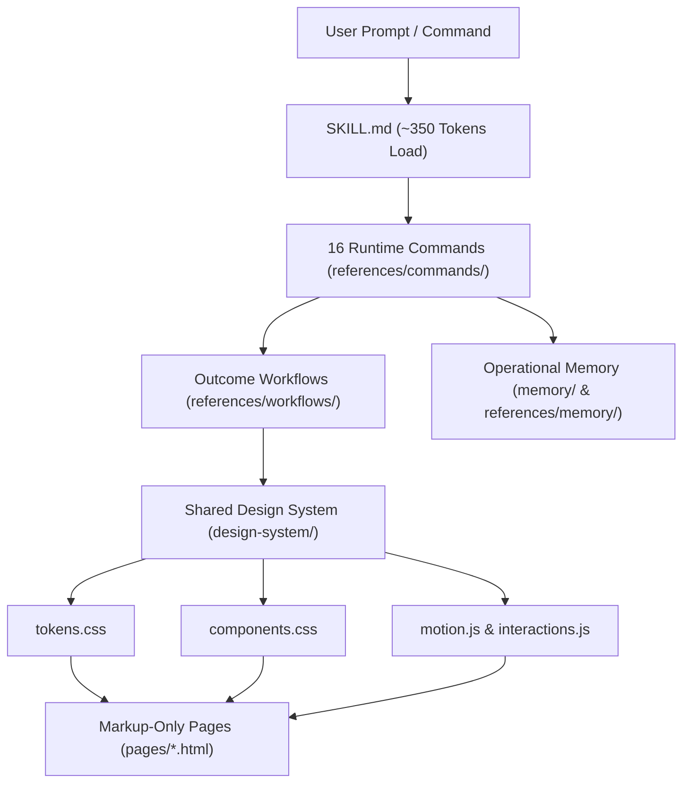

<div align="center">

# 🎨 TidyFactor Design `v1.2.0`
### Code-Native Interactive Prototyping Engine & Anti-Slop Design System Suite

**The official interactive prototyping foundation for the TidyFactor Ecosystem.**

[](https://www.npmjs.com/package/@alwkala/tidyfactor-design)
[](LICENSE)
[](README.ar.md)
[](#-anti-slop-governance--quality-bar-rule-8)
[-green.svg?style=for-the-badge)](#-compliance--governance)

[✨ Live Demo](https://alwkala.com/tidyfactor-design/) • [🚀 Quick Start](#-quick-start--cli-usage) • [⚡ 16 Slash Commands](#-universal-16-slash-commands) • [🛡️ Anti-Slop Rules](#-anti-slop-governance--quality-bar-rule-8) • [📖 بالعربية](README.ar.md)

</div>

---

> [!NOTE]
> **TidyFactor Design** is an AI-era, code-native alternative to Figma. It empowers developers and AI coding agents (Antigravity, Claude Code, Cursor, Codex, Windsurf) to build professional, clickable, animated HTML/CSS/JS interactive prototypes with zero build steps and zero per-page CSS/JS drift.

---

## 🏛️ System Architecture & Flow



### 📁 Directory Layout

```
my-prototype/
├── design-system/
│   ├── tokens.css        ← Design tokens (colors, typography, spacing, radius, motion)
│   ├── base.css          ← CSS reset, typography inheritance & dark mode rules
│   ├── components.css    ← Shared component library (buttons, cards, navbars, modals)
│   ├── utilities.css     ← Spatial layout & container helper classes
│   ├── motion.js         ← Shared scroll-reveals & entrance choreography
│   └── interactions.js   ← Shared dropdowns, tabs, modals & toggle behavior
├── pages/
│   ├── index.html        ← Landing page markup ONLY (zero inline CSS/JS)
│   ├── dashboard.html    ← App dashboard markup ONLY
│   └── pricing.html      ← Pricing table markup ONLY
├── scripts/              ← Python Power Tools (palette extraction, BG removal, WebP compression)
├── proto-nav.js          ← Dev-only floating prototype toolbar
└── brand.json            ← Single source of truth for identity, voice & dials
```

---

## 🛡️ Anti-Slop Governance & Quality Bar (Rule 8)

`tidyfactor-design` enforces strict anti-slop rules derived from the consensus of premier design engineering skills (*Taste-Skill*, *Hallmark*, *Anthropic Frontend-Design*, *Website Cloner*).

> [!IMPORTANT]
> **Pre-Emit Self-Critique Stamp**: Every generated prototype or component is evaluated on 6 axes: **Philosophy (P)**, **Hierarchy (H)**, **Execution (E)**, **Specificity (S)**, **Restraint (R)**, and **Variety (V)**. Scores < 3 trigger an automatic revision pass before emission:
> `/* Pre-emit critique: P5 H4 E5 S4 R5 V5 */`

### ⚙️ The Three-Dial System (`brand.json`)

Configure layout asymmetry, animation depth, and data density dynamically:

```json
{
  "dials": {
    "designVariance": 8,
    "motionIntensity": 6,
    "visualDensity": 4
  }
}
```

### ⛔ 16 Auto-Rejected AI Anti-Patterns

| Anti-Pattern Tell | Why It Fails | Mechanical Rule |
|---|---|---|
| **Purple-Gradient Hero** | Most recognized AI template tell | Single anchor hue; no gradient hero backgrounds |
| **Inter-Everywhere** | Unpaired single-font layout | Pair distinctive display + body faces (`Geist` / `Outfit`) |
| **3-Column Feature Grid** | Generic 3-equal card row | Asymmetric grid, variable heights, or inline icons |
| **Ubiquitous Eyebrows** | Small caps tag above *every* header | **Eyebrow Cap**: Max 1 eyebrow per 3 sections (`ceil(N/3)`) |
| **Floating Hero** | Hero top padding > `pt-24` | **Hero Padding Cap**: Desktop top padding max `pt-24` (6rem) |
| **Wrapped CTAs** | Button label wrapping to 2 lines | Single-line CTA text on desktop (max 3 words) |
| **Jagged Card Buttons** | Card CTAs at random heights | Pin card buttons to bottom via `mt-auto` |
| **Fake Div Screenshots** | `<div>` boxes faking product UI | Banned. Use real images or real component previews |
| **Invented Metrics** | Fake claims ("+47% conversion") | Banned. Must use real data or `—` metric placeholders |
| **Re-Drawn Chrome** | Fake browser traffic-light dots | Banned. Use real screenshots with hairline borders |

---

## ⚡ Universal 16 Slash Commands & Power Tools

```bash
/init        # Scaffold new design system & initial page
/school      # Select visual movement (Brutalism, Glassmorphism, Swiss, Luxury, Minimal)
/tokens      # Manage design tokens & brand.json source of truth
/palette     # Extract palette & WCAG 2.1 AA contrast scores (extract_palette.py)
/assets      # AI background removal & WebP batch compression (optimize_images.py)
/components  # Build reusable component classes & 8-State Demo Wrappers (.preview.html)
/page        # Add marketing or content screen (markup-only)
/dashboard   # Add app screen or analytics surface
/motion      # Add scroll-reveals & 4-tier whimsy interactions in motion.js
/states      # Define interactive component state matrix
/flow        # Wire floating prototype toolbar (proto-nav.js)
/i18n        # Arabic/English typography (El Messiri/Tajawal) & RTL logical properties
/audit       # Read-only audit against Rule 8 & finish gate (test_build.py)
/clone       # Reverse-engineer external site with Interaction Model identification
/retrofit    # Unify drifted multi-page project under central design system
/deploy      # Local preview server & distribution bundle (build.py)
```

---

## 🎨 8 Pluggable CSS Foundations

| Foundation | Identifier | Best For | Architecture |
|---|---|---|---|
| **Native CSS** | `native` | Pure zero-dependency design systems | Custom CSS variables & semantic classes |
| **Tailwind Utility** | `tailwind` | Fast utility prototyping | Tailwind v4 utility engine |
| **daisyUI** | `daisyui` | Rapid web application screens | Tailwind CDN + daisyUI components |
| **Hybrid** | `hybrid` | Signature brand apps & dashboards | daisyUI composite widgets + Native brand styling |
| **shadcn/ui** | `shadcn` | Accessible component primitives | Tailwind v4 + Radix UI accessible tokens |
| **Pico CSS v2** | `pico` | Ultra-fast semantic minimalist sites | Semantic HTML5 tags styled without utility bloat |
| **Bootstrap 5.3** | `bootstrap` | Enterprise apps & dark mode themes | Enterprise CSS variables & `data-bs-theme="dark"` |
| **Alpine + Tailwind** | `alpine` | Interactive client micro-interactions | Alpine.js reactive state (`x-data`) + Tailwind v4 |

---

## 📦 Quick Start & CLI Usage

Published on NPM as [**`@alwkala/tidyfactor-design`**](https://www.npmjs.com/package/@alwkala/tidyfactor-design).

### 1. Interactive Scaffold:

```bash
# Scaffold new prototype workspace
npx @alwkala/tidyfactor-design my-proto

# Specify CSS Foundation (--foundation=native|tailwind|daisyui|hybrid)
npx @alwkala/tidyfactor-design my-app --foundation=native

# Specify Design School (--school=minimalist|brutalism|glassmorphism|swiss|luxury)
npx @alwkala/tidyfactor-design my-brand --school=luxury

# Automated AI Agent / CI mode (zero prompts)
npx @alwkala/tidyfactor-design my-design-system --yes
```

### 2. Inject Agent Skill into Existing Workspace:

```bash
npx @alwkala/tidyfactor-design add-skill
```

---

## 🇸🇦 Native Arabic & RTL Support

`tidyfactor-design` provides first-class support for bilingual Middle Eastern digital products:
- **Typography**: Headings = **El Messiri**, Body = **Tajawal**. Never Amiri for headings above 24px.
- **RTL Physics**: Direction switching (`dir="rtl"` / `dir="ltr"`) via CSS logical properties (`margin-inline-start`, `padding-inline`, etc.).
- **Modesty Guidelines**: Cultural visual rules for regional Middle Eastern targets.

---

## 📄 License & Governance

Distributed under the **MIT License**. Created & maintained by [Alwkala](https://alwkala.com) as part of the TidyFactor Ecosystem. Verified at **100% Compliance (8/8 Pass)** under `tidyfactor-skill-architect`.
