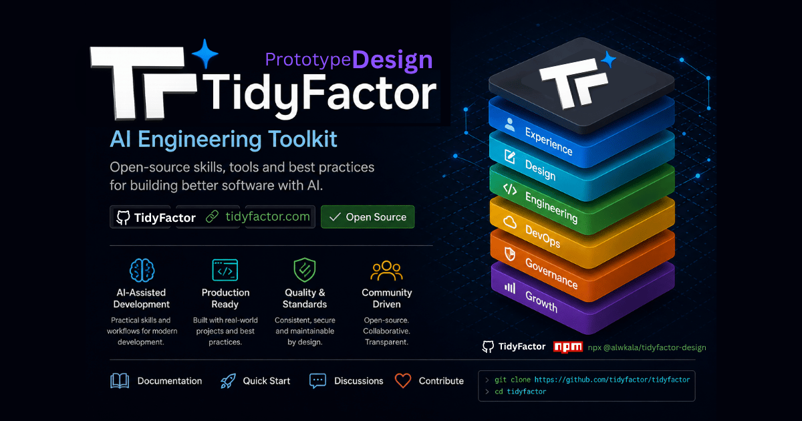
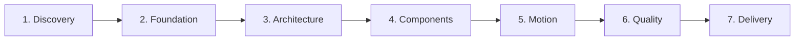

<div align="center">

# 🎨 TidyFactor Design `v1.9.0`
### The Code-Native UI Design Lifecycle Engine, Anti-Slop Design System Suite & Interactive Prototyping Architecture for AI Coding Agents

Give **Google Antigravity, Claude Code, Cursor, OpenAI Codex, or Windsurf** a senior design engineer's brain that transforms raw intent into production-grade design systems and interactive prototypes — without Figma handoff friction, generic AI slop, or per-page CSS drift.

[](https://www.npmjs.com/package/@tidyfactor/design)
[](https://github.com/TidyFactor/Design/stargazers)
[](LICENSE)
[](https://github.com/TidyFactor)
[](SKILL.md)
[](README.ar.md)
[-green.svg?style=for-the-badge)](#-the-15-structural-rules-of-tidyfactor-skills)
[](SKILL.md)

[ English ](README.md) • [ العربية ](README.ar.md) • [ فارسی ](README.fa.md) • [ Español ](README.es.md) • [ Português ](README.pt.md) • [ 简体中文 ](README.zh.md) • [ Deutsch ](README.de.md) • [ Français ](README.fr.md)

<br/><br/>

<p align="center">
  
</p>

</div>

---

## 📚 Table of Contents

- [🎯 Why TidyFactor/Design — The Code-Native Alternative to Figma](#-why-tidyfactordesign--the-code-native-alternative-to-figma)
- [🏛️ The Core Breakthrough: Design Intelligence vs. Execution](#%EF%B8%8F-the-core-breakthrough-design-intelligence-vs-execution)
- [🚀 Quick Start](#-quick-start)
- [🧭 Dual-Mode Decision Architecture (DM-DA Protocol)](#-dual-mode-decision-architecture-dm-da-protocol)
- [🔄 The 7 UI Design Lifecycle Stages](#-the-7-ui-design-lifecycle-stages)
- [⚡ The 24-Command Registry](#-the-24-command-registry)
- [🧠 Operational Memory — Rules, Matrices & Zero Invention](#-operational-memory--rules-matrices--zero-invention)
- [🧩 Production Component Library (Volume 01 – Volume 03)](#-production-component-library-volume-01--volume-03)
- [🛡️ Anti-Slop Governance & Mechanical Quality Gate](#%EF%B8%8F-anti-slop-governance--mechanical-quality-gate)
- [🇸🇦 Native Arabic & Surgical RTL Engineering](#-native-arabic--surgical-rtl-engineering)
- [⚡ Token Efficiency & YAML Primacy (Rule 15)](#-token-efficiency--yaml-primacy-rule-15)
- [🏛️ The 15 Structural Rules & Compliance Scorecard](#%EF%B8%8F-the-15-structural-rules--compliance-scorecard)
- [❓ FAQ](#-faq)
- [🤝 Contributing & Community](#-contributing--community)
- [📜 License](#-license)

---

## 🎯 Why TidyFactor/Design — The Code-Native Alternative to Figma

> [!IMPORTANT]
> **The Design Slop Epidemic in AI Coding**  
> When you ask a generic AI model to *"create a modern SaaS landing page"*, it produces a bland statistical average: repetitive purple-gradient heroes, unreadable Inter typography everywhere, arbitrary 3-column cards with card-in-card nesting, and fragmented CSS.  
> **TidyFactor Design is the architectural cure:** It transforms the expertise of a senior UI/UX designer and design engineer into an **executable operating system** for AI coding agents.

### Figma vs. TidyFactor Design: A Fundamental Paradigm Shift

TidyFactor Design does not try to be a vector drawing tool on a 2D canvas. It is **the Code-Native Design Workflow** built specifically for developers, design engineers, and AI coding agents:

| Dimension | Traditional Figma Workflow | TidyFactor Design (Code-Native Engine) |
|---|---|---|
| **Core Paradigm** | Visual graphic canvas | **Code-native design engineering workflow** |
| **Workspace** | Canvas-centric vector drawings | **Code-centric semantic HTML5 / CSS3 / Vanilla JS** |
| **Primary Actors** | Visual designer $\to$ Developer handoff | **AI Coding Agent + Developer + Design Engineer unified** |
| **Atomic Units** | Proprietary canvas components & variables | **Design tokens (`brand.yaml`) + component matrices + workflows** |
| **Prototyping** | Static screen transition linkers | **Real, responsive, zero-build HTML/CSS/JS runtime in the browser** |
| **Handoff Friction** | High friction: redlining, pixel drift, re-coding | **Zero Handoff Drift**: The design *is* the production code |
| **Governance & QA** | Subjective human visual inspection | **Mechanical Quality Gates**: Automated 7-axis AST audits (`validate_skill.py`) |
| **Scope** | UI asset drawing | **End-to-end 7-stage design lifecycle management** |

---

## 🏛️ The Core Breakthrough: Design Intelligence vs. Execution

The most powerful innovation of **TidyFactor Design** is the strict architectural separation of **Design Intelligence** from **Design Implementation**:

```
                 DESIGN INTELLIGENCE
                        │
             ┌──────────┴──────────┐
             ↓                     ↓
       Operational Memory       Workflows
    (Rules, Matrices, Schemas) (Ordered Steps & Checklists)
             │                     │
             └──────────┬──────────┘
                        ↓
                 AI Coding Agent
          (Antigravity / Claude / Cursor)
                        ↓
                Design System SSOT
             (brand.yaml + tokens.css)
                        ↓
            Interactive HTML/CSS/JS
             (Zero per-page CSS/JS)
                        ↓
             Mechanical Audit Gate
           (7-Axis Stamp + Anti-Slop)
                        ↓
             Production Delivery
           (Clean CSS Tokens + Handoff)
```

### Why This Makes the Skill Reusable Across Every Project
Because design knowledge is codified into **Operational Memory** (rules, matrices, typography pairings, motion physics) and separated from the code generation workflows, the AI agent **never guesses or re-invents visual engineering rules**. It executes against a shared, verified Single Source of Truth.

$$\text{Traditional Prompting: } \text{Prompt} \longrightarrow \text{AI generates generic, drifted UI}$$
$$\text{TidyFactor Design: } \text{Design Brief} \longrightarrow \text{Rules} \longrightarrow \text{System} \longrightarrow \text{Code} \longrightarrow \text{Validation} \longrightarrow \text{Handoff}$$

---

## 🚀 Quick Start

### 1. Installation via NPM / NPX
Install the skill into your local project workspace:
```bash
# Add to current workspace
npx @tidyfactor/design add

# Or run the global CLI runner
npx @tidyfactor/cli add tidyfactor-design
```

### 2. Invocable in All Major AI Coding Agents
Invoke directly inside **Google Antigravity, Claude Code, Cursor, Codex, or Windsurf**:
```text
/tidyfactor-design
```
Or run individual lifecycle commands:
```text
/brief          # Establish design context (Mode A: 3-round fast track, or Mode B: debate)
/tokens         # Generate CSS tokens and brand variables
/components     # Assemble 8-state interactive components
/page           # Compose a complete, token-disciplined page
/audit          # Audit against the 16 AI tells and 7-axis quality stamp
```

---

## 🧭 Dual-Mode Decision Architecture (DM-DA Protocol)

TidyFactor Design incorporates **The Contextual Decision Layer (CDL v2.0)**, operating under the formal role of **TidyFactor Dual-Mode Decision Architect (DM-DA)**:

```
                      USER INTENT
                           │
             ┌─────────────┴─────────────┐
             ↓                           ↓
      [MODE A] 🎯                [MODE B] 🔥
  Smart 3-Round Protocol     Relentless Debate & Interview
  (Fast-Track Alignment)      (Deep Ideological Extraction)
             │                           │
      3 Rounds Max             Continuous Counter-Questions
             │                 Challenges Anti-Patterns
             │                 Forces Logical Trade-offs
             ↓                           │
     Emit Brief / Cache                  │ Terminated by "END DEBATE"
             │                           ↓
             └───────────┬───────────────┘
                         ↓
             .tidyfactor/brief.md
        Artifact: DEBATE_SYNTHESIS.md
                         ↓
            Deterministic Code Emission
```

### [MODE A] 🎯 Smart 3-Round Protocol (الارتجال الذكي المقيد)
- **Round 1 (Root & Mission)**: Extract primary audience mindset (`inspire`, `evaluate`, `act`, `learn`) and product mission.
- **Round 2 (Boundaries & Stack)**: Lock CSS engine (`native`, `tailwind`, `daisyui`, `pico`, `hybrid`), page archetype (`L1`–`L4`), and typography pairing.
- **Round 3 (Final Conflicts & Safe Defaults)**: Resolve edge trade-offs and auto-populate unasked parameters with safe defaults.
- **Escalation Gate**: Emits `.tidyfactor/brief.md` instantly and presents the choice: *"Adopt baseline immediately OR escalate to Debate Mode?"*

### [MODE B] 🔥 Relentless Debate & Interview (الاستجواب والمناظرة اللانهائية)
- **Continuous Multi-Turn Interrogation**: Activated via `/debate`, `/grill-me`, or Mode A escalation.
- **Relentlessly Challenges Assumptions**: Exposes anti-patterns, forces binary trade-offs, and tests RTL/motion fragility before any code is written.
- **Strict Termination Rule**: Only ends when the user explicitly triggers `"END DEBATE"` or `"اعتماد"`.
- **Deliverable**: Emits a formal `architectural_debate_synthesis.md` artifact.

---

## 🔄 The 7 UI Design Lifecycle Stages

The design engineering process is partitioned into 7 sequential stages:



1. **Discovery**: Understand audience psychology, purpose, and visual DNA.
2. **Foundation**: Establish color tokens, WCAG AAA contrast, typography pairings, and design school.
3. **Architecture**: Select layout archetypes, navigation shells, footers, and page templates.
4. **Components**: Author 8-state interactive UI primitives with flex pinning and strict component anatomy.
5. **Motion**: Inject physics-based easing curves, GSAP ScrollTrigger seams, and reduced-motion guards.
6. **Quality**: Execute mechanical 7-axis self-critique audits, performance budgeting, and anti-slop scans.
7. **Delivery**: Export clean CSS variable maps, static zero-build prototypes, and developer handoff specs.

---

## ⚡ The 24-Command Registry

| Lifecycle Stage | Slash Command | Purpose & User Intent | Injected Operational Memory | Primary Output |
|---|---|---|---|---|
| **1. Discovery** | `/brief` | Design context discovery & DM-DA protocol | `workflows/brief.md` + `memory/decision-points.md` | `.tidyfactor/brief.md` |
| **1. Discovery** | `/study` | Extract visual DNA from reference URL/image | `commands/study.md` + `memory/01-design-schools.md` | Structured visual DNA report |
| **2. Foundation** | `/init` | Scaffold new design system / prototype suite | `workflows/init-prototype.md` + `memory/architecture.md` | `design-system/` + semantic `index.html` |
| **2. Foundation** | `/brand` | Scaffold and manage `brand.yaml` design tokens | `commands/brand.md` + `memory/11-brand-json-v2.md` | Authoritative `brand.yaml` SSOT |
| **2. Foundation** | `/typography` | Mood-routed typography pairing (Latin + Arabic) | `commands/typography.md` + `memory/12-typography-matrix.md` | Font tokens + Google Fonts preconnect |
| **2. Foundation** | `/school` | Lock visual movement (Minimal, Brutalist, Glass...) | `commands/school.md` + `memory/01-design-schools.md` | Visual school declared in `brand.yaml` |
| **2. Foundation** | `/tokens` | Manage design tokens & CSS custom properties | `commands/tokens.md` + `memory/02-design-tokens.md` | Synchronized `tokens.css` |
| **2. Foundation** | `/palette` | Extract color palette with WCAG AAA verification | `commands/palette.md` + `scripts/extract_palette.py` | Light & dark mode contrast tokens |
| **2. Foundation** | `/assets` | Optimize images, convert to WebP, remove backgrounds | `commands/assets.md` + `scripts/optimize_images.py` | Sub-150KB WebP assets |
| **3. Architecture** | `/layout` | Select macrostructure archetype (L1–L4) | `commands/layout.md` + `memory/13-layout-archetypes.md` | Scaffolded grid layout shell |
| **3. Architecture** | `/nav-footer` | Wire navigation (N1–N9) & footer (Ft1–Ft8) | `commands/nav-footer.md` + `memory/14-nav-footer-catalog.md` | Production nav and footer components |
| **3. Architecture** | `/page` | Assemble content or marketing page | `workflows/init-prototype.md` + `memory/05-component-anatomy.md` | Markup-only `pages/<name>.html` |
| **3. Architecture** | `/dashboard` | Assemble data-dense admin or app dashboard | `workflows/init-prototype.md` + `memory/05-component-anatomy.md` | KPI card grids, sidebar rail & data tables |
| **4. Components** | `/components` | Scaffold UI components adhering to anatomy | `commands/components.md` + `memory/05-component-anatomy.md` | `components.css` component definitions |
| **4. Components** | `/states` | Enforce 8-state interactive wrappers | `commands/states.md` + `memory/05-component-anatomy.md` | Idle, hover, focus, active, disabled states |
| **5. Motion** | `/motion` | Physics-based easing & animation recipes | `commands/motion.md` + `memory/04-motion-principles.md` | `motion.js` with GSAP / CSS fallbacks |
| **5. Motion** | `/flow` | Wire client-side interactive prototype navigation | `commands/flow.md` + `memory/09-prototype-flow.md` | Single-page prototype transitions |
| **5. Motion** | `/i18n` | Arabic/RTL localization & bidirectional UI | `commands/i18n.md` + `memory/08-arabic-bilingual.md` | Mirrored layout + Arabic typography |
| **6. Quality** | `/perf` | Audit performance budget & page weight | `commands/perf.md` + `memory/15-performance-budget.md` | Sub-500KB total page weight report |
| **6. Quality** | `/audit` | Structural consistency audit & quality bar | `workflows/audit-prototype.md` + `memory/06-quality-bar.md` | 7-Axis Quality Stamp (`P5 H5 E5 S5 R5 V5 D5`) |
| **6. Quality** | `/clone` | Reverse-engineer design system from external URL | `workflows/clone-prototype.md` + `memory/03-narrative-conversion.md` | Clean reconstructed tokens |
| **6. Quality** | `/retrofit` | Unify drifted prototype under design system | `workflows/retrofit-prototype.md` + `memory/07-consistency-contract.md` | Inline styles eliminated & mapped to tokens |
| **7. Delivery** | `/handoff` | Export developer specs & CSS variable map | `commands/handoff.md` + `memory/11-brand-json-v2.md` | Developer handoff tables & documentation |
| **7. Delivery** | `/deploy` | Live local preview server & zero-build deploy | `commands/deploy.md` + `memory/06-quality-bar.md` | Static preview on local or hosting server |

---

## 🧠 Operational Memory — Rules, Matrices & Zero Invention

Operational memory (`references/memory/`) contains **pure technical constraints, schemas, and matrices**—never narrative filler:

- **01-design-schools.md**: Rules for 6 architectural design movements (Minimalist, Neo-Brutalist, Glassmorphic, Neo-Skeuomorphic, Warm Editorial, Playful).
- **02-design-tokens.md**: Strict 8pt spacing grid, modular typography scales, and semantic surface colors.
- **04-motion-principles.md**: Physics-based easing curves (`cubic-bezier(0.16, 1, 0.3, 1)`), duration brackets, and `@media (prefers-reduced-motion)` guards.
- **06-quality-bar.md**: The 16 forbidden AI tells, 11 Codex defect bans, and the **7-Axis Pre-Emit Quality Stamp** (`P5 H5 E5 S5 R5 V5 D5`).
- **08-arabic-bilingual.md**: Bidirectional layout rules (El Messiri display, Tajawal body, never Amiri >24px).
- **12-typography-matrix.md**: Exact Latin/Arabic pairings matched by emotional register.
- **13-layout-archetypes.md**: L1 (Hero+Story), L2 (Split App), L3 (Sidebar Dashboard), L4 (Editorial Grid).
- **15-performance-budget.md**: Hard limits: $\le 150\text{ KB}$ HTML/CSS, $\le 350\text{ KB}$ WebP media, zero external runtime scripts.

---

## 🧩 Production Component Library (Volume 01 – Volume 03)

`tidyfactor-design` includes 8 modular component matrices in operational memory:

```
references/memory/
├── 21-eyebrow-kicker-matrix.md      # 16 micro-hierarchy kickers across 4 structural families
├── 22-hero-section-matrix.md       # 8 GSAP ScrollTrigger + SVG motion hero architectures
├── 23-card-architecture-matrix.md   # 16 modular cards (flex-col, mt-auto CTA bottom pinning)
├── 24-button-cta-matrix.md          # 16 button alternatives with full 8-state interaction matrices
├── 25-divider-separator-matrix.md   # Volume 03 Section Transitions & parametric SVG wavePath seams
├── 26-metrics-stat-matrix.md        # 12 tabular stat cards (tabular-nums, SVG rings, initCounters)
├── 27-list-indicator-matrix.md      # 12 trust bullet indicators (Status Rings, Milestone Trees)
└── 28-shared-motion-primitives.md   # Shared GSAP foundations (easing, prepDraw, splitChars)
```

### Architectural Invariants:
1. **Vertical Flex & Bottom Pinning**: Every card must use `display: flex; flex-direction: column;`. CTA actions MUST be pinned via `margin-top: auto` to eliminate ragged button rows across different card heights.
2. **Seam Ownership Mental Model**: Section dividers belong to the **outgoing section** and inherit the incoming background via `currentColor`, eliminating gap seams during resize.
3. **Heritage Detailing & Zero Motif Overlap**: Mashrabiya, Lotus, and Kufic geometric motifs are isolated to background seams and watermarks using CSS `mask-image` with opacity $\le 0.08$. Text overlays over heavy motifs are strictly prohibited.

---

## 🛡️ Anti-Slop Governance & Mechanical Quality Gate

TidyFactor Design enforces **automated, verifiable quality checks** on every emitted line of code.

### 🚫 The 16 Forbidden AI Tells (Zero Tolerance)
1. ❌ **Purple Gradient Hero**: Banned generic `#7928CA` to `#FF0080` or indigo radial glows.
2. ❌ **Inter Everywhere**: Banned using Inter as a default for luxury, editorial, or cultural surfaces.
3. ❌ **Generic 3-Column Feature Grid**: Banned identical 3-card grids without clear visual weight.
4. ❌ **Card-in-Card Nesting**: Banned nesting bordered cards inside other bordered cards without contrast.
5. ❌ **Aurora Blobs & Floating Orbs**: Banned unanchored, blurred colorful spheres floating randomly.
6. ❌ **Pure Black/White (#000/#fff) Surfaces**: Banned harsh pure black without undertones or depth.
7. ❌ **Gradient Text Headlines**: Banned unreadable multi-stop gradient headlines.
8. ❌ **Side-Stripe Cards**: Banned arbitrary colored 4px left borders on feature boxes.
9. ❌ **Missing Active/Focus States**: Banned interactive elements that only have basic `:hover`.
10. ❌ **Broken RTL Directional Margins**: Banned `mr-*` or `ml-*` in bidirectional contexts.
11. ❌ **Ragged Action Rows**: Banned cards without bottom-pinned CTA buttons.
12. ❌ **Unconstrained Image Sizes**: Banned embedding raw multi-megabyte PNG/JPEG files.
13. ❌ **Unhedged Font Flashes**: Banned missing `font-display: swap` or local font fallbacks.
14. ❌ **Arbitrary Z-Index Soup**: Banned random `z-index: 99999` without defined token scales.
15. ❌ **No-JavaScript Broken Fallback**: Banned prototypes that turn completely blank without JS.
16. ❌ **Text Over Cluttered Motifs**: Banned placing body copy over busy geometric patterns.

### 🏷️ The 7-Axis Pre-Emit Quality Stamp
Before any code is delivered, the agent verifies and outputs the 7-Axis Quality Stamp:
```text
[QUALITY GATE: P5 H5 E5 S5 R5 V5 D5 — 35/35 PASSED]
- P (Performance): Sub-500KB total page weight, preconnected fonts.
- H (Hierarchy): Exactly one H1, unambiguous typography ratio scale.
- E (Ergonomics): 44px min tap targets, full 8-state interactive coverage.
- S (Semantics): Strict semantic HTML5 (`<main>`, `<article>`, `<nav>`).
- R (RTL & Bilingual): Native logical properties (`margin-inline-start`), tailored fonts.
- V (Visual Authenticity): Anti-slop certified, zero forbidden AI cliches.
- D (Decision Alignment): 100% adherence to confirmed .tidyfactor/brief.md.
```

---

## 🇸🇦 Native Arabic & Surgical RTL Engineering

TidyFactor Design was forged with first-class MENA cultural and typographic intelligence:

- **Logical CSS Properties**: Always uses `margin-inline-start`, `padding-inline-end`, `inset-inline-start` instead of physical `left`/`right`/`margin-left`.
- **Curated Arabic Type Pairings**:
  - **Classic Display**: El Messiri (Headlines) + Tajawal (Body)
  - **Modern Geometric**: Alexandria (Headlines) + Readex Pro (Body)
  - **Contemporary Tech**: Cairo (Headlines) + IBM Plex Sans Arabic (Body)
- **The Amiri Constraint**: Amiri is strictly prohibited for body text or sizes above 24px in modern UI layouts.
- **Bi-directional Mirroring**: Layouts flip symmetrically with natural optical adjustment for Arabic letterforms.

---

## ⚡ Token Efficiency & YAML Primacy (Rule 15)

In compliance with Rule 15 of TidyFactor Skills-LAB:
- **Cognitive Layer in YAML**: Brand tokens, design schemas, decision gate snapshots, and architecture matrices are stored in `brand.yaml` instead of JSON.
- **35% to 50% Token Savings**: Eliminates redundant brackets, quotes, and syntax noise, giving LLMs significantly more reasoning context.
- **Dual-Engine Compatibility**: Automatically falls back to `brand.json` if present in legacy workspaces.
- **Clean Wire Protocols**: JSON is reserved exclusively for external machine runtimes (`package.json`, `manifest.json`).

---

## 🏛️ The 15 Structural Rules & Compliance Scorecard

`tidyfactor-design` strictly implements the **TidyFactor Skill Methodology**:

| # | Structural Rule | Status | Verification Mechanism |
|---|---|:---:|---|
| **1** | **Dispatcher Discipline** | ✅ PASS | `SKILL.md` is a lean router (~747 tokens) with clear anti-triggers. |
| **2** | **One Workflow = One Outcome** | ✅ PASS | Every workflow has a single deliverable and a `## Validation checklist`. |
| **3** | **Operational Memory** | ✅ PASS | `references/memory/` contains pure schemas, matrices, and technical constraints. |
| **4** | **No Empty Structures** | ✅ PASS | Clean, flattened architecture without single-file folders. |
| **5** | **Philosophy Isolation** | ✅ PASS | Brand philosophy isolated exclusively to `memory/philosophy.md`. |
| **6** | **Trigger-Justified Growth** | ✅ PASS | Commands added strictly per verifiable user lifecycle triggers. |
| **7** | **Deterministic Native Tooling** | ✅ PASS | Deterministic scripts (`optimize_images.py`, `extract_palette.py`, `validate_skill.py`). |
| **8** | **Behavioral Parity & SemVer SSOT** | ✅ PASS | Atomic version synchronization across all metadata (`v1.9.0`). |
| **9** | **Platform Compatibility** | ✅ PASS | Valid YAML frontmatter parsed via `yaml.safe_load()`. |
| **10** | **Runtime Tooling Manifest Contract** | ✅ PASS | `manifest.json` declares all tools with `"skill_root_anchor": "self"`. |
| **11** | **Memory Freshness** | ✅ PASS | All 31 memory files maintain verified `<!-- last-verified: 2026-09-05 -->` tags. |
| **12** | **Skill vs. MCP Boundary** | ✅ PASS | Static knowledge in skill; dynamic APIs delegate to MCP servers. |
| **13** | **Two-Tier Multilingual Docs** | ✅ PASS | Universal 8-language switcher bar across all localized READMEs. |
| **14** | **Contextual Decision Layer (CDL v2.0)** | ✅ PASS | Full DM-DA protocol: Mode A (Smart 3-Round) & Mode B (Relentless Debate). |
| **15** | **Token Efficiency & YAML Primacy** | ✅ PASS | `brand.yaml` prioritized over JSON for token savings. |

```bash
# Run the automated 13-check validator suite
python tools/validate_skill.py
# Result: [SUCCESS] ALL SKILL INTEGRITY CHECKS PASSED (15/15 COMPLIANT)!
```

---

## ❓ FAQ

### How is TidyFactor Design different from Tailwind UI or shadcn/ui?
Component libraries provide pre-made HTML/React snippets. **TidyFactor Design is a complete design engineering lifecycle engine**: it discovers your brand DNA, chooses an aesthetic school, computes WCAG AAA contrast tokens, arranges macrostructures, defines motion physics, audits against AI slop, and outputs tailored code directly into your workspace with zero build dependencies.

### Does it require Node.js or a complex build step?
**No.** TidyFactor Design prototypes run natively in any modern browser using semantic HTML5, CSS Custom Properties, and Vanilla JS. You can open `index.html` directly or serve it via any static server.

### Can I use Tailwind CSS instead of Vanilla CSS tokens?
**Yes.** The `/brief` and `/layout` commands let you choose between `native` (vanilla CSS custom properties), `tailwind` (utility classes), `daisyui`, `pico`, or `hybrid`.

---

## 🤝 Contributing & Community

We welcome contributions from design engineers, frontend architects, and AI developers!
- 🐛 **Report Issues**: [GitHub Issues](https://github.com/TidyFactor/Design/issues)
- 💡 **Discuss Ideas**: [GitHub Discussions](https://github.com/TidyFactor/Design/discussions)
- 📖 **Read the Engineering Guide**: [docs/GUIDE.md](docs/GUIDE.md) & [docs/GUIDE.ar.md](docs/GUIDE.ar.md)

---

## 📜 License

Licensed under the **Apache-2.0 License**. See [LICENSE](LICENSE) for details.

---

<div align="center">

**Built with pride by the TidyFactor Core Team & Alwkala Digital Agency.**  
*Empowering AI Coding Agents to Design with Precision, Taste, and Zero Slop.*

</div>
