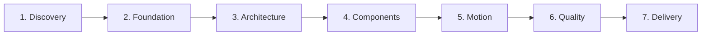

<div align="center">

<p align="center">
  
</p>

# 🎨 TidyFactor Design `v1.9.0`
### Code-Native UI Design Lifecycle Engine & Anti-Slop Design System Suite

**The official UI design & interactive prototyping foundation for the TidyFactor Ecosystem.**

[](https://www.npmjs.com/package/@tidyfactor/design)
[](LICENSE)
[](README.ar.md)
[](#-anti-slop-mechanical-governance--quality-gate)
[-green.svg?style=for-the-badge)](#-the-15-structural-rules-of-tidyfactor-skills)

[ 🇺🇸 English ](README.md) • [ 🇸🇦 العربية ](README.ar.md) • [ 🇮🇷 فارسی ](README.fa.md) • [ 🇪🇸 Español ](README.es.md) • [ 🇧🇷 Português ](README.pt.md) • [ 🇨🇳 中文 ](README.zh.md) • [ 🇩🇪 Deutsch ](README.de.md) • [ 🇫🇷 Français ](README.fr.md)

</div>

---

## 🏛️ The Core Breakthrough: Design Intelligence vs. Execution

The foundational innovation of **TidyFactor Design** is the strict architectural separation of **Design Knowledge** from **Design Implementation**:

```
                 DESIGN INTELLIGENCE
                        │
             ┌──────────┴──────────┐
             ↓                     ↓
       Operational Memory       Workflows
      (Rules, Matrices, CDL)  (Ordered Steps)
             │                     │
             └──────────┬──────────┘
                        ↓
                  AI Coding Agent
           (Antigravity / Claude / Cursor)
                        ↓
                Design System SSOT
             (brand.yaml + tokens.css)
                        ↓
            Interactive HTML/CSS/JS
             (Zero per-page CSS/JS)
                        ↓
             Mechanical Audit Gate
           (7-Axis Stamp + AI Tells)
                        ↓
             Production Handoff
           (Clean CSS Tokens + Specs)
```

### Why it is a *Design Engineering Operating System*, not just a Prompt
When you ask an AI model to *"create a landing page"*, it attempts to simultaneously invent visual philosophy, layout, color theory, component hierarchy, responsive behavior, and implementation code in a single unconstrained prompt. The result is almost invariably **generic AI slop**: repetitive purple-gradient heroes, un-anchored CTAs, card-in-card nesting, and fragmented CSS.

**TidyFactor Design** replaces arbitrary prompt generation with a **Deterministic Design Engineering Pipeline**:

$$\text{Traditional AI Prompting: } \text{Prompt} \longrightarrow \text{AI generates generic UI}$$
$$\text{TidyFactor Design Engine: } \text{Design Brief} \longrightarrow \text{Rules} \longrightarrow \text{System} \longrightarrow \text{Code} \longrightarrow \text{Validation} \longrightarrow \text{Handoff}$$

---

## ⚡ The Definitive Comparison: Figma vs. TidyFactor Design

TidyFactor Design is **the Code-Native Alternative to Figma** for the AI coding agent era:

| Dimension | Figma | TidyFactor Design |
|---|---|---|
| **Primary Environment** | Visual Canvas GUI | Code-Native Live Browser Workspace |
| **Architectural Focus** | Canvas-centric vector drawings | Code-centric semantic HTML5 / CSS3 / Vanilla JS |
| **Target User** | Human UI/UX Designer | AI Agent + Developer + Design Engineer |
| **Component Model** | Proprietary frames & canvas variants | CSS Custom Properties + 8-State Component Wrappers |
| **Prototyping** | Click-through screen transitions | Fully interactive, responsive HTML/CSS/JS runtime |
| **Handoff Friction** | Redundant redlining & re-implementation in code | **Zero Handoff Drift**: Design *is* the production code |
| **Governance & QA** | Manual design review & subjective inspection | **Mechanical Quality Gates**: Automated 7-axis audit scripts |
| **System Scope** | Asset creation | Full 7-Stage UI Design Lifecycle Management |

---

## 🧠 The Concept of "Operational Memory"

In TidyFactor, `references/memory/` files are **NOT** narrative articles or marketing essays. They are **executable engineering constraints**, tabular decision matrices, and authoritative schemas:

- **Typography Matrix (`12-typography-matrix.md`)**: Exact mood-routed Arabic/Latin font pairings with ratio scales.
- **Layout Archetypes (`13-layout-archetypes.md`)**: L1–L4 structural macrostructures with explicit container grids.
- **Motion Principles (`04-motion-principles.md`)**: Exact cubic-bezier easing curves and reduced-motion fallback contracts.
- **Core Component Matrices (`21-` through `28-`)**: Exhaustive catalogs of Eyebrows, Heros, Cards, 8-State Buttons, Section Dividers, Tabular Metrics, and Trust Bullets.
- **Quality Bar (`06-quality-bar.md`)**: The 16 named AI anti-pattern tells and 11 Codex defect bans with automated audit thresholds.
- **Arabic / RTL Rigor (`08-arabic-bilingual.md`)**: Curated bidirectional rules (El Messiri display, Tajawal body, never Amiri >24px).

Because this operational memory is decoupled and injected on-demand, the AI agent **never re-invents visual engineering rules**; it executes against deterministic ground truth.

---

## 🔄 The 7 UI Design Lifecycle Stages & 24 Command Registry

The skill provides 24 specialized slash commands mapped across 7 rigorous lifecycle stages:



| Lifecycle Stage | Slash Command | User Intent | What It Injects | Output / Deliverable |
|---|---|---|---|---|
| **1. Discovery** | `/brief` | Strategic Design Discovery & Brief Resolution | `workflows/brief.md` + `memory/decision-points.md` + `memory/06-quality-bar.md` | `.tidyfactor/design-brief.snapshot.json` + `design-brief.md` |
| **1. Discovery** | `/study` | Extract design DNA from reference URL/image | `commands/study.md` + `memory/01-design-schools.md` + `memory/06-quality-bar.md` | Structured visual DNA report |
| **2. Foundation** | `/init` | Start brand-new design system / prototype | `workflows/init-prototype.md` + `memory/architecture.md` + `memory/foundations.md` | Scaffolded `design-system/` + semantic `index.html` |
| **2. Foundation** | `/brand` | Scaffold or manage `brand.yaml` / `brand.json` | `commands/brand.md` + `memory/11-brand-json-v2.md` | Validated `brand.yaml` design token SSOT |
| **2. Foundation** | `/typography` | Mood-routed typography pairing | `commands/typography.md` + `memory/12-typography-matrix.md` | Font tokens in `tokens.css` + Google Fonts preconnect |
| **2. Foundation** | `/school` | Select design school & movement | `commands/school.md` + `memory/01-design-schools.md` | Visual school declaration locked in `brand.yaml` |
| **2. Foundation** | `/tokens` | Manage design tokens and CSS variables | `commands/tokens.md` + `memory/02-design-tokens.md` | Synchronized `design-system/tokens.css` |
| **2. Foundation** | `/palette` | Extract color palette & compute WCAG AAA | `commands/palette.md` + `scripts/extract_palette.py` | WCAG 2.1 AAA contrast tokens for light/dark modes |
| **2. Foundation** | `/assets` | Asset hygiene, media & image optimization | `commands/assets.md` + `scripts/optimize_images.py` | Constrained WebP assets and transparent cutouts |
| **3. Architecture** | `/layout` | Select macrostructure layout archetype | `commands/layout.md` + `memory/13-layout-archetypes.md` | L1–L4 responsive grid shell scaffolded |
| **3. Architecture** | `/nav-footer` | Choose navigation (N1-N9) & footer (Ft1-Ft8) | `commands/nav-footer.md` + `memory/14-nav-footer-catalog.md` | Production nav and footer components wired |
| **3. Architecture** | `/page` | Add content or marketing page | `workflows/init-prototype.md` + `memory/05-component-anatomy.md` | Markup-only `pages/<name>.html` reading shared tokens |
| **3. Architecture** | `/dashboard` | Add data-dense dashboard or app screen | `workflows/init-prototype.md` + `memory/05-component-anatomy.md` | Tabular dashboard layout with KPI cards and shell rails |
| **4. Components** | `/components` | Manage shared UI components & 8-state catalog | `commands/components.md` + `memory/05-component-anatomy.md` | `design-system/components.css` component definitions |
| **4. Components** | `/states` | Define interactive 8-state wrappers | `commands/states.md` + `memory/05-component-anatomy.md` | Interactive states (idle, hover, active, focus, loading...) |
| **5. Motion** | `/motion` | Shared animations, scroll & motion recipes | `commands/motion.md` + `memory/04-motion-principles.md` | `design-system/motion.js` with GSAP & Lenis fallbacks |
| **5. Motion** | `/flow` | Wire interactive prototype navigation flow | `commands/flow.md` + `memory/09-prototype-flow.md` | Client-side routing between prototype pages |
| **5. Motion** | `/i18n` | Arabic/RTL localization & bidirectional UI | `commands/i18n.md` + `memory/08-arabic-bilingual.md` | Automatic RTL mirroring (`dir="rtl"`) & Arabic type |
| **6. Quality** | `/perf` | Asset performance budget & size verification | `commands/perf.md` + `memory/15-performance-budget.md` | Audit scorecard checking sub-500KB total page weight |
| **6. Quality** | `/audit` | Structural consistency audit & quality bar | `workflows/audit-prototype.md` + `memory/06-quality-bar.md` | 7-Axis Quality Stamp + Anti-Slop detection report |
| **6. Quality** | `/clone` | Extract design system from external URL/clone | `workflows/clone-prototype.md` + `memory/03-narrative-conversion.md` | Clean reconstructed tokens from reference site |
| **6. Quality** | `/retrofit` | Unify drifted prototype under design system | `workflows/retrofit-prototype.md` + `memory/07-consistency-contract.md` | Inline styles eradicated and mapped to shared tokens |
| **7. Delivery** | `/handoff` | Developer handoff specs & CSS variable map | `commands/handoff.md` + `memory/11-brand-json-v2.md` | Production handoff tables + optional Brain KI sync |
| **7. Delivery** | `/deploy` | Local preview server and static deployment | `commands/deploy.md` + `memory/06-quality-bar.md` | Live preview via local server with zero build step |

---

## 📐 Core UI Component & Page Composition Architecture (Volume 01–03)

`tidyfactor-design` v1.9.0 introduces 8 comprehensive Component Architecture Matrices in operational memory:

```
references/memory/
├── 21-eyebrow-kicker-matrix.md      # 16 micro-hierarchy kickers across 4 structural families
├── 22-hero-section-matrix.md       # 8 GSAP ScrollTrigger + SVG motion architectures
├── 23-card-architecture-matrix.md   # 16 modular card variants (flex-col, mt-auto CTA anchoring)
├── 24-button-cta-matrix.md          # 16 button alternatives with full 8-state interaction matrices
├── 25-divider-separator-matrix.md   # Volume 03 Section Transitions & parametric SVG wavePath seams
├── 26-metrics-stat-matrix.md        # 12 tabular stat cards (tabular-nums, SVG rings, initCounters)
├── 27-list-indicator-matrix.md      # 12 trust bullet indicators (Status Rings, Milestone Trees)
└── 28-shared-motion-primitives.md   # Shared GSAP foundations (easing, prepDraw, splitChars)
```

### Key Architectural Invariants:
1. **Vertical Flex & Pinning Contract**: Every card must use `display: flex; flex-direction: column;`. Actions MUST be pinned to the bottom via `margin-top: auto` to prevent jagged button rows.
2. **Seam Ownership Mental Model**: In `25-divider-separator-matrix.md`, the seam belongs to the **outgoing section**; it draws from incoming section color via `currentColor`, eliminating background gap seams.
3. **Heritage Detailing & Zero Motif Overlap**: Mashrabiya, Lotus, and Kufic geometric patterns are isolated to section transitions or background watermarks using CSS `mask-image` with opacity $\le 0.08$. Motif overlays on text are strictly banned.

---

## ⚡ Rule 15: Token Efficiency & Semantic Density (YAML Primacy)

In alignment with **Rule 15**, `tidyfactor-design` adopts **YAML Primacy** for the entire cognitive layer:

- **~40% Context Token Reduction**: `brand.yaml` consumes ~1,290 tokens versus ~2,180 tokens in JSON by removing brackets, quotes, and trailing commas.
- **Zero Syntax Drift**: Completely eliminates LLM syntax errors caused by missing or extraneous commas.
- **Dual-Engine Backward Compatibility**: All tooling automatically reads `brand.yaml` first, falling back gracefully to `brand.json` for legacy codebases.

---

## 🛡️ Anti-Slop Mechanical Governance & Quality Gate

TidyFactor Design mechanically detects and auto-rejects generic AI patterns during `/audit`:

### 🚫 The 16 Named AI Anti-Pattern Tells
1. **Purple-Gradient Hero**: Purple-to-pink/blue background gradient with white centered text.
2. **Inter-Everywhere**: Single unpaired font family used across display and body.
3. **3-Column Feature Grid**: 3 identical columns with generic icons and 2-line headings.
4. **Card-in-Card**: Arbitrary nested card containers with no semantic hierarchy.
5. **Gradient Headline**: `background-clip: text` linear gradient fill on headlines.
6. **Side-Stripe Card**: 4–6px thick colored border on card edges as a decorative crutch.
7. **Full-Viewport Centered Hero**: `min-height: 100vh` centered short sentence + massive CTA.
8. **Pure Black / Pure White**: `#000000` or `#ffffff` flat surfaces (must use tinted neutrals).
9. **Default-Attractor Sameness**: Reusing identical macrostructures across consecutive pages.
10. **Specimen Fall-Through**: Defaulting to editorial `01 - HELLO` specimen layout for SaaS.
11. **The AI Nav**: Wordmark left, 4-5 links center, CTA right, 1px bottom border.
12. **The AI Footer**: 4 generic columns (Product, Company, Resources, Legal) + copyright.
13. **Aurora-Blob Background**: Flowing organic mesh blobs in purple/cyan behind hero text.
14. **Floating-Orb Decoration**: 3D spheres or blurred circles drifting aimlessly behind hero.
15. **Italic Headers**: Flipping one arbitrary word to italic (`Built to <em>think</em>`) for fake editorial flair.
16. **Lazy-Loaded LCP**: Adding `loading="lazy"` to the main hero image (tanks Core Web Vitals).

### 🏷️ The 7-Axis Pre-Emit Self-Critique Stamp
Every generated prototype component, token set, or layout must be stamped with:
`/* Pre-emit critique: P5 H5 E5 S5 R5 V5 D5 */`
- **P** — Philosophy & School Authenticity
- **H** — Hierarchy & Layout Balance
- **E** — Encapsulation & Zero Per-Page CSS/JS
- **S** — State Completeness (8-State Wrappers)
- **R** — RTL & Typography Rigor (El Messiri + Tajawal)
- **V** — Velocity & Motion Polish (Sub-200ms Easing)
- **D** — Decision Alignment (100% Synchronized with `brand.yaml`)

---

## 🎨 8 Pluggable CSS Foundations

Lock your foundation once per project during `/brief` or `/init`. Never mix foundations:

1. **Native CSS** — Pure modern CSS custom properties, zero dependencies, ultimate portability.
2. **Tailwind CSS** — Utility-first workflow mapped to design tokens via `tailwind.config.js`.
3. **daisyUI** — Semantic component classes over Tailwind with pre-built theme mappings.
4. **Hybrid** — Native design tokens (`tokens.css`) paired with utility classes for page assembly.
5. **shadcn/ui** — Modern headless component architecture with Tailwind utility styling.
6. **Pico CSS** — Classless, ultra-light semantic CSS for minimal content-first platforms.
7. **Bootstrap 5** — SASS token overrides for enterprise migrations.
8. **Alpine.js** — Lightweight declarative reactive micro-interactions without SPAs.

---

## 🛠️ Python Tooling Suite (`scripts/`)

- **`scripts/audit_design.py`**: AST parser verifying zero per-page CSS/JS, token compliance, and anti-pattern tells.
- **`scripts/extract_palette.py`**: Computes WCAG 2.1 AAA contrast ratios and generates `tokens.css` + `brand.yaml`. Supports `--source  --yaml`.
- **`scripts/optimize_images.py`**: Resizes assets to design tokens, generates WebP formats, and constrains image budgets. Supports `--target <dir> --webp`.

---

## 🚀 Quickstart & Installation

Install via the TidyFactor CLI or directly through any AI Coding Agent:

```bash
# Via TidyFactor CLI (NPM)
npx @tidyfactor/cli add tidyfactor-design

# Open Agent Skills standard (Claude Code / Cursor / Windsurf)
npx skills add TidyFactor/Design
```

### Typical Workflow Sequence:
```bash
# 1. Establish design context and resolve unknowns
/brief

# 2. Scaffold design system and initial prototype
/init

# 3. Extract palette from logo or reference image
/palette --source assets/logo.png

# 4. Review and audit structural compliance
/audit

# 5. Export developer handoff specifications
/handoff
```

---

## 🏛️ License & Governance

- **License**: Apache-2.0. Open-source, free for personal and commercial use.
- **SSOT Governance**: Governed strictly under the **15 Structural Rules** of TidyFactor Skills-LAB.
- **Ecosystem**: Part of the **TidyFactor Ecosystem** ([tidyfactor.com](https://tidyfactor.com)), stewarded by **Alwkala** ([alwkala.com](https://alwkala.com)).
